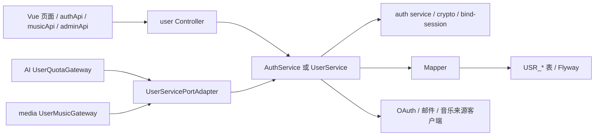

# User 模块：身份、权限、配额与用户侧音乐凭据

本页回答“用户相关功能从哪里进、在哪里编排、落到哪些表、会被谁复用”。这里的 `user-module` 是业务模块，不等于单体入口；运行时仍由 `apps/monolith-app` 装配并暴露 HTTP API。本文列的是代表性路由组，不是完整 API 清单；最终以 Controller、Service、测试和迁移文件为准。

## 1. 模块职责与总链路

user 模块负责：

- 注册、邮箱验证、密码登录、刷新/注销、OAuth 授权和账号绑定；
- 当前用户资料、偏好、密码和账号状态；
- 分组、权限、特权解锁和用户配额策略；
- 用户侧音乐 API Key、Cookie、来源账号绑定会话及密文存储；
- 向 AI、media 等模块提供稳定的 `UserServicePort` 边界。



核心入口：

- [AuthController](../modules/user-module/src/main/java/io/github/shizuki/site/user/controller/AuthController.java)、[AuthRegistrationController](../modules/user-module/src/main/java/io/github/shizuki/site/user/controller/AuthRegistrationController.java)、[AuthVerificationController](../modules/user-module/src/main/java/io/github/shizuki/site/user/controller/AuthVerificationController.java)：令牌、注册、验证码和 OAuth 授权。
- [MeController](../modules/user-module/src/main/java/io/github/shizuki/site/user/controller/MeController.java)：当前用户资料、偏好和密码。
- [UserService](../modules/user-module/src/main/java/io/github/shizuki/site/user/service/UserService.java)、[UserServiceImpl](../modules/user-module/src/main/java/io/github/shizuki/site/user/service/impl/UserServiceImpl.java)：用户域用例总编排。
- [AuthService](../modules/user-module/src/main/java/io/github/shizuki/site/user/service/AuthService.java)、[AuthServiceImpl](../modules/user-module/src/main/java/io/github/shizuki/site/user/service/impl/AuthServiceImpl.java)：认证流程编排。

## 2. 功能矩阵

| 功能 | 代表性 API | 后端主链 | 数据/外部依赖 | 前端入口 |
| --- | --- | --- | --- | --- |
| 注册、登录、注销、令牌检查 | `/api/v1/auth/*` | `Auth*Controller` → `AuthService` → grant strategy/token service → user mapper | 账号、OAuth identity、刷新令牌、邮箱验证码 | [`authApi.js`](../fronted/vue3-merged/src/services/authApi.js)、[`httpClient.js`](../fronted/vue3-merged/src/services/httpClient.js) |
| 当前用户资料与偏好 | `/api/v1/me` | `MeController` → `UserService` → account/preference mapper | 用户账号、头像、偏好 | [`authApi.js`](../fronted/vue3-merged/src/services/authApi.js)、`useAuthSession.js` |
| 分组、权限、管理员操作 | `/api/v1/admin/groups`、`/api/v1/admin/users` | `Admin*Controller` → `UserService` → group/permission mapper | 分组目录、权限、用户组关系 | [`adminApi.js`](../fronted/vue3-merged/src/services/adminApi.js)、[`AdminPage.vue`](../fronted/vue3-merged/src/pages/AdminPage.vue) |
| 配额策略与解锁特权 | `/api/v1/admin/group-quota-policies`、`/api/v1/admin/privileges/unlock` | admin controller → `UserService.resolveQuota`/策略写入 | 分组配额策略、用户组 | [`adminApi.js`](../fronted/vue3-merged/src/services/adminApi.js) |
| 音乐 API Key | `/api/v1/me/music/api-keys` | `MeMusicApiKeyController` → `UserService` → `MusicApiKeyCryptoService` → provider secret mapper | 加密的用户供应商密钥 | [`musicApi.js`](../fronted/vue3-merged/src/services/musicApi.js)、[`ProfilePage.vue`](../fronted/vue3-merged/src/pages/ProfilePage.vue) |
| 音乐来源账号/Cookie | `/api/v1/me/music/source-accounts` | `MeMusicSourceAccountController` → bind-session service / verifier → `UserService` | 加密 Cookie、绑定会话、来源账号状态 | [`musicApi.js`](../fronted/vue3-merged/src/services/musicApi.js)、[`MusicLibraryPage.vue`](../fronted/vue3-merged/src/pages/MusicLibraryPage.vue) |

## 3. 认证与注册链路

典型的邮箱登录/注册路径是：

```text
authApi
  → /api/v1/auth/register/email 或 /api/v1/auth/tokens
  → AuthRegistrationController / AuthController
  → AuthServiceImpl
  → AuthGrantStrategyFactory
      → EmailPasswordGrantStrategy / OAuthCodeGrantStrategy / RefreshTokenGrantStrategy
  → EmailVerificationService、AuthTokenIssuer、RefreshTokenService
  → UserAccountMapper / OAuthLoginMapper / OAuthBindingMapper
  → 账号与认证状态
```

需要改认证流程时，优先阅读：

- [AuthFlowService](../modules/user-module/src/main/java/io/github/shizuki/site/user/service/auth/AuthFlowService.java)：多步骤认证流程和状态处理；
- [AuthGrantStrategyFactory](../modules/user-module/src/main/java/io/github/shizuki/site/user/auth/AuthGrantStrategyFactory.java)：按 grant 类型选择策略；
- [AuthTokenIssuer](../modules/user-module/src/main/java/io/github/shizuki/site/user/service/auth/AuthTokenIssuer.java) 与 [RefreshTokenService](../modules/user-module/src/main/java/io/github/shizuki/site/user/service/auth/RefreshTokenService.java)：令牌签发和刷新；
- [EmailVerificationService](../modules/user-module/src/main/java/io/github/shizuki/site/user/service/auth/EmailVerificationService.java)、[ImageCaptchaService](../modules/user-module/src/main/java/io/github/shizuki/site/user/service/auth/ImageCaptchaService.java)：验证码和验证码图片。

认证“能否进入 Controller”和“能否操作资源”是两层：入口过滤器及共享安全库先处理请求，Controller/注解再处理登录、分组和特权语义。不要只改 `AuthController` 而跳过 `common-servlet` 的入口约定。

## 4. 资料、分组、权限与配额

### 4.1 当前用户资料

`MeController` 负责读取/更新账号、偏好、资料和密码；`UserService` 负责校验和持久化。主要 mapper 是 [UserAccountMapper](../modules/user-module/src/main/java/io/github/shizuki/site/user/mapper/UserAccountMapper.java) 与 [UserPreferenceMapper](../modules/user-module/src/main/java/io/github/shizuki/site/user/mapper/UserPreferenceMapper.java)。头像字段的历史变更可从 `V4__add_user_avatar_url.sql` 追踪。

### 4.2 分组和管理员策略

管理员 API 分为几组：

- `AdminGroupCatalogController`：分组目录 CRUD；
- `AdminGroupPermissionController`：组权限列表和替换；
- `AdminUserGroupController`：查询/替换用户分组；
- `AdminQuotaPolicyController`：分组配额查询、单条更新、批量 upsert；
- `AdminOptionsController`、`AdminPrivilegeController`：前端管理选项和临时特权解锁。

它们的共同链路是：

```text
AdminPage/adminApi
  → ADMIN + @RequireGroup / privilege 检查
  → Admin*Controller
  → UserService
  → GroupCatalogMapper / GroupPermissionMapper / GroupQuotaPolicyMapper / UserAccountMapper
  → 分组目录、权限和配额表
```

AI 计算配额时不要直接查询用户表；通过 [UserQuotaGateway](../modules/ai-module/src/main/java/io/github/shizuki/site/ai/integration/UserQuotaGateway.java) → [UserServicePortAdapter](../modules/user-module/src/main/java/io/github/shizuki/site/user/integration/UserServicePortAdapter.java) → `UserService.resolveQuota`。详细跨模块链路见 [11-cross-module-flows.md](11-cross-module-flows.md)。

## 5. 音乐密钥与来源账号

这部分是 user 模块向 media 暴露的凭据边界：

```text
ProfilePage / MusicLibraryPage
  → musicApi
  → MeMusicApiKeyController 或 MeMusicSourceAccountController
  → UserService
  → MusicApiKeyCryptoService / MusicSourceAccountBindSessionService
  → UserProviderSecretMapper / OAuthBindingMapper
  → 加密凭据与绑定状态
```

- API Key 的明文只在需要调用供应商的短链路中解密，不应写日志、响应或 `.agent/`。
- Cookie 写入前经过来源账号校验；绑定会话需要查看 `MusicSourceAccountBindSessionService`、`NcmQrAuthClient` 和 `MusicWebAuthClient` 的实际策略。
- media 模块通过 `UserMusicGateway` 获取状态或受控凭据，不应绕过 Port 直接注入 user 的 mapper。
- `SecretStartupValidator`、`OAuthPreheatRunner` 等启动组件会校验/预热外部认证配置；配置值只从既有环境读取。

相关实现：[MusicApiKeyCryptoService](../modules/user-module/src/main/java/io/github/shizuki/site/user/service/security/MusicApiKeyCryptoService.java)、[MusicSourceAccountBindSessionService](../modules/user-module/src/main/java/io/github/shizuki/site/user/service/MusicSourceAccountBindSessionService.java)、[UserProviderSecretMapper](../modules/user-module/src/main/java/io/github/shizuki/site/user/mapper/UserProviderSecretMapper.java)。

## 6. 数据迁移与改动检查

模块迁移重点：

- [`V1__init_schema.sql`](../modules/user-module/src/main/resources/db/migration/V1__init_schema.sql)：用户域基础表；
- `V3__oauth_emailless_identity_cleanup.sql`：OAuth identity 清理；
- `V4__add_user_avatar_url.sql`：头像字段；
- `V5__music_asmr_friend_admin_access.sql`、`V6__quota_unlimited_normalization.sql`：音乐访问和配额语义。

单体合并迁移对应 `apps/monolith-app/src/main/resources/monolith/db/migration/` 下的 `V101`、`V102`、`V403`、`V404`、`V423`、`V427` 等版本。修改 schema 前必须确认当前启动使用哪套 Flyway location，不要只改模块迁移就假设生产单体已覆盖。

改动 user 功能时按此顺序检查：

1. 前端 `authApi`/`musicApi`、认证状态和错误分支；
2. Controller 路径、HTTP 方法、登录/分组/特权注解；
3. `UserService`/`AuthService` 及 grant、crypto、bind-session 协作者；
4. mapper、entity/DTO、模块迁移和单体合并迁移；
5. AI/media 使用的 Port/Gateway 契约与对应测试；
6. 日志中不得出现密码、Cookie、Token、API Key 明文。
