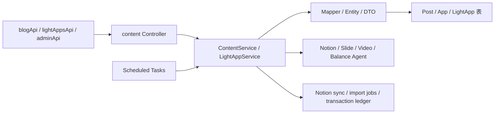

# Content 模块：博客、作者、互动与轻应用

`content-module` 承载博客/帖子和应用中心，同时包含一组较大的轻应用域：TimePrism 项目、任务、待办、日程、白板、番茄钟、URL 链接和账单。本文记录代表性功能与链路；完整端点以 [ContentService](../modules/content-module/src/main/java/io/github/shizuki/site/content/service/ContentService.java)、[LightAppService](../modules/content-module/src/main/java/io/github/shizuki/site/content/service/LightAppService.java) 和各 Controller 为准。

## 1. 模块职责与总链路



主要入口：

- [PostController](../modules/content-module/src/main/java/io/github/shizuki/site/content/controller/PostController.java)：公开帖子列表、详情、Markdown、侧栏和公开 whisper。
- [MyPostController](../modules/content-module/src/main/java/io/github/shizuki/site/content/controller/MyPostController.java)：当前用户帖子 CRUD、发布状态、Notion 同步和演示文稿。
- [ContentServiceImpl](../modules/content-module/src/main/java/io/github/shizuki/site/content/service/impl/ContentServiceImpl.java)：帖子、作者、可见性、互动和外部内容生成编排。
- [LightAppController](../modules/content-module/src/main/java/io/github/shizuki/site/content/controller/LightAppController.java)、[LightAppServiceImpl](../modules/content-module/src/main/java/io/github/shizuki/site/content/service/impl/LightAppServiceImpl.java)：轻应用资源和关系的主要入口。
- [MeLightAppBalanceSourceAccountController](../modules/content-module/src/main/java/io/github/shizuki/site/content/controller/MeLightAppBalanceSourceAccountController.java)：账单来源账号绑定、同步和导入任务。

## 2. 功能矩阵

| 功能 | 代表性 API/控制器 | 后端主链 | 持久化/外部依赖 | 前端入口 |
| --- | --- | --- | --- | --- |
| 公开博客列表与详情 | `/api/v1/posts` | `PostController` → `ContentService` → post/content/presentation mapper | 帖子、Markdown、标签、封面、侧栏、可见性 | [`blogApi.js`](../fronted/vue3-merged/src/services/blogApi.js)、[`BlogListPage.vue`](../fronted/vue3-merged/src/pages/BlogListPage.vue)、[`BlogPage.vue`](../fronted/vue3-merged/src/pages/BlogPage.vue) |
| 我的帖子与发布状态 | `/api/v1/me/posts` | `MyPostController` → `ContentServiceImpl` → post/content/tag mapper | 草稿、发布、分类策略、组 ACL | [`blogApi.js`](../fronted/vue3-merged/src/services/blogApi.js) |
| 作者资料、whisper、点赞/举报 | `/api/v1/author/profile`、`/api/v1/*/likes`、`/api/v1/reports` | 专用 controller → `ContentService` → author/interaction/report mapper | 作者资料、互动和审核状态 | `blogApi.js`、[`HomePage.vue`](../fronted/vue3-merged/src/pages/HomePage.vue) |
| 分类、可见性与后台审核 | `/api/v1/admin/posts/*`、`/api/v1/admin/apps/*` | admin controller → content service → policy/meta/ACL mapper | 分类元数据、组策略、whisper/audit | [`adminApi.js`](../fronted/vue3-merged/src/services/adminApi.js)、[`AdminPage.vue`](../fronted/vue3-merged/src/pages/AdminPage.vue) |
| 应用中心与轻应用项目 | `/api/v1/apps`、`/api/v1/light-apps/projects` | `AppController`/`LightAppController` → service → light-app mapper | 项目、应用配置和用户归属 | [`lightAppsApi.js`](../fronted/vue3-merged/src/services/lightAppsApi.js)、[`AppsPage.vue`](../fronted/vue3-merged/src/pages/AppsPage.vue) |
| TimePrism、待办、任务、日程、白板、番茄钟 | `/api/v1/light-apps/*` | `LightAppService` → 对应资源 mapper → 关系/重复规则 mapper | 项目、任务列、重复规则、白板、时间事件 | `lightAppsApi.js`、`src/components/lightapps/*` |
| 账单、债务、 recurring charge、汇率 | `/api/v1/light-apps/balance/*` | `LightAppService` / balance sync service → ledger mapper | 账户、交易、导入任务、映射、汇率 | `lightAppsApi.js`、`BalanceLedgerWindow.vue` |
| Notion 同步、演示文稿、视频工具 | `/api/v1/me/posts/*`、`/api/v1/me/posts/video` | content service → Notion/Slide/Video client | 同步 job/cursor、presentation、外部辅助服务 | [`BlogPresentationWorkspace.vue`](../fronted/vue3-merged/src/components/blog/BlogPresentationWorkspace.vue)、`blogApi.js` |
| 翻译 | `/api/v1/tools/translate` | `WebToolTranslateController` → `TranslateToolService` | 配置化翻译供应商 | 前端工具调用点以 `rg -n "translate" fronted/vue3-merged/src` 为准 |

## 3. 博客与可见性链路

### 3.1 公开读取

```text
HomePage / BlogListPage / BlogPage
  → blogApi
  → PostController (/api/v1/posts)
  → ContentService.listPublishedPosts / getPublishedPost / getMarkdown / getSidebar
  → PostMapper + PostContentMapper + PostTagMapper + PostPresentationMapper
  → 发布状态、分类、可见性、组 ACL 过滤
  → 公开响应
```

帖子详情不是单纯的 `PostMapper.selectById`：发布状态、可见性、分类策略、组权限和内容版本都会影响返回结果。修改读取条件时同时检查 [ContentVisibilityEnum](../modules/content-module/src/main/java/io/github/shizuki/site/content/model/ContentVisibilityEnum.java)、`PostGroupAclMapper`、分类 policy mapper 和对应 service 测试。

### 3.2 编辑、发布与后台审核

```text
Blog editor
  → MyPostController
  → ContentServiceImpl
  → post/content/tag/presentation mapper
  → draft → publish/unpublish → public read path

AdminPage/adminApi
  → AdminAuthorProfileController / AdminContentVisibilityController
    / AdminPostCategoryMetaController / AdminPostCategoryPolicyController
    / AdminPostWhisperController
  → content service
  → policy/meta/whisper/ACL tables
```

权限检查要分开看：当前用户能否编辑自己的帖子、帖子是否公开、某个分组能否看到、管理员是否能修改全局策略，这些不是同一个布尔字段。

## 4. 轻应用链路

`LightAppController` 的路由很多，但可按资源族阅读：

| 资源族 | 典型操作 | 主要 mapper |
| --- | --- | --- |
| projects | 创建、更新、删除、列表 | `LightAppProjectMapper` |
| balance | accounts、transactions、debts、recurring-charges、overview、analytics、FX | `LightAppBalance*Mapper`、`LightAppFxRateMapper` |
| time tools | pomodoros、schedules、upcoming、recurring rules | `LightAppPomodoroTemplateMapper`、`LightAppSchedule*Mapper` |
| planning | todos、tasks、columns、reorder/move、recurring rules | `LightAppTodo*Mapper`、`LightAppTask*Mapper` |
| collaboration | whiteboards、URL links、metadata resolve | `LightAppWhiteboardMapper`、`LightAppUrlLinkMapper` |
| integrations | Notion sync jobs、balance import jobs/bind sessions | `LightAppTaskNotionSync*Mapper`、`LightAppBalance*Mapper` |

阅读/修改一项轻应用功能时遵循：

```text
lightAppsApi 或 lightapps/* 组件
  → LightAppController 的资源路由
  → LightAppService / LightAppServiceImpl
  → 资源 mapper + 关联/重复规则 mapper
  → 项目归属、用户归属、排序/状态、事务
  → LightApp* 响应
```

不要把所有轻应用逻辑塞进 `monolith-app`；单体只是装配入口。只有跨模块入口、运维和网关行为才应先看 `apps/monolith-app`。

## 5. 外部同步与生成链路

### 5.1 Notion

- 帖子同步：`MyPostController` → `PostNotionSyncService` → `NotionClient`/codec → `NotionSyncJobMapper`、cursor mapper。
- 任务同步：`LightAppService` → `LightAppTaskNotionSyncService` → Notion client → task sync job/cursor mapper。
- 定时补偿：[`PostNotionNightlySyncTask`](../modules/content-module/src/main/java/io/github/shizuki/site/content/task/PostNotionNightlySyncTask.java) 和 [`LightAppTaskNotionNightlySyncTask`](../modules/content-module/src/main/java/io/github/shizuki/site/content/task/LightAppTaskNotionNightlySyncTask.java)。

### 5.2 演示文稿与视频

```text
MyPostController / PostVideoController
  → ContentServiceImpl 或 PostVideoServiceImpl
  → PostPresentationGeneratorClient / PostVideoConverterClient
  → presentation 结果或转录/摘要结果
  → PostPresentationMapper / 帖子内容状态
```

外部客户端的 URL、超时和重试来自配置，不要在页面或 Controller 中硬编码。实现入口是 [PostPresentationGeneratorClient](../modules/content-module/src/main/java/io/github/shizuki/site/content/support/PostPresentationGeneratorClient.java)、[PostVideoConverterClient](../modules/content-module/src/main/java/io/github/shizuki/site/content/support/PostVideoConverterClient.java) 和 [PostVideoServiceImpl](../modules/content-module/src/main/java/io/github/shizuki/site/content/service/impl/PostVideoServiceImpl.java)。

### 5.3 账单绑定和导入

```text
BalanceLedgerWindow / lightAppsApi
  → MeLightAppBalanceSourceAccountController
  → LightAppBalanceBillSyncService
  → LightAppBalanceBillSyncCryptoService
  → LightAppBalanceBillSyncAgentClient
  → import job / mapping / transaction writer
  → LightAppBalanceTransactionMapper
```

后台定时补偿由 [`LightAppBalanceBillSyncNightlyTask`](../modules/content-module/src/main/java/io/github/shizuki/site/content/task/LightAppBalanceBillSyncNightlyTask.java) 触发。来源账号密文和导入任务属于敏感数据边界，日志只保留状态、provider 和 job id 等非秘密信息。

## 6. 数据迁移与改动检查

模块迁移按功能阶段演进：

- [`V1__init_schema.sql`](../modules/content-module/src/main/resources/db/migration/V1__init_schema.sql)、`V3`、`V4`：帖子基础、标签/内容和列表封面/侧栏；
- `V5`–`V10`：轻应用、番茄钟、账单/重复规则、URL 链接、TimePrism 字段、白板；
- `V11`–`V13`：博客演示文稿、Notion 重构和任务 Notion 同步。

单体合并迁移对应 `V201`–`V202`、`V408`–`V419`、`V425`–`V426`。涉及新字段/新表时，先确认模块迁移和单体 location 的发布关系。

改动 content 功能时检查：

1. 页面组件和 `blogApi`/`lightAppsApi`/`adminApi` 请求及错误状态；
2. Controller 路由、登录、资源归属和管理员权限；
3. `ContentService` 或 `LightAppService` 的用例、事务和排序/状态语义；
4. mapper、实体/DTO、migration、同步 job/cursor 和定时任务；
5. 外部客户端的超时、重试、幂等和脱敏日志；
6. 发布、可见性、组 ACL 与后台审核的回归测试。
