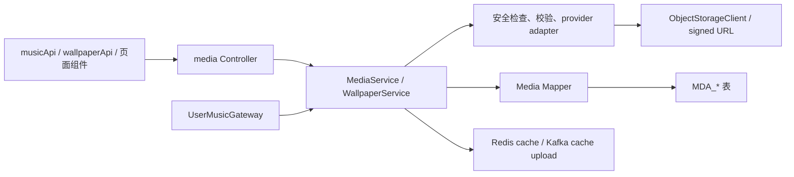

# Media 模块：资源、壁纸、音乐与对象存储

`media-module` 同时处理上传资源、L2D/壁纸、音乐供应商和用户歌单。它是“文件/流媒体数据如何安全进入对象存储、数据库和缓存”的主要阅读入口；用户音乐凭据由 user 模块保管，media 通过 Gateway 使用。

## 1. 模块职责与总链路



关键入口：

- [AssetController](../modules/media-module/src/main/java/io/github/shizuki/site/media/controller/AssetController.java)：上传策略、relay、资源创建、下载 URL 和举报。
- [HomeWallpaperController](../modules/media-module/src/main/java/io/github/shizuki/site/media/controller/HomeWallpaperController.java)、[WallpaperDiscoveryController](../modules/media-module/src/main/java/io/github/shizuki/site/media/controller/WallpaperDiscoveryController.java)：壁纸导入、发现、库、公开展示和设置。
- [MusicController](../modules/media-module/src/main/java/io/github/shizuki/site/media/controller/MusicController.java)、[MeMusicLibraryController](../modules/media-module/src/main/java/io/github/shizuki/site/media/controller/MeMusicLibraryController.java)：公共音乐查询/播放和用户歌单。
- [MediaServiceImpl](../modules/media-module/src/main/java/io/github/shizuki/site/media/service/impl/MediaServiceImpl.java)、[WallpaperServiceImpl](../modules/media-module/src/main/java/io/github/shizuki/site/media/service/impl/WallpaperServiceImpl.java)：主要业务编排。

## 2. 功能矩阵

| 功能 | 代表性 API | 后端主链 | 存储/外部依赖 | 前端入口 |
| --- | --- | --- | --- | --- |
| 通用资源上传与下载 | `/api/v1/assets/*` | `AssetController` → `MediaServiceImpl` → validator/asset mapper | Object Storage、signed URL、`MDA_ASSET` | `musicApi.js`/资源组件，具体调用点用 `rg -n "assets|upload" fronted/vue3-merged/src` 查找 |
| L2D/壁纸包导入 | `/api/v1/home-wallpapers/*` | `HomeWallpaperController` → `WallpaperServiceImpl` → package/L2D/security validator | 对象存储、导入 job、wallpaper profile | [`wallpaperApi.js`](../fronted/vue3-merged/src/services/wallpaperApi.js)、`WallpaperL2dCanvas.vue` |
| 壁纸发现与审核 | `/api/v1/home-wallpapers/discovery`、`/api/v1/admin/home-wallpapers` | discovery controller/service、admin controller | Workshop/Wallhaven、审核状态、缓存/远程下载 | [`WallpaperDiscoveryPanel.vue`](../fronted/vue3-merged/src/components/app/WallpaperDiscoveryPanel.vue)、[`adminApi.js`](../fronted/vue3-merged/src/services/adminApi.js) |
| 公共音乐检索/播放 | `/api/v1/music/*` | `MusicController` → `MediaServiceImpl` → provider adapter | Meting/Netease/Spotify/ASMR/Freesound、播放 URL、配额 | [`musicApi.js`](../fronted/vue3-merged/src/services/musicApi.js)、[`MusicLibraryPage.vue`](../fronted/vue3-merged/src/pages/MusicLibraryPage.vue) |
| 默认歌单、首页和缓存 | `/api/v1/music/default-playlist`、`/home`、`/bundle` | media service → playlist/cache mapper | PostgreSQL、Redis、Kafka cache upload | `musicApi.js`、音乐首页视图 |
| 用户歌单与收藏 | `/api/v1/me/music/*` | `MeMusicLibraryController` → media service → user playlist mapper | 用户歌单、track、collect 关系 | `musicApi.js`、`MusicLibraryPage.vue` |
| 用户来源账号与供应商密钥 | `/api/v1/me/music/source-accounts`、`/api/v1/me/music/api-keys` | media → `UserMusicGateway` → user Port | user 模块加密凭据；外部供应商 | [`ProfilePage.vue`](../fronted/vue3-merged/src/pages/ProfilePage.vue)、`MusicLibraryPage.vue` |
| 管理员音乐配置 | `/api/v1/admin/music/*` | `AdminMusicController` → media service | provider config、guide、默认歌单 | `adminApi.js`、`AdminPage.vue` |
| 环境音/声音库 | `/api/v1/ambient-library` | `AmbientLibraryController` → provider/config | Freesound/环境音配置 | [`ambientLibraryApi.js`](../fronted/vue3-merged/src/services/ambientLibraryApi.js) |

## 3. 资源与对象存储链路

典型上传流程：

```text
前端请求 upload policy
  → AssetController
  → MediaServiceImpl.createUploadPolicy / relay / createAsset
  → UploadValidator + AssetSecurityInspector
  → ObjectStorageClient + OssKeyBuilder
  → MediaAssetMapper / MediaAssetReportMapper
  → 资源元数据、审核/扫描状态
  → signed download URL
```

关键规则：

- 上传策略、relay 和资源登记是不同阶段；修改其中一个时同时检查前端上传状态机和失败重试。
- `AssetSecurityInspector` 负责安全扫描结果，`L2dZipValidator` 负责 L2D 包结构；不要用文件扩展名替代服务端校验。
- 对象存储路径、Bucket 和 URL 有配置边界，具体值来自已有配置，不写入 `.agent/`。
- 资源的可见性、审核状态和公开 URL 不是同一个状态；读取链路要检查对应枚举和权限。

实现入口：[DefaultAssetSecurityInspector](../modules/media-module/src/main/java/io/github/shizuki/site/media/service/security/DefaultAssetSecurityInspector.java)、[L2dZipValidator](../modules/media-module/src/main/java/io/github/shizuki/site/media/service/l2d/L2dZipValidator.java)、[ObjectStorageClient](../libs/common-integration/src/main/java/io/github/shizuki/common/storage/client/ObjectStorageClient.java)、[OssKeyBuilder](../libs/common-integration/src/main/java/io/github/shizuki/common/storage/util/OssKeyBuilder.java)。

## 4. 壁纸导入、发现与审核

```text
WallpaperDiscoveryPanel / wallpaperApi
  → WallpaperDiscoveryController
  → WallpaperDiscoveryServiceImpl
  → WorkshopBrowseHtmlParser / Wallhaven HTTP / RemoteDownloadedMultipartFile
  → WallpaperServiceImpl import package
  → MediaWallpaperImportJobMapper + MediaWallpaperProfileMapper
  → asset/object storage + import job status
  → HomeWallpaperController public/library/settings
```

管理员审核从 `AdminHomeWallpaperController` 进入；审核通过后才进入相应公开/首页角色。导入任务是异步或长耗时边界，修改状态机时要同时检查 job 查询、重试和前端进度显示。

## 5. 音乐检索、播放、缓存与歌单

### 5.1 公共音乐

```text
MusicLibraryPage / MusicVoiceHomeView / MusicVoiceWorkDetailView
  → musicApi
  → MusicController
  → MediaServiceImpl
  → provider adapter
      → MetingMusicProvider / NeteaseCookieProvider / SpotifyMusicProvider
        / AsmrMusicProvider / FreesoundProvider
  → normalized track/playlist response
  → resolve playback → expiry policy / provider URL
```

播放 URL 可能有有效期，`TrackUrlExpiryPolicy` 和 provider 解析不可被页面层绕过。搜索、播放解析、Spotify preview、语音作品和配额是不同用例，改一项时不要把所有 provider 逻辑合并到 Controller。

### 5.2 缓存与异步上传

音乐曲目缓存涉及 `MusicTrackCacheMapper`、`MusicTrackCacheUploadPublisher`、`MusicTrackCacheUploadConsumer`、`MusicListenCacheCleanupTask` 和 `MusicLibraryHomeCacheRefreshTask`。典型路径是：

```text
播放/解析请求 → track cache 查询或生成 → Redis/对象存储
  → Kafka upload event → consumer 落盘/更新状态
  → 定时清理与首页缓存刷新
```

修改缓存时检查 key、过期时间、Kafka 幂等、失败重试和数据库状态，不能只验证一次接口返回。

### 5.3 用户歌单与 user 边界

```text
MusicLibraryPage
  → MeMusicLibraryController
  → MediaServiceImpl
  → UserMusicPlaylistMapper / TrackMapper / CollectMapper
  → 用户歌单和收藏关系

provider credential lookup
  → UserMusicGateway
  → common UserServicePort
  → user-module UserServicePortAdapter
  → user 加密凭据
```

media 不应直接依赖 user 的 mapper 或读取 user 的密文表；需要新增用户音乐信息时优先扩展 `UserServicePort`/Gateway 契约，并在 monolith 装配处验证实现。

## 6. 数据迁移与改动检查

模块迁移重点：

- [`V1__init_schema.sql`](../modules/media-module/src/main/resources/db/migration/V1__init_schema.sql)、`V3`、`V4`：媒体资源、歌单 profile、用户歌单/收藏关系；
- `V5`：音乐曲目缓存/收听时间；
- `V6`：壁纸 profile 和导入相关表；
- `V7`、`V8`：Meting seed 与音乐 secret 清理。

单体合并迁移对应 `V301`–`V302`、`V405`–`V407`、`V413`、`V423`、`V424`、`V427`。生产发布前检查 `apps/monolith-app` 实际 Flyway location。

改动 media 功能时检查：

1. 前端 service、上传/播放/导入状态机和过期处理；
2. Controller 的登录、管理员、资源所有权和公开性检查；
3. `MediaService`/`WallpaperService`、provider、validator 和 Gateway；
4. mapper、实体/DTO、迁移、Redis/Kafka/对象存储状态；
5. signed URL、密钥、Cookie、远程下载和压缩包处理的安全边界；
6. provider 失败、缓存失效、导入重试和资源审核的测试。
