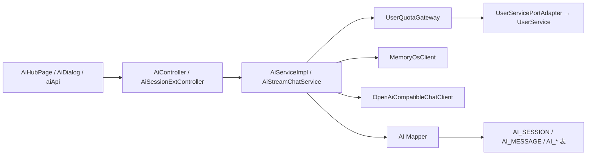

# AI 模块：会话、SSE、角色世界书、记忆与配额

`ai-module` 负责 AI 会话生命周期、消息持久化、流式回复、角色/世界书、陪伴配置、城镇资源和记忆范围。AI 消耗的用户配额由 user 模块提供，但 AI 业务不应直接依赖 user 的 mapper。

## 1. 模块职责与总链路



关键入口：

- [AiController](../modules/ai-module/src/main/java/io/github/shizuki/site/ai/controller/AiController.java)：会话、非流式消息、配额、角色、城镇、世界书和后台配置。
- [AiSessionExtController](../modules/ai-module/src/main/java/io/github/shizuki/site/ai/controller/AiSessionExtController.java)：会话摘要、消息查询、重命名/删除和 SSE 流式入口。
- [AiServiceImpl](../modules/ai-module/src/main/java/io/github/shizuki/site/ai/service/impl/AiServiceImpl.java)：会话/角色/世界书/记忆等业务编排。
- [AiStreamChatService](../modules/ai-module/src/main/java/io/github/shizuki/site/ai/service/AiStreamChatService.java)：流式回复协议和增量回调边界。

## 2. 功能矩阵

| 功能 | 代表性 API | 后端主链 | 数据/外部依赖 | 前端入口 |
| --- | --- | --- | --- | --- |
| 创建/列出 AI 会话 | `POST/GET /api/v1/ai-sessions` | `AiController` → `AiService` → session mapper | `AI_SESSION`、模式和标题 | [`aiApi.js`](../fronted/vue3-merged/src/services/aiApi.js)、[`AiSessionRail.vue`](../fronted/vue3-merged/src/components/AiSessionRail.vue) |
| 非流式发送消息 | `POST /api/v1/ai-sessions/{id}/messages` | `AiController` → `AiServiceImpl` → quota/context/provider → message mapper | `AI_MESSAGE`、配额使用、角色/世界书/记忆上下文 | [`AiDialog.vue`](../fronted/vue3-merged/src/components/AiDialog.vue) |
| SSE 流式消息 | `POST /api/v1/ai-sessions/{id}/messages/stream` | `AiSessionExtController` → `AiStreamChatService` → AI client → delta listener | SSE、消息落库、客户端断开/失败状态 | `aiApi.js`、`AiDialog.vue` |
| 配额查询/扣减 | `GET /api/v1/ai-quotas/me` | `AiService` → `UserQuotaGateway` → `UserServicePort` | 用户组配额策略、`AI_QUOTA_USAGE` | `AiDialog.vue`、AI 页面状态 |
| 角色与导入 | `/api/v1/ai-characters/*` | `AiController` → `AiServiceImpl` → character mapper | 角色元数据、导入内容 | [`AiHubPage.vue`](../fronted/vue3-merged/src/pages/AiHubPage.vue) |
| 世界书与条目 | `/api/v1/ai-worldbooks/*` | `AiController` → service → worldbook/entry mapper | 世界书、条目和会话上下文 | `AiHubPage.vue`、AI 组件 |
| 城镇、陪伴与记忆 | `/api/v1/ai-towns/*`、admin companion/memory | `AiServiceImpl` → town/companion/memory mapper | `MemoryOsClient`、城镇资源、记忆 scope | `AiHubPage.vue`、后台管理入口 |

## 3. 会话与 SSE 链路

### 3.1 普通消息

```text
AiDialog
  → aiApi.createAiSession / sendAiMessage
  → AiController
  → AiServiceImpl
  → 读取 session、character、worldbook、历史 message
  → UserQuotaGateway.resolveQuota
  → OpenAiCompatibleChatClient
  → AiMessageMapper / AiQuotaUsageMapper / AiSessionMapper
  → assistant response
```

上下文拼装由 `AiServiceImpl` 负责，包含会话模式、历史消息、角色设定、世界书和可选记忆。修改 prompt/context 时同时检查长度限制、敏感信息、配额扣减和消息持久化，不要只改前端展示文本。

### 3.2 SSE 流式消息

```text
AiDialog
  → aiApi.streamAiMessage
  → POST /api/v1/ai-sessions/{id}/messages/stream
  → AiSessionExtController (text/event-stream)
  → AiStreamChatService
  → quota/context preparation
  → OpenAiCompatibleChatClient streaming response
  → DeltaListener
  → SSE delta/done/error
  → 前端增量更新 assistant bubble
  → 最终消息和使用量落库
```

前端 `AiDialog` 对流式不支持的旧部署有非流式 fallback；后端修改事件名、错误格式或完成标记时，必须同步 `aiApi.js`、组件状态机和 `AiDialog.spec.js`。服务端断开、超时和部分回复不能简单当成成功响应。

## 4. 配额边界

```text
AiServiceImpl / AiStreamChatService
  → UserQuotaGateway
  → common-integration UserServicePort
  → monolith 中的 UserServicePortAdapter
  → user-module UserService.resolveQuota
  → group quota policy + usage
```

AI 模块只依赖 `UserQuotaGateway` 的能力，不应：

- 直接注入 `UserServiceImpl`；
- 直接查询 user 的配额 mapper；
- 在 AI 模块复制一套分组配额规则；
- 在日志或 SSE 事件里输出用户密钥、完整 prompt 或外部 provider 凭据。

配额相关改动需要同时检查 user 侧策略、AI usage mapper、免费/无限额度语义和流式失败后的扣减/回滚行为。

## 5. 角色、世界书、城镇与记忆

### 5.1 角色和世界书

角色/世界书都是上下文构建源，不是单独的聊天 provider：

```text
AiController
  → character/worldbook CRUD
  → AiCharacterMapper / AiWorldbookMapper / AiWorldbookEntryMapper
  → AiServiceImpl context builder
  → 普通或流式消息用例
```

导入接口要检查大小、格式、所有权和覆盖策略；修改世界书条目结构时同步 request/response、mapper、迁移和前端编辑器。

### 5.2 记忆和陪伴

`MemoryOsClient` 是 AI 模块到记忆系统的外部适配器；本地数据库的 `AiMemoryScopeMapper`、`AiCompanionProfileMapper`、`AiTownAssetImportMapper` 保存作用域、陪伴配置和导入状态。典型路径：

```text
AiServiceImpl
  → memory scope / companion / town controller
  → local mapper
  → MemoryOsClient.retrieve / profile
  → context messages
  → OpenAiCompatibleChatClient
```

外部记忆服务的 URL、令牌和超时从配置注入；文档和日志只记录配置键名、状态和 job id，不记录真实值。

## 6. 数据迁移与改动检查

模块迁移：

- [`V1__init_schema.sql`](../modules/ai-module/src/main/resources/db/migration/V1__init_schema.sql)：会话、消息、配额使用等基础表；
- `V2__ai_session_mode_fields.sql`：会话模式字段；
- `V3__ai_character_worldbook_assets.sql`：角色和世界书资源；
- `V4__ai_companion_profile.sql`、`V5__ai_memory_scope_and_town_assets.sql`：陪伴、记忆 scope 和城镇资产。

单体合并迁移对应 `V401`–`V402`、`V420`–`V422` 和 `V429`。新增 AI 字段/状态时检查普通消息、SSE、定时维护和单体迁移路径是否一致。

改动 AI 功能时检查：

1. `aiApi`、`AiDialog`、`AiSessionRail` 的加载、流式、fallback、重试和断开状态；
2. Controller 的登录、会话所有权、管理员权限和响应/SSE 协议；
3. `AiServiceImpl` 的上下文、配额、provider、记忆和事务编排；
4. session/message/quota/character/worldbook/memory mapper 与迁移；
5. `OpenAiCompatibleChatClient`、`MemoryOsClient` 的超时、重试、错误脱敏；
6. 普通消息、流式增量、空回复、provider 失败、用户配额不足和部分落库的测试。
