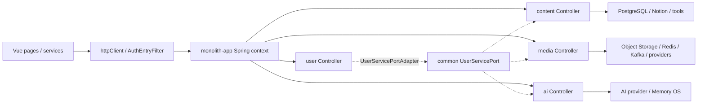

# 跨模块链路：从前端请求到单体、边界适配器和外部系统

本页补齐“一个功能跨越多个模块时，应该按什么顺序读源码”。项目是单体运行、模块化编译：四个业务模块编译进 `apps/monolith-app`，模块间不应通过互相注入实现类来形成隐式依赖；需要跨域能力时优先使用 `common-integration` 的 Port 和模块侧 Gateway。

## 1. 总体边界


阅读原则：

- 前端从页面或组件进入 `src/services/*Api.js`，再进入后端 Controller；
- 后端从 Controller 进入 Service，再追 mapper/entity/migration 和外部 client；
- 认证由共享入口处理，资源/分组/管理员权限仍由模块 Controller 和 Service 负责；
- user 数据被其他业务复用时走 `UserServicePort` → `UserServicePortAdapter` → user service；
- 修改 schema 时同时核对模块迁移和单体合并迁移。

## 2. 认证请求链

```text
页面 / useAuthSession
  → authApi / httpClient
  → Authorization: Bearer ...
  → apps/monolith-app AuthEntryFilter
  → common-servlet 的登录上下文、审计/限流/异常能力
  → 目标模块 Controller
  → Controller 自身的登录、组或 privilege 检查
  → Service 用例
```

登录/注册的令牌签发另走：

```text
authApi
  → AuthController / AuthRegistrationController / AuthVerificationController
  → AuthServiceImpl
  → grant strategy + email/OAuth/token service
  → user mapper
  → token response
```

因此，新增受保护接口时要同时检查 `httpClient`、`AuthEntryFilter`、Controller 注解和前端登录失效处理，不能只加一个 `@RequireLogin`。

入口文件：[AuthEntryFilter](../apps/monolith-app/src/main/java/io/github/shizuki/site/monolith/filter/AuthEntryFilter.java)、[`httpClient.js`](../fronted/vue3-merged/src/services/httpClient.js)、[`useAuthSession.js`](../fronted/vue3-merged/src/composables/useAuthSession.js)。

## 3. 用户配额链：AI 与媒体共享 user 边界

```text
AI / media 业务 Service
  → UserQuotaGateway 或 UserMusicGateway
  → common-integration UserServicePort
  → user-module UserServicePortAdapter
  → user-module UserService
  → 用户组、配额策略、用户凭据/偏好 mapper
```

两个 Gateway 的语义不同：

- [UserQuotaGateway](../modules/ai-module/src/main/java/io/github/shizuki/site/ai/integration/UserQuotaGateway.java)：AI 只需要解析用户配额；
- [UserMusicGateway](../modules/media-module/src/main/java/io/github/shizuki/site/media/integration/UserMusicGateway.java)：media 获取音乐配额、API Key 状态/受控明文、偏好和来源账号状态。

适配器实现是 [UserServicePortAdapter](../modules/user-module/src/main/java/io/github/shizuki/site/user/integration/UserServicePortAdapter.java)。如果新用例需要用户能力，优先扩展 Port/Gateway 的最小接口并在 monolith 装配验证，不要引入 user 实现类或 mapper。

## 4. 音乐来源账号链

```text
ProfilePage / MusicLibraryPage
  → musicApi
  → user-module MeMusicApiKeyController / MeMusicSourceAccountController
  → crypto + bind-session + UserProviderSecretMapper
  → 加密凭据/账号状态
  → media UserMusicGateway
  → MediaServiceImpl
  → Meting/Netease/Spotify/ASMR 等 provider
  → 搜索、播放解析、导入来源歌单
```

这里有两个持久化域：凭据和来源账号在 user，用户歌单和曲目关系在 media。变更来源账号绑定时同时检查 user 的安全服务、media 的 Gateway、provider 的错误处理和 `MusicLibraryPage` 的轮询状态；不要把 Cookie 复制进 media 表或前端 store。

## 5. 对象存储与壁纸资源链

```text
资源/壁纸页面
  → wallpaperApi / asset service
  → AssetController / HomeWallpaperController
  → MediaServiceImpl / WallpaperServiceImpl
  → UploadValidator + AssetSecurityInspector + L2dZipValidator
  → ObjectStorageClient / OssKeyBuilder
  → MediaAssetMapper / Wallpaper profile/import job mapper
  → signed URL / 审核状态 / 公开角色
```

壁纸从 Workshop/Wallhaven 导入时还会经过 discovery service 和远程下载，再进入相同的资源登记/安全检查/对象存储链。修改资源可见性、审核或 URL 时需同时检查资源元数据、wallpaper profile、导入 job 和前端展示角色。

入口：[AssetController](../modules/media-module/src/main/java/io/github/shizuki/site/media/controller/AssetController.java)、[HomeWallpaperController](../modules/media-module/src/main/java/io/github/shizuki/site/media/controller/HomeWallpaperController.java)、[ObjectStorageClient](../libs/common-integration/src/main/java/io/github/shizuki/common/storage/client/ObjectStorageClient.java)。

## 6. AI 会话与 SSE 链

```text
AiHubPage / AiDialog / AiSessionRail
  → aiApi
  → AiSessionExtController (/messages/stream)
  → AiStreamChatService
  → UserQuotaGateway → UserServicePort → user quota
  → AiServiceImpl context builder
  → MemoryOsClient.retrieve (可选)
  → OpenAiCompatibleChatClient
  → delta listener → SSE
  → AiDialog 增量渲染
  → AiMessageMapper / AiQuotaUsageMapper 最终落库
```

`AiDialog` 对旧部署支持非流式 fallback，所以后端改 SSE 事件、HTTP 状态或完成语义时，需要同时检查 `aiApi.js`、组件状态机、非流式 endpoint 和测试。配额不足、provider 超时、客户端断开和部分回复要分别定义状态，不能都返回“成功”。

## 7. 博客、演示文稿与视频链

```text
BlogPage / BlogPresentationWorkspace
  → blogApi
  → MyPostController / PostController / PostVideoController
  → ContentServiceImpl / PostVideoServiceImpl
  → PostPresentationGeneratorClient 或 PostVideoConverterClient
  → presentation / transcript / summary 结果
  → post content/presentation mapper
  → 前端下载、预览或回填编辑器
```

Notion 同步是另一条异步链：

```text
帖子或任务同步请求
  → PostNotionSyncService / LightAppTaskNotionSyncService
  → NotionClient + codec
  → sync job/cursor mapper
  → nightly task 补偿与重试
```

外部服务地址和密钥由配置注入，查看配置键名即可；实现修改要同时考虑超时、重试、幂等和同步 job 状态。

## 8. 轻应用账单同步链

```text
BalanceLedgerWindow / lightAppsApi
  → MeLightAppBalanceSourceAccountController
  → LightAppBalanceBillSyncService
  → LightAppBalanceBillSyncCryptoService
  → LightAppBalanceBillSyncAgentClient
  → import job + import mapping
  → LightAppBalanceTransactionWriter
  → account / transaction / debt / recurring charge mapper
  → ledger response
```

夜间任务 [`LightAppBalanceBillSyncNightlyTask`](../modules/content-module/src/main/java/io/github/shizuki/site/content/task/LightAppBalanceBillSyncNightlyTask.java) 处理补偿。来源账号密文、绑定会话和第三方返回内容是敏感边界；日志只写 provider、状态、摘要和 job id。

## 9. 管理员与运维链

```text
AdminPage
  → adminApi / musicApi
  → user admin controllers（用户、组、权限、配额）
  → content admin controllers（分类、whisper、可见性、作者）
  → media admin controllers（资源、壁纸、音乐 provider）
  → apps/monolith-app AdminOpsController / AdminOpsInsightController
  → 容器、服务健康、日志、Meguri/prompt cache 状态
```

管理员页面的“业务管理”和“运行维护”不是同一层：业务管理落在四个模块，容器/健康/日志等运维入口属于 `monolith-app`。修改 AdminPage 时先按 `adminApi` 的函数定位具体 Controller，不要因页面集中就把业务逻辑搬入单体入口。

## 10. Meguri 网关链

Meguri 不是四个业务模块之一，但它是前端可见的单体特有边界：

```text
MeguriPage
  → meguriApi
  → MeguriGatewayController
  → MeguriGatewayService
  → MeguriGatewayProperties / 远端 Meguri 服务
  → 状态、指标、资源或 prompt cache 响应
```

入口是 [MeguriGatewayController](../apps/monolith-app/src/main/java/io/github/shizuki/site/monolith/controller/MeguriGatewayController.java)、[MeguriGatewayService](../apps/monolith-app/src/main/java/io/github/shizuki/site/monolith/meguri/MeguriGatewayService.java) 和 [`MeguriPage.vue`](../fronted/vue3-merged/src/pages/MeguriPage.vue)。它的服务器归属、配置和部署边界遵循根目录 `AGENTS.md` 与 `deploy/meguri-website.md`，不要把它误写成 AI module 内部服务。

## 11. 迁移与装配链

数据迁移有两套需要同时识别的入口：

```text
模块开发迁移
  → modules/<module>/src/main/resources/db/migration

单体运行迁移
  → apps/monolith-app/src/main/resources/monolith/db/migration
    + migration-pg / migration-pg_rollback（如当前配置启用）
```

模块 POM 负责编译边界，`monolith-app` 把四个业务模块和公共库组合进一个 Spring Boot 上下文。schema、Port、Controller 或配置改动必须同时检查：

1. 模块源码与模块测试；
2. 单体装配、配置和实际 Flyway location；
3. 前端 service/页面协议；
4. 外部 provider、对象存储、Redis/Kafka、Notion/AI/Meguri 辅助服务；
5. 认证、配额、脱敏日志、幂等和失败补偿。

## 12. 快速定位命令

```powershell
# 从 API 或页面反查后端
rg -n "关键词" fronted/vue3-merged/src/services fronted/vue3-merged/src/pages modules apps

# 查跨模块边界
rg -n "UserServicePort|UserQuotaGateway|UserMusicGateway|ObjectStorageClient" libs modules apps

# 查迁移覆盖
rg --files modules apps/monolith-app/src/main/resources/monolith | rg "migration|V[0-9]+__"
```
