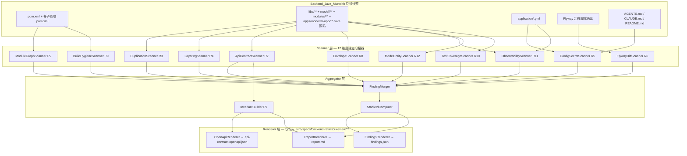

# Design Document — 后端整体重构评审 (backend-refactor-review)

> 配套规格：`.kiro/specs/backend-refactor-review/requirements.md`
> 工作流类型：`requirements-first` / 特性 spec
> 语言：中文
> **本文档设计的是"评审工具链与产物管线"，不是 Backend_Java_Monolith 本身。**
> 任何在本设计中出现的"修改 / 修复 / 替换"动作，目标文件都只允许是
> `.kiro/specs/backend-refactor-review/**`。设计中**严禁**对
> `*.java` / `pom.xml` / `application*.yml` / `*.sql` / `compose.yaml` / `Dockerfile.*`
> 的任何写入路径，本文档同样不规划这类写入。

---

## Overview

### 设计目标

本设计文档定义一个**只读式**的评审工具链（下称 _Audit Toolchain_），由若干扫描器
（_Scanner_）、聚合器（_Aggregator_）和渲染器（_Renderer_）组成，最终产出三份产物：

| 产物             | 路径                                                            | 形态          | 受众             |
| ---------------- | --------------------------------------------------------------- | ------------- | ---------------- |
| 评审报告         | `.kiro/specs/backend-refactor-review/report.md`                 | 中文 Markdown | 人               |
| 机器可读发现清单 | `.kiro/specs/backend-refactor-review/findings.json`             | JSON 数组     | 下游 spec / 工具 |
| API 合约快照     | `.kiro/specs/backend-refactor-review/api-contract.openapi.json` | OpenAPI 3.0.x | 下游合约测试     |

工具链的输入是 Backend_Java_Monolith 范围内 5 个根（`pom.xml` / `libs/**` / `model/**`
/ `modules/**` / `apps/monolith-app/**`）的当前快照；工具链以"读"为唯一访问模式，
由 12 项需求（R1–R12）组成的评审矩阵驱动。

### 设计原则

1. **只读不可变性**：管线中任何一个 Scanner 的"输出根目录"在白名单之外都视为运行时违规，
   立即终止本次评审并以 CRITICAL 级 Finding 写入产物（对应 R1.5）。
2. **可重复性**：相同输入 → 相同 `findings.json`（除时间戳外字节等价）。
   所有 Finding 通过稳定 `id` 算法保证跨机器、跨时间一致（对应 R1.4）。
3. **工具失败可见**：任何工具不可用、超时或崩溃，必须落地为一条 Finding（severity
   不低于 MEDIUM），不得以"工具失败"跳过需求（对应 R3.5、R6.5、R10.5、约束 4）。
4. **维度单一职责**：12 个 Dimension 各自由独立 Scanner 负责，所有 Scanner 输出统一
   `Finding` 对象，由 Aggregator 合并后再交给 Renderer。
5. **关注行为标尺**：API 契约清单与 OpenAPI 导出是后续重构 spec 的**唯一**行为基线，
   故被提升为一等公民并独立成产物（对应 R7）。

### 范围与非范围

- 范围：参见 `requirements.md` Glossary 中 Backend_Java_Monolith 的定义。
- 非范围：参见 `requirements.md` Non-goals。本设计不重复列出。

---

## Architecture

### 顶层数据流



### 运行时拓扑

Audit Toolchain 在评审者本地或 CI runner 上执行，**不部署为常驻服务**。
其执行模型为单次批处理：

1. _预检_（Preflight）：核对 5 个根存在、`mvn -v`、`pmd -v`、`dot -V` 等命令可用；
   输出根目录白名单初始化。
2. _并行扫描_：12 个 Scanner 之间无写入依赖，彼此独立并行。
   仅 `ApiContractScanner`（R7）的"OpenAPI 导出"子步骤需要 Maven 解析依赖树，
   因此与 `BuildHygieneScanner`（R9）共用一次 `mvn dependency:tree` 缓存以节省时间。
3. _聚合_：所有 Scanner 完成后，把各自产生的 Finding 数组喂入 Aggregator；
   StableIdComputer 在此阶段为每条 Finding 计算 `id`。
4. _渲染_：以幂等方式覆盖三份产物文件。渲染前先备份旧产物到内存，
   再原子写入（先写到 `*.tmp` → `os.rename`）。

### 写入边界（关键约束）

任何 Scanner / Aggregator / Renderer 的文件写入操作都必须经过统一的
`SpecWriteGate.write(path, bytes)`。该网关只接受满足以下正则的目标路径：

```
^\.kiro/specs/backend-refactor-review/[A-Za-z0-9._\-]+(\.md|\.json)$
```

任何不匹配的写入请求**抛出异常 + 终止整次评审**，并产出一条 CRITICAL Finding
`process_violation` 对应 R1.5。

---

## Components and Interfaces

下列均为概念性接口（伪代码风格）。具体实现语言不在本设计强制范围内（推荐 Python 3.11
作为编排层、shell out 调用 Maven/PMD/dot 等外部工具）。**全部接口均为只读输入 → 不可变输出**。

### 1. ModuleGraphScanner（R2）

**输入**：reactor 中全部 `pom.xml`（递归发现，排除 `target/**`）。
**输出**：`ModuleDependencyGraph` + 一组 `BoundaryFinding`。

#### 解析与建图

- 用 `xml.etree.ElementTree` 解析每个 `pom.xml`。
- 对每个 POM，提取：
  - 自身坐标 `(groupId, artifactId, packaging)`（缺省 `groupId` 取 `parent/groupId`）。
  - 所属层级标签（由 POM 文件相对路径决定）：
    - `^libs/` → `LIBS`
    - `^model(/|$)` → `MODEL`
    - `^modules/` → `MODULES`
    - `^apps/` → `APPS`
    - 其它 → `ROOT`（仅根 POM）
  - 全部 `<dependency>` 子元素。仅当 `groupId == io.github.shizuki` 时算作内部边；
    第三方依赖不进入图，但保留至 `BuildHygieneScanner` 共享缓存。
- 节点 = `artifactId`；边 = `(from_artifactId → to_artifactId, scope)`。
- `scope` 缺省视为 `compile`。
- 显式记录每条边的 `pom_file` 与"依赖块起止行号"以便回填 `evidence`。

#### 环路检测算法

使用 Tarjan 强连通分量（SCC）：

- 输入：有向图 `G`。
- 步骤：执行 Tarjan，对每个 SCC `C`：
  - 若 `|C| >= 2` → 列出环路 Finding `severity=CRITICAL`。
  - 若 `|C| == 1` 且节点存在自环 → 同样列出 CRITICAL。
- 复杂度 `O(V + E)`，对当前 9 模块规模无任何性能压力。
- 算法实现优先使用 Python 标准库可达性自写实现（< 50 行）；如使用 NetworkX 则固定版本
  `networkx==3.3`。

#### 层级违规规则（R2.4 / R2.5）

记节点 `n` 的层级为 `tier(n) ∈ {LIBS, MODEL, MODULES, APPS, ROOT}`，
定义合法依赖方向（仅列允许的有向边）：

| from \\ to | LIBS | MODEL | MODULES | APPS |
| ---------- | ---- | ----- | ------- | ---- |
| LIBS       | ✅   | ❌    | ❌      | ❌   |
| MODEL      | ✅   | ✅    | ❌      | ❌   |
| MODULES    | ✅   | ✅    | ⚠ 见下  | ❌   |
| APPS       | ✅   | ✅    | ✅      | ❌   |

- ❌ 处任意一条 `compile` 边 → `BoundaryFinding`，severity = HIGH。
- `MODULES → MODULES` 边：
  - 若 `scope ∈ {test}` → INFO，不报 Finding。
  - 若 `scope ∈ {compile, runtime}` → BoundaryFinding，severity = HIGH，
    `proposed_action` 必须列出"下沉至 `libs/common-*`" 与"上移至 `apps/monolith-app`
    装配层"两条互斥候选路径（对应 R2.5）。

#### API 类型 / 内部类型比

对每个 `modules/<m>` 模块：

- _API 类型_：`<m>/src/main/java/**` 下任意位置同时满足
  - 类被声明为 `public`；
  - 包路径包含一段 `api`、`client`、`facade`、`dto`、`event` 之一；
- _内部类型_：模块下其它 `public` 类。
- 比值 `api_ratio = |API_types| / max(|Internal_types|, 1)`；
- 若 `api_ratio < 0.05` → 在报告对应章节标注"过度内聚但接口稀薄"，**不直接报 Finding**
  （R2.6 仅要求标注，不要求 severity）。

#### Mermaid + DOT 渲染

- 渲染两种文本：
  - Mermaid `flowchart TD`，节点按 tier 分 subgraph，边颜色按 scope 编码
    （`compile` 实线、`runtime` 虚线、`test` 灰色虚线）。
  - DOT 文本：作为附录代码块插入 `report.md`，命名 `module-graph.dot`。
- 不再额外生成图片二进制文件（避免对仓库写入二进制）。
- 若安装了 `dot`（Graphviz）`>= 2.49`，可在评审者本地 `dot -Tsvg` 自行渲染，
  设计中不强制。

#### 接口

```pseudo
ModuleGraph = ModuleGraphScanner.run(reactor_root: Path) -> ModuleDependencyGraph
findings: List[Finding] = ModuleGraphScanner.detect_violations(graph)
mermaid_text: str = ModuleGraphRenderer.to_mermaid(graph)
dot_text: str = ModuleGraphRenderer.to_dot(graph)
```

### 2. DuplicationScanner（R3）

**主工具**：PMD CPD `7.7.0`（`pmd-cpd` 子命令）；**备用工具**：jscpd `4.0.5`。

#### 配置

- 命令行（主路径，PMD CPD）：

  ```bash
  pmd-cpd \
    --minimum-tokens 50 \
    --language java \
    --format xml \
    --files libs/ model/ modules/ apps/monolith-app/ \
    --skip-lexical-errors \
    --no-fail-on-violation
  ```

- 后处理：
  - 解析 XML，得到 `DuplicationBlock` 列表。每块含 `tokens`、N 个 `occurrence(file, line_start, line_end)`。
  - **跨模块**判定：把每个 `file` 路径映射到所属模块（`libs/<m>` / `model/<m>` /
    `modules/<m>` / `apps/monolith-app`）。当一个 `DuplicationBlock` 的 occurrence
    覆盖 ≥ 2 个不同模块时即满足"跨模块重复"要求。
  - **相似度计算**：CPD 默认按 token 等价输出 100% 一致片段。为获得 R3 要求的
    `SimilarityScore >= 70` 语义，DuplicationScanner 在 100% CPD 命中之上，
    再用 `difflib.SequenceMatcher.ratio() * 100` 在每对 occurrence 的源代码片段上计算
    "字符级相似度"，作为 `SimilarityScore`；
    100% token 等价的 CPD 命中会得到 `SimilarityScore = 100`。
  - 阈值过滤：`tokens >= 50 AND SimilarityScore >= 70`。
- 失败回退（jscpd 备用）：
  - 若 PMD CPD 退出码非 0 或解析失败，DuplicationScanner 写入一条 MEDIUM Finding
    `cpd_unavailable` 并立刻执行：

    ```bash
    npx jscpd@4.0.5 \
      --min-tokens 50 \
      --threshold 30 \
      --reporters json \
      --output .kiro/specs/backend-refactor-review/.tmp/jscpd \
      libs model modules apps/monolith-app
    ```

  - jscpd 输出后，按相同 `SimilarityScore` 策略再过滤一次。

- 若两套工具都失败 → 单条 HIGH Finding `duplication_tooling_failed` 写入产物，
  且 R3.4 的 Top 30 表标注"未能采集"，**仍不得跳过本需求**（R3.5）。

#### 提议归并目标 (`proposed_extraction_target`)

按以下决策树（取第一条命中）：

1. 若所有 occurrence 都位于工具/校验/拦截/异常/响应包装类（包名匹配
   `(?i)(filter|interceptor|exception|advice|validator|response|envelope)`）→
   `libs/common-servlet`。
2. 若存在 occurrence 涉及外部集成（`(?i)(client|integration|kafka|redis|s3|http)`）
   → `libs/common-integration`。
3. 若 occurrence 都在 `*Util*` / `*Helper*` / `*Constants*` → `libs/common-core`。
4. 若 occurrence 涉及 entity / request / response 共享 POJO → `model/<匹配子目录>`。
5. 否则 → `保留就地`，并在 `proposed_action` 注明"语义差异未达抽取阈值"。

特例（R3.3）：当不同模块下出现**同名启动校验类**（如 `SecretStartupValidator`），
直接折叠为一条 ConsolidationFinding，`severity=HIGH`，
`proposed_extraction_target=libs/common-servlet`。

#### 接口

```pseudo
duplications: List[DuplicationFinding] = DuplicationScanner.run()
top30: Markdown = DuplicationScanner.render_top30_table(duplications)
```

### 3. LayeringScanner（R4）

**解析器**：JavaParser CLI（`java-parser-3.26.0`）或 Python `javalang==0.13.0`。
首选 `javalang`（无 JVM 启动成本，足以提取注解 + 类型简单名 + 包路径）。

#### 类型分类规则（命中顺序固定）

按 R4 要求"注解 → 后缀 → 包段"的优先级，逐条尝试：

| 优先级 | 规则                                                         | 分类                     |
| ------ | ------------------------------------------------------------ | ------------------------ |
| 1      | 类被 `@RestController` / `@Controller` 注解                  | `controller`             |
| 1      | 类被 `@Service` 注解 + 类型为 `interface`                    | `service-interface`      |
| 1      | 类被 `@Service` 注解 + 类型为 `class`                        | `service-impl`           |
| 1      | 类被 `@Mapper`（MyBatis）注解                                | `mapper`                 |
| 1      | 类被 `@Repository` 注解                                      | `mapper`（按本项目约定） |
| 1      | 类被 `@Configuration` / `@ConfigurationProperties` 注解      | `config`                 |
| 1      | 类被 `@Component` 注解 + 类名匹配 `.*Filter\|.*Interceptor`  | `support`                |
| 2      | 类名以 `Controller` 结尾                                     | `controller`             |
| 2      | 类名以 `Service` 结尾 + 是 interface                         | `service-interface`      |
| 2      | 类名以 `ServiceImpl` 结尾                                    | `service-impl`           |
| 2      | 类名以 `Mapper` 结尾                                         | `mapper`                 |
| 2      | 类名以 `Task` / `Job` 结尾                                   | `task`                   |
| 2      | 类名以 `Listener` / `Producer` / `Consumer` 结尾             | `mq`                     |
| 2      | 类名以 `Client` / `Handler`（在 integration 包下）结尾       | `integration`            |
| 3      | 包路径段 `controller`                                        | `controller`             |
| 3      | 包路径段 `service`                                           | `service-impl`           |
| 3      | 包路径段 `mapper` / `dao`                                    | `mapper`                 |
| 3      | 包路径段 `config`                                            | `config`                 |
| 3      | 包路径段 `task` / `job`                                      | `task`                   |
| 3      | 包路径段 `mq` / `messaging`                                  | `mq`                     |
| 3      | 包路径段 `util` / `utils` / `helper`                         | `util`                   |
| 3      | 包路径段 `model` / `entity` / `dto` / `request` / `response` | `model`                  |
| 4      | 兜底                                                         | `support`                |

#### 冲突检测（R4.2）

定义"冲突"为：分类决策中**优先级 1（注解）** 与**优先级 3（包段）** 给出不同标签，
或包段同时包含两个互斥语义段（如同时含 `controller` 和 `service`）。

每个冲突类型生成一条 LayeringFinding，`severity=MEDIUM`，
`evidence.symbol = <FQN>`，`proposed_action` 给出"按注解迁移包" 与
"按包迁移注解"两个候选。

#### 命名一致性（R4.3）

读取每个子模块 `pom.xml`，对比目录名 `<dir>` 与 `<artifactId>`：

- 若不等 → NamingFinding，`severity=LOW`，`proposed_action` 给出
  - "重命名目录使其与 `artifactId` 一致" 与
  - "保留目录名，更新 `CLAUDE.md` 等文档" 两条互斥候选。

#### 文档漂移（R4.4）

读取根目录下 `CLAUDE.md`、`README.md`、`AGENTS.md`、`HELP.md`，提取关键词
（"微服务"/"microservice"、"单体"/"monolith"），与 `apps/monolith-app/pom.xml` 是否
为可执行 Spring Boot 应用比较。当文档主张为微服务、而实际仅有单体装配时 →
DocumentationDriftFinding，`severity=LOW`。

#### 三元一致率（R4.5）

```
trinity_rate = #{type | annotation_class == suffix_class == package_class} / total_types
```

将该指标写入报告"分层一致性"小节。

### 4. ConfigSecretScanner（R5）

**输入**：`apps/monolith-app/src/main/resources/application*.yml`、`AGENTS.md`、
`README.md`、根目录 `compose.yaml`（仅读 env 段，不修改）。
**输出**：`EnvVarInventory` + `SecretFinding[]` + `ConsolidationFinding[]`。

#### 占位符抽取

- YAML 解析使用 `ruamel.yaml==0.18.6`（保留行号 / 列号信息以填回 `evidence.line_range`）。
- 对每个标量值，匹配正则 `\$\{([^:}]+)(?::([^}]*))?\}`：
  - `group(1)` = 环境变量 key；
  - `group(2)` = 默认值（可空）。
- 同一 key 在多个文件出现时，合并 `referenced_files` 列表，**保留每一处的 default**
  （差异时 default 字段填 `<<conflicting>>` 并加 MEDIUM Finding `env_default_conflict`）。

```json
{
  "key": "DB_PASSWORD",
  "default_value": "postgres",
  "referenced_files": [
    {
      "path": "apps/monolith-app/src/main/resources/application.yml",
      "line": 42
    }
  ]
}
```

#### 密钥检测规则

对 `EnvVarInventory` 与 `AGENTS.md` 的明文文本各自执行：

| 规则 ID                         | 触发条件                                                                                                                                                       | severity                       |
| ------------------------------- | -------------------------------------------------------------------------------------------------------------------------------------------------------------- | ------------------------------ |
| `S-DEFAULT-PASSWORD`            | YAML 占位符 key 名称匹配 `(?i)(password\|passwd\|secret\|token\|apikey\|api_key\|access_key\|private_key)` 且默认值非空、非 `${random.*}`、非 `change-me` 占位 | CRITICAL                       |
| `S-RANDOM-FALLBACK`             | 默认值为 `${random.uuid}` 或 `${random.value}`                                                                                                                 | HIGH（暗示生产可能裸跑随机值） |
| `S-PLAINTEXT-CREDENTIAL-IN-DOC` | 受版本控制的 `*.md` 行匹配 `(?i)password.{0,20}[:：=]\s*\S+` 且字符串熵 ≥ 3.5                                                                                  | CRITICAL                       |
| `S-HOST-IP-LITERAL`             | 受版本控制的文档出现形如 `\d{1,3}(\.\d{1,3}){3}` 且伴随 ssh / root / scp 关键词                                                                                | HIGH                           |

特别地，`AGENTS.md` 中已观测到的"服务器明文密码"行 → 必报 `S-PLAINTEXT-CREDENTIAL-IN-DOC`，
`proposed_action` 中文文本必须包含两条原文级指令：

1. 立即在密钥管理系统（KMS / Bitwarden / Vault）轮换该凭据；
2. 用 `git filter-repo` 或 `BFG Repo-Cleaner` 从历史中清除（命令仅写在
   `proposed_action` 字符串里，**Audit Toolchain 自身绝不执行**）。

> 重要：扫描器在写入 `findings.json` 时，对命中 `S-PLAINTEXT-CREDENTIAL-IN-DOC`
> 与 `S-DEFAULT-PASSWORD` 的 `evidence` 字段进行**值脱敏**：保留 `file_path` /
> `line_range` / `symbol`，但不在 `findings.json` 中复刻明文密码字符串。
> 这是为了避免产物本身成为新的泄露源。

#### \*Properties 归并（R5.4）

LayeringScanner 已识别出全部 `@ConfigurationProperties(prefix=...)` 的类。
ConfigSecretScanner 在此结果上：

- 按 `prefix` 字段 group by；
- 当同一 `prefix` 出现 ≥ 2 个 `*Properties` 类（不同模块） → ConsolidationFinding，
  `severity=MEDIUM`，`proposed_action` 给出"合并到 `libs/common-*`"或"按子前缀拆分"
  两个候选。

#### 强制环境变量列表（R5.5）

对 EnvVarInventory：默认值为空且未在 `application-*.yml` 中以 profile 形式提供时，
该变量进入"启动时缺失即失败"列表，列在报告附录"必需环境变量"小节，并标注
"failure_mode = boot-fail-fast"。

### 5. FlywayDiffScanner（R6）

**输入**：`modules/<domain>-module/src/main/resources/db/migration/`（域级脚本）
与 `apps/monolith-app/src/main/resources/monolith/db/migration-pg/`（单体装配脚本）。
**还需要扫描**旧路径 `apps/monolith-app/src/main/resources/monolith/db/migration/`
（MySQL 历史路径）。

#### 解析策略

- SQL 解析器：`sqlglot==25.20.0`，方言按目录路径决定：
  - `migration-pg/` → `postgres`
  - `migration/`（旧路径）→ `mysql`
  - `modules/<x>/db/migration/` → 优先 `postgres`，解析失败回退 `mysql`。
- 抽取每个脚本里的 `CREATE TABLE` / `ALTER TABLE` / `CREATE INDEX` 语句，归约为
  最终 schema 模型（每张表的列集合 + 主键 + 索引集合 + 字段类型）。
- 不执行 SQL，仅静态解析。

#### SchemaDiffMatrix 生成

对每个域 `domain ∈ {user, content, media, ai}`：

- `module_schema = fold(modules/<domain>-module/db/migration/*.sql)`
- `monolith_schema = fold(apps/monolith-app/.../monolith/db/migration-pg/*.sql)`
- 对两者求 _表对齐_（按 `table_name` 大小写不敏感比对），逐表算：
  - `column_diff_count = |sym_diff(columns)|`
  - `index_diff_count = |sym_diff(indexes)|`
  - `first_diverging_version = min(version(s) where diff first appears)`

输出表如下：

| domain | module_path | monolith_path | column_diff_count | index_diff_count | first_diverging_version |
| ------ | ----------- | ------------- | ----------------- | ---------------- | ----------------------- |

任何 `column_diff_count > 0 OR index_diff_count > 0` → SchemaDriftFinding，
`severity=HIGH`。

#### 仅追加版本号约束（R6.4）

`proposed_action` 文案必须严格包含中文短语 **"以追加新版本号 V_xxx 的方式修复，
禁止改写已发布版本号"**。设计层面通过 Renderer 对该字段做模式校验：
若 `dimension == schema` 且 `proposed_action` 不含上述关键短语 → 渲染失败终止评审。

#### 双轨决策（R6.3）

当旧路径 `migration/` 存在且与 `migration-pg/` 重叠：

- 默认建议：`proposed_action` 给出**两条互斥候选**：
  1. "删除旧 MySQL 路径 + 在 PG 路径标注 baseline（`flyway_schema_history.installed_rank`
     的 baseline 选项）"；
  2. "保留双轨 + 在 `application.yml` 中以 profile 区分 `flyway.locations`，并加 lock"。
- 仅描述、不执行。

#### 解析失败处理（R6.5）

每个无法解析的 `.sql` 文件单独产生一条 `severity=MEDIUM` 的 SchemaToolFinding，
`evidence.symbol` 取文件名，`evidence.line_range` 取 `[1, max_line]`。

### 6. ApiContractScanner（R7）—— 一等公民

**输入**：`modules/**` 与 `apps/monolith-app/**` 全部 Java 源码。

#### 控制器扫描

使用 `javalang` AST：

- 收集所有类满足 `@RestController` 或 `(@Controller AND @ResponseBody)` 的注解。
- 对每个公开方法（`public`），抽取：
  - HTTP 方法：`@GetMapping` / `@PostMapping` / `@PutMapping` / `@PatchMapping` /
    `@DeleteMapping`；以及 `@RequestMapping(method=...)` 显式列出。
  - 路径：合并类级 `@RequestMapping` 与方法级 mapping 的 path（前缀 + 后缀拼接，
    `/` 规范化）。
  - 入参：参数中带 `@RequestBody` / `@RequestParam` / `@PathVariable` / `@RequestHeader`
    的形参，连同其类型简名进入 `request_schema`（详见 Data Models）。
  - 返回类型：方法签名上的返回类型，区分泛型：`ApiResponse<X>` / `PageResponse<X>` /
    `ResponseEntity<X>` / `X`。
  - 权限注解：`@RequirePermission` / `@RequireGroup` / `@RequireAdminPrivilege`
    （sa-token 相关也兜底匹配 `@SaCheckLogin` / `@SaCheckPermission`）。
  - 限流注解：`@RateLimit` / `@RateLimiter`（如存在）。
- 输出 `ApiContractInventory`：每条端点为一行（详见 Data Models）。

#### OpenAPI 导出策略

提供两条互斥路径，按优先级取首个可行项：

1. **优先**：springdoc-openapi CLI（`springdoc-openapi-cli==1.8.0`），方式如下：

   ```bash
   mvn -B -pl apps/monolith-app -am -DskipTests \
       -Dorg.springdoc.profile=audit \
       -Dspring.config.location=.kiro/tools/audit-app.yml \
       package
   java -jar .kiro/tools/springdoc-openapi-cli.jar \
       --apiDocsUrl=http://localhost:8898/v3/api-docs \
       --outputDir=.kiro/specs/backend-refactor-review/ \
       --outputFileName=api-contract.openapi.json \
       --skipTlsVerify
   ```

   - 启动配置 `audit-app.yml` 放在 `.kiro/tools/` 下，**不进入 `apps/monolith-app/src/main/resources/`**；
     通过 `-Dspring.config.location` 让单体读取它，从而满足 R10.2 / R5 边界。
   - 该启动只暴露 `/v3/api-docs`，不开任何业务流量端口（端口 `8898` 仅本机回环）。
   - 导出后立即关闭 Spring 进程。

2. **回退**：Audit Toolchain 自带的"AST → OpenAPI"静态生成器：
   - 若步骤 1 任一阶段失败（包括 Spring 启动失败、`-Dspring.config.location` 路径不可用、
     端口冲突），ApiContractScanner 切换到静态生成，从 `ApiContractInventory`
     直接生成 OpenAPI 3.0.3 文档。
   - 静态路径不解析复杂泛型/继承，但保证 `(path, method)` 完整覆盖；
     在 `info.x-audit-fallback` 字段写入 `true` 让下游可识别。
   - 同步落一条 MEDIUM Finding `openapi_export_fallback`，
     `behavior_impact = "OpenAPI 字段精度可能降低；不影响行为不变量验证"`。

#### 四个不变量（R7.4）

下文 _Correctness Properties_ 章节会以"For all"形式正式登记。本节描述等价定义：

- **Schema 等价定义**（用于 Property 2 / 3 / 4）：
  对两个 JSON Schema `S1`, `S2`，定义 `equiv(S1, S2)` 当且仅当：
  1. `field_name_set(S1) == field_name_set(S2)`（字段名集合，深递归到对象嵌套），
  2. `field_type_set(S1) == field_type_set(S2)`（按 OpenAPI 原生类型 + `format` 元组），
  3. `required_set(S1) == required_set(S2)`，
  4. 对数组字段，`items` 满足同样的递归 `equiv`。
- **路径 + 方法等价**：把每个端点表示为 `(method, normalized_path)`，
  `normalized_path` 把 `{xxx}` 占位符全部替换成 `{p}` 以消除参数命名差异。
- **错误响应等价**：`application/problem+json` 在 OpenAPI 中体现为
  `responses.4xx.content.application/problem+json.schema`，比对其 `equiv` 即可。

#### 未授权端点（R7.5）

判定算法：

- 端点 e 的 `required_permissions` 为空集；
- e 的 `path` 不属于配置文件 `shizuki.gateway.auth.public-paths`、
  `shizuki.gateway.auth.guest-paths` 任一通配符匹配；
  → ContractFinding，`severity=HIGH`。

### 7. EnvelopeScanner（R8）

复用 ApiContractScanner 的方法签名抽取结果：

- 把每个端点的返回类型映射到 4 个桶：`ApiResponse<T>` / `PageResponse<T>` /
  `ResponseEntity<T>` / `raw object`。
- `wrap_rate = (#ApiResponse + #PageResponse) / total_endpoints`。
- 对 `ResponseEntity<T>`：再静态分析方法体，只要方法体内存在 `ApiResponse` 字面构造或
  调用形如 `ResponseEntity.ok(ApiResponse.success(...))` → 视为已包装，
  否则报 ContractFinding。
- `@ExceptionHandler` 检查：把 `@ExceptionHandler` 方法的返回类型按 RFC 7807 字段
  `{type, title, status, detail}` 静态匹配，缺一字段即 ErrorContractFinding。

### 8. BuildHygieneScanner（R9）

#### 命令

```bash
# 在 reactor root 执行；缓存复用给 ApiContractScanner（步骤 1）
mvn -B -DskipTests dependency:tree -Doutput=.kiro/specs/backend-refactor-review/.tmp/dep-tree.txt
mvn -B -DskipTests dependency:analyze -DignoreNonCompile=true | tee .kiro/specs/backend-refactor-review/.tmp/dep-analyze.txt
```

- 解析输出文本（`dependency:tree` 输出每行形如 `[INFO] +- groupId:artifactId:type:version:scope`）。
- 合并所有模块得到 `DependencyMatrix(groupId:artifactId → set<version>)`。

#### 版本漂移（R9.2）

- 若 `|set<version>| >= 2` → VersionDriftFinding，`severity=HIGH`，
  `evidence.symbol = "<groupId>:<artifactId>"`。

#### 未使用依赖（R9.3）

- 解析 `dependency:analyze` 段落 `Unused declared dependencies found`，每条转为
  UnusedDependencyFinding，`severity=LOW`。

#### 仓库内构建产物 / 本地仓库（R9.4）

- 用 `git ls-files` 列出受版本控制的文件，匹配下列 glob，每项一条 HygieneFinding：

  | glob                                        | 建议 `.gitignore` 规则                |
  | ------------------------------------------- | ------------------------------------- |
  | `**/target/**`                              | `**/target/`                          |
  | `modules/content-module/.mvn/repository/**` | `modules/**/.mvn/repository/`         |
  | `%BASE_WIN%/.venv-cpu/**`                   | `%BASE_WIN%/`（更激进可加 `.venv*/`） |

#### BOM 升级判定（R9.5）

- 输出表：每个版本占位符（`spring-boot.version` 等）vs 各子模块解析结果。
- 判定枚举 `BomVerdict`：
  - `KEEP_AS_IS`：所有子模块解析版本与占位符相等且无新版可用；
  - `UPGRADE_TO_BOM`：存在 ≥ 2 个第三方依赖各自版本独立声明，可纳入同一 BOM 管理；
  - `BOM_OK_BUT_OUTDATED`：当前已用 BOM 但最新稳定版高出 ≥ 2 个 minor；
  - `INCONSISTENT_OVERRIDE`：子模块对占位符做了局部覆盖。
- 把判定结果写入报告"构建卫生"章节，对前两个枚举级别附 `proposed_action`。

### 9. TestCoverageScanner（R10）—— 不修改 reactor pom.xml

#### 命令（必须不写 reactor pom.xml）

JaCoCo 启用通过**两层策略**实现：

1. **首选**：构建期注入 JVM agent，不修改任何 POM。

   ```bash
   mvn -B test \
       "-Dargline=-javaagent:.kiro/tools/jacocoagent.jar=destfile=.kiro/specs/backend-refactor-review/.tmp/jacoco.exec,append=true" \
       -Dorg.jacoco.report.skip=false
   ```

   - `jacocoagent.jar` 来自 jacoco `0.8.12` 发行包；放置在 `.kiro/tools/`（评审者本地缓存目录），
     **不进入 reactor**。
   - `argline` 注入到每个 surefire-fork JVM。这一切均通过 CLI 系统属性传入，**不修改
     `apps/monolith-app/pom.xml` 或任何子模块 POM**（对应 R10.2 与约束 1）。

2. **次选**（首选失败时）：使用本地 profile 文件。
   - 在 `.kiro/tools/` 下放 `audit-coverage.profile.xml`（不是 reactor 的一部分）。
   - 调用：

     ```bash
     mvn -B -s .kiro/tools/audit-coverage.profile.xml test
     ```

   - 注意：Maven `-s` 是 settings.xml 路径，profile 仅影响插件链；profile 内通过
     `<argLine>` 同样注入 jacoco agent，从而避免修改任何 POM。

#### 报告生成

- `mvn` 完成后调 `java -jar .kiro/tools/jacococli.jar report`：

  ```bash
  java -jar .kiro/tools/jacococli.jar report \
      .kiro/specs/backend-refactor-review/.tmp/jacoco.exec \
      --classfiles libs/common-core/target/classes \
      --classfiles libs/common-servlet/target/classes \
      --classfiles libs/common-integration/target/classes \
      --classfiles model/target/classes \
      --classfiles modules/user-module/target/classes \
      --classfiles modules/content-module/target/classes \
      --classfiles modules/media-module/target/classes \
      --classfiles modules/ai-module/target/classes \
      --classfiles apps/monolith-app/target/classes \
      --xml .kiro/specs/backend-refactor-review/.tmp/jacoco.xml
  ```

- 解析 `jacoco.xml`，按模块汇总 `line_coverage_pct` / `branch_coverage_pct` /
  `method_coverage_pct`。
- 若任何模块 `target/classes` 不存在（test 阶段未编译） → 用 `mvn -B -pl <m> -am test-compile`
  提前补一次 class 文件；仍失败则跳过该模块并写入 `severity=MEDIUM` Finding
  `coverage_classfile_missing`。

#### 阈值与门槛建议（R10.3 / R10.4）

- 行覆盖率 `< 30%` 或 `tests_run == 0` → CoverageGapFinding，`severity=MEDIUM`。
- 报告"建议门槛"列：
  - `apps/monolith-app` 与 `modules/*-module` → 行 `>= 60%`、分支 `>= 40%`；
  - `libs/*` → 行 `>= 50%`、分支 `>= 30%`；
  - `model/*` → 行 `>= 30%`、分支 `>= 10%`（多为 POJO）。
- 文案明确"建议非强制"。

#### 测试失败处理（R10.5）

- `mvn test` 全失败时，TestCoverageScanner 必须仍尝试解析 `target/surefire-reports`
  下已生成的部分 XML，提取已运行用例。
- 全无 surefire 输出 → 单条 `severity=MEDIUM` 的 TestEnvFinding，
  `proposed_action` 列出 3 类典型修复路径：
  1. testcontainers 不可用：建议在 CI 上启用 docker socket 或回退到 H2；
  2. Flyway 版本冲突：建议在评审本地 profile 中固定 `flyway.version`；
  3. 依赖缺失：建议在评审前执行 `mvn -B dependency:go-offline`。

### 10. ObservabilityScanner（R11）

- 入站接入点：扫描全部
  - 实现 `Filter` / `OncePerRequestFilter` 的类；
  - `@KafkaListener` / `@RabbitListener` 注解的方法；
  - `@Scheduled` 注解的方法；
  - 实现 `MessageListener` 的类。
- 与 `TraceIdFilter` / `RequestIdFilter` 的关联判定：
  - 对 HTTP 入口：判断同一 Filter 链中是否存在上述两个 Filter（按 `@Order` 与
    Spring 配置类的 `addFilterBefore` / `addFilterAfter` 静态分析）；
  - 对 Kafka / 定时任务：检查方法第一行是否调用 `MDC.put` 或
    `TraceContext.beginSpan` 这类约定；缺则进入 `TraceCoverageTable` 的
    `coverage = MISSING` 行。
- 写入端点 `@AuditLog` 检查：任何 `POST/PUT/PATCH/DELETE` 端点，
  缺 `@AuditLog` 且不在 `public-paths` → ObservabilityFinding，`severity=MEDIUM`。
- 日志密度：用 `git ls-files | xargs grep -E 'LoggerFactory\.getLogger|log\.(info|warn|error|debug)'`
  统计每模块 `log_calls`；用 `cloc`（或自写 LOC 计数器）统计每模块 `kloc`，得
  `log_density = log_calls / kloc`。
- 生产 `logging.level` 检查：解析 YAML，若键
  `logging.level.io.github.shizuki` 在生产 profile 下为 `DEBUG` / `TRACE` →
  ObservabilityFinding，`severity=MEDIUM`。

### 11. ModelEntityScanner（R12）

- 输入：`model/entity/src/main/java/io/github/shizuki/site/{ai,content,media,user}/entity/**`。
- 第一步：扫描每个 entity，抽取 `import` 语句中以
  `io.github.shizuki.site.{ai,content,media,user}.entity.` 开头的条目。
  当其域 ≠ 当前类所在域 → `EntityCrossDomainImportTable` 一行 +
  BoundaryFinding，`severity` 至少 HIGH（跨域引用直接破坏边界）。
- 第二步：与 `modules/<m>-module/src/main/java/**` 中类的简单类名做集合相等比较；
  命中 → ConsolidationFinding，`severity=MEDIUM`，附字段差异摘要。
- 第三步：拆分 vs 单 jar 决策矩阵（R12.3）。固定五维输出：

  | 维度                    | 拆分为 3 个子模块 | 保留单 jar + 强约束包结构 |
  | ----------------------- | ----------------- | ------------------------- |
  | 受影响文件数            |                   |                           |
  | 构建耗时变化            |                   |                           |
  | 依赖隔离强度            |                   |                           |
  | 对 modules 调用方破坏性 |                   |                           |
  | 推荐度                  |                   |                           |

  推荐方案与理由由扫描器静态产出（基于跨域引用数量、当前 build-helper 配置复杂度），
  写入报告章节 12。

---

## Data Models

下列数据结构以 JSON Schema 风格描述。它们是**产物中可见的字段**与
**Scanner 之间共享的内存结构**。所有 schema 都通过 Aggregator 统一序列化。

### Finding（核心实体）

```json
{
  "id": "string (12 char lowercase hex)",
  "dimension": "boundary | duplication | layering | naming | config | secret | schema | api_contract | build | test | observability | error_contract",
  "severity": "CRITICAL | HIGH | MEDIUM | LOW",
  "evidence": {
    "file_path": "string (POSIX, repo-relative)",
    "line_range": [123, 145],
    "symbol": "string (FQN / artifactId / file:lineRange / null)"
  },
  "proposed_action": "string (中文)",
  "behavior_impact": "string (中文，标注是否会改变对外 API)"
}
```

字段约束：

- `dimension`：12 个枚举值与需求维度一一对应。
- `evidence.line_range`：`[start, end]`，含端点；不可考的全文件级 Finding 取
  `[1, file_total_lines]`；纯逻辑性 Finding 取 `[0, 0]`。
- `evidence.symbol`：缺省按以下退化顺序填值：
  1. 类的全限定名（FQN）；
  2. Maven 坐标 `groupId:artifactId`；
  3. `<file_basename>:<line_start>-<line_end>`；
  4. 仍缺失 → 字面量字符串 `"<unresolved>"`，由 StableIdComputer 取空字符串参与哈希。

#### 稳定 ID 算法

```
id = sha1_hex(
    dimension
    + "|"
    + (evidence.file_path or "")
    + "|"
    + (evidence.symbol or "")
)[0:12].lower()
```

- 实现：Python `hashlib.sha1(s.encode("utf-8")).hexdigest()[:12]`。
- 当 `symbol` 缺失（fallback 链都失败）时，参与哈希的字段为空字符串。
  此时 `findings.json` 的 `evidence.symbol` 字段写为 `null`，但 ID 计算仍成立。
- 同一 Finding 在不同评审次次运行中保持稳定的前提：file_path 与 symbol 都未变。
- 撞车（不同 Finding 同 ID）概率 `< 2^-48`；
  若发生 → Aggregator 在第二条 Finding 的 `evidence.symbol` 后追加 `"#dup-<n>"`
  让二者重新可辨。

### ModuleDependencyGraph

```json
{
  "nodes": [
    {
      "artifact_id": "common-core",
      "group_id": "io.github.shizuki",
      "tier": "LIBS | MODEL | MODULES | APPS | ROOT",
      "pom_path": "libs/common-core/pom.xml"
    }
  ],
  "edges": [
    {
      "from": "media-service",
      "to": "user-service",
      "scope": "compile | runtime | test",
      "declared_in": "modules/media-module/pom.xml",
      "line_range": [45, 49]
    }
  ],
  "cycles": [["media-service", "user-service", "media-service"]],
  "tier_violations": [
    /* edges that violate the tier matrix */
  ],
  "api_ratios": [
    {
      "artifact_id": "user-service",
      "api_types": 12,
      "internal_types": 87,
      "ratio": 0.138
    }
  ]
}
```

### DuplicationFinding（特化）

```json
{
  "tokens": 73,
  "similarity_score": 92,
  "occurrences": [
    {
      "file_path": "modules/user-module/.../config/SecretStartupValidator.java",
      "line_range": [11, 58]
    },
    {
      "file_path": "modules/media-module/.../config/SecretStartupValidator.java",
      "line_range": [11, 58]
    }
  ],
  "proposed_extraction_target": "libs/common-servlet | libs/common-core | libs/common-integration | model/<sub> | 保留就地"
}
```

### ApiContractInventory

```json
[
  {
    "controller_class": "io.github.shizuki.site.user.api.UserController",
    "http_method": "POST",
    "path": "/users",
    "request_schema": {
      "type": "object",
      "fields": [{ "name": "username", "type": "string", "required": true }]
    },
    "response_schema": {
      "wrapper": "ApiResponse",
      "payload_type": "UserResponse",
      "fields": [
        { "name": "id", "type": "integer", "format": "int64", "required": true }
      ]
    },
    "error_envelope": "application/problem+json",
    "required_permissions": ["user:create"],
    "rate_limit": null,
    "idempotent": false,
    "evidence": {
      "file_path": "modules/user-module/.../UserController.java",
      "line_range": [42, 71]
    }
  }
]
```

### EnvVarInventory

```json
[
  {
    "key": "DB_PASSWORD",
    "default_value": "<<redacted>>",
    "is_secret": true,
    "referenced_files": [
      {
        "file_path": "apps/monolith-app/src/main/resources/application.yml",
        "line": 42
      }
    ],
    "boot_required_if_missing": true
  }
]
```

### SchemaDiffMatrix

```json
[
  {
    "domain": "user",
    "module_path": "modules/user-module/src/main/resources/db/migration",
    "monolith_path": "apps/monolith-app/src/main/resources/monolith/db/migration-pg",
    "column_diff_count": 3,
    "index_diff_count": 1,
    "first_diverging_version": "V1.2"
  }
]
```

### TraceCoverageTable

```json
[
  {
    "entrypoint_kind": "http | kafka | scheduled | mq-listener",
    "symbol": "io.github.shizuki.site.media.api.MediaController",
    "trace_filter_present": true,
    "request_id_filter_present": false,
    "coverage": "FULL | PARTIAL | MISSING"
  }
]
```

### DependencyMatrix（R9）

```json
{
  "groupId:artifactId": {
    "versions": ["3.2.12", "3.3.4"],
    "declared_in": [
      { "module": "apps/monolith-app", "scope": "compile" },
      { "module": "modules/ai-module", "scope": "compile" }
    ]
  }
}
```

### EntityCrossDomainImportTable（R12）

```json
[
  {
    "source_fqn": "io.github.shizuki.site.media.entity.MediaAsset",
    "source_domain": "media",
    "target_fqn": "io.github.shizuki.site.user.entity.User",
    "target_domain": "user",
    "file_path": "model/entity/src/main/java/io/github/shizuki/site/media/entity/MediaAsset.java",
    "line_no": 13
  }
]
```

---

> 至此完成 Overview → Architecture → Components and Interfaces → Data Models 四个章节。
> 下一节进入 Correctness Properties；先用 prework 工具对全部 12 个需求做可测试性分类。

---

## Correctness Properties

> _性质（Property）是指一段在系统所有合法执行下都成立的普适命题；它把人类可读的需求
> 翻译成可由机器验证的不变量。下列性质是 Audit Toolchain 自身的"自证清白"集，
> 用于保证：在评审者操作正确、外部工具可用的前提下，工具链一定不破坏 reactor、
> 一定按需求矩阵产出 Finding、产物在不同机器上字节稳定。它们不替代由 R7 登记给
> 下游重构 spec 的"行为不变量"——后者另列于 §P-DOWNSTREAM-INVARIANTS。_

### Property 1：Audit Toolchain 写入边界 (P-WRITE-BOUNDARY)

_For all_ Scanner / Aggregator / Renderer 发起的 `SpecWriteGate.write(path, bytes)`
调用，写入成功 _当且仅当_ `path` 匹配正则
`^\.kiro/specs/backend-refactor-review/[A-Za-z0-9._\-]+(\.md|\.json)$`；
任意不匹配的写入请求都使整次评审终止并恰好产出一条 `dimension=process_violation`、
`severity=CRITICAL` 的 Finding。

**Validates: Requirements 1.1, 1.5**

### Property 2：Finding 序列化的 schema 完备性 (P-FINDING-SCHEMA)

_For all_ 由任意 Scanner 输出、经 Aggregator 合并的 Finding 对象 `f`，
`findings.json` 中的 `f` 都同时包含 `id`、`dimension`、`severity`、`evidence`、
`proposed_action`、`behavior_impact` 六个字段，且
`f.dimension ∈ {boundary, duplication, layering, naming, config, secret, schema,
api_contract, build, test, observability, error_contract, process_violation}`，
`f.severity ∈ {CRITICAL, HIGH, MEDIUM, LOW}`，
`f.evidence.line_range` 为长度为 2 的非负整数数组。

**Validates: Requirements 1.3**

### Property 3：稳定 ID 算法的纯函数性 (P-STABLE-ID)

_For all_ 三元组 `(d, p, s)`（dimension / file_path / symbol；当任一为 `null`
时取空字符串参与哈希），`StableIdComputer.compute(d, p, s)` 返回长度恰为 12 的
小写十六进制字符串，等于 `sha1_hex(d + "|" + p + "|" + s)[0:12]`；
对相同输入返回值幂等；对 Aggregator 输入顺序的任意置换得到的 Finding 集合
具有相同的 ID 集合。

**Validates: Requirements 1.4**

### Property 4：模块依赖图建模的双向一致 (P-GRAPH-MODEL)

_For all_ 满足 Maven reactor 拓扑约束的 `pom.xml` 集合，
`ModuleGraphScanner.run` 产出的 `ModuleDependencyGraph` 的节点集合等于
全部 reactor `artifactId` 集合，每条 `<dependency>` 中 `groupId == io.github.shizuki`
的依赖在图中恰好对应一条边；进一步，
`ModuleGraphRenderer.to_mermaid` 与 `ModuleGraphRenderer.to_dot` 都是双射的：
将各自的输出文本喂回对应解析器（mermaid-parser / pydot）后能恢复出节点/边集合等价的图。

**Validates: Requirements 2.1, 2.2**

### Property 5：环路检测的可靠性与完备性 (P-CYCLE-DETECTION)

_For all_ 有向图 `G`，`ModuleGraphScanner.detect_cycles(G)` 返回的环路集合恰好
等于 Tarjan SCC 中所有 `|C| >= 2` 的强连通分量与所有自环节点的并集；
当且仅当存在自环或长度 ≥ 2 的环路时，存在至少一条 `severity=CRITICAL`、
`dimension=boundary` 的 Finding。

**Validates: Requirements 2.3**

### Property 6：层级矩阵下的边界违规判定 (P-TIER-VIOLATION)

_For all_ 边 `e = (from, to, scope)`，
`BoundaryFinding(e)` 被产出 _当且仅当_ `(tier(from), tier(to))` 在
**Components and Interfaces §1** 给出的层级允许矩阵中标记为 ❌；
对 `MODULES → MODULES` 的 `compile`/`runtime` 边，对应 Finding 的
`proposed_action` 中文文本同时包含子串"下沉至 libs"和"上移至 apps"。

**Validates: Requirements 2.4, 2.5**

### Property 7：API/内部类型比的取值与标注 (P-API-RATIO)

_For all_ `modules/<m>` 模块，记其 API 类型数为 `a`、内部类型数为 `i`，
计算 `ratio = a / max(i, 1)`，则 `ratio ∈ [0, +∞)`，且报告中模块 `<m>` 被标注为
"过度内聚但接口稀薄" _当且仅当_ `ratio < 0.05`。

**Validates: Requirements 2.6**

### Property 8：重复检测过滤与归并目标 (P-DUPLICATION-FILTER)

_For all_ `DuplicationFinding f` 出现在最终 `findings.json` 中，
`f.tokens >= 50` ∧ `f.similarity_score >= 70` ∧
`f.occurrences` 涵盖至少两个不同的"模块根"（`libs/<m>` / `model/<m>` /
`modules/<m>` / `apps/monolith-app`）；并且
`f.proposed_extraction_target` ∈ {`libs/common-core`, `libs/common-servlet`,
`libs/common-integration`, `model/<sub>`, `保留就地`}。
当多个 `f` 在不同模块下指向**同名启动校验类**（按简单类名相等）时，
它们被折叠为一条 `severity=HIGH` 的 ConsolidationFinding。
报告附录的 Top 30 表是按 `similarity_score` 降序、`tokens` 次降序的稳定排序结果，
表大小 = `min(30, |all_findings|)`。

**Validates: Requirements 3.1, 3.2, 3.3, 3.4**

### Property 9：重复检测工具失败的兜底 (P-DUPLICATION-FAILSAFE)

_For all_ 评审运行，无论 PMD CPD 与 jscpd 是否退出码非 0，
`findings.json` 中针对 R3 的产出都不为空：

- 当两套工具至少一套成功时：`{f | f.dimension == 'duplication'}` 不要求恒为空集，
  但报告 §R3 章节必须包含完整的 Top 30 表（或备注"无跨模块重复"）；
- 当两套工具都失败时：恰好出现一条 `dimension=duplication`、`severity=HIGH`、
  `evidence.symbol == 'duplication_tooling_failed'` 的 Finding，
  且 Top 30 表标注"未能采集"。

**Validates: Requirements 3.5**

### Property 10：分类器的全函数性与冲突判定 (P-CLASSIFIER-TOTALITY)

_For all_ `(annotations, simple_name, package_segments)` 三元组（包括三者全空），
`LayeringScanner.classify(...)` 返回值都属于
{`controller`, `service-interface`, `service-impl`, `mapper`, `model`,
`support`, `task`, `config`, `integration`, `mq`, `util`}（11 项枚举），
且当注解优先级 1 给出的标签 `Lₐ` 与包段优先级 3 给出的标签 `Lₚ` 不同（且二者均非
`support` 兜底）时，_当且仅当_ 此时产出一条 `dimension=layering`、`severity=MEDIUM`
的 Finding。

**Validates: Requirements 4.1, 4.2**

### Property 11：模块目录名与 artifactId 一致性 (P-NAMING-DRIFT)

_For all_ `modules/<dir>/pom.xml`，记其声明的 `artifactId` 为 `a`，
`<dir> != a` _当且仅当_ 产出一条 `dimension=naming` 的 NamingFinding，
且该 Finding 的 `proposed_action` 中文文本同时包含子串"统一命名"与"保留现状"。

**Validates: Requirements 4.3**

### Property 12：所有比率指标取值落在 [0, 1] (P-RATE-BOUNDS)

_For all_ 报告中产出的比率指标 `m ∈ {trinity_rate, wrap_rate, log_density_normalized}`，
`m ∈ [0, 1]`（其中 `log_density_normalized = log_density / max(log_density)`）；
`trinity_rate` 与 `wrap_rate` 在分母为 0 时定义为 1（空集视为完全一致）；
`log_density` 在 `kloc == 0` 时定义为 0。

**Validates: Requirements 4.5, 8.4, 11.3**

### Property 13：环境变量清单的提取-定位往返 (P-ENV-INVENTORY-COMPLETENESS)

_For all_ `application*.yml` 文档 `D`，`EnvVarInventory(D)` 中 `key` 集合 _当且仅当_
等于正则 `\$\{([^:}]+)(?::[^}]*)?\}` 在 `D` 上的全部捕获组的并集；
对每个 inventory 条目 `e`，`e.referenced_files` 中每个 `(file, line)` 都能在
原 YAML 中定位到一处出现 `${e.key...}` 的位置；
`mandatory ⊆ inventory`，且
`mandatory = {e | e.default_value is null AND e.key 不在任何 profile 的 fallback 中}`。

**Validates: Requirements 5.1, 5.5**

### Property 14：密钥检测规则的全称判定 (P-SECRET-DETECTION)

_For all_ `(key, default)` 对（来自 EnvVarInventory）与受版本控制的明文文档行 `L`，

- `(key 匹配 (?i)(password|passwd|secret|token|apikey|api_key|access_key|private_key)
AND default 非空 AND default 不是 ${random.*} AND default 不在 {"change-me",
"<<set-me>>"})` _当且仅当_ 产出一条 `severity=CRITICAL`、`dimension=secret` 的 Finding；
- `L` 同时匹配 `(?i)password.{0,20}[:：=]\s*\S+` 且对应捕获到的字符串熵 ≥ 3.5
  _当且仅当_ 产出一条 `severity=CRITICAL`、`dimension=secret` 的 Finding；
- 上述任一 Finding 的 `proposed_action` 中文文本同时包含子串"立即"和"轮换"，以及
  "历史"和"清除"两个关键短语；
- 同一类 Finding 的 `evidence` 中**不复刻明文凭据值**，仅保留 `file_path` /
  `line_range` / `symbol`。

**Validates: Requirements 5.2, 5.3**

### Property 15：\*Properties 同前缀归并 (P-PROPERTIES-CONSOLIDATION)

_For all_ `@ConfigurationProperties` 类集合 `C`，按 `prefix` 分组得 `G(C)`：
`{prefix | |G(C)[prefix]| >= 2}` _当且仅当_ `findings.json` 中存在
`dimension=config`、`evidence.symbol = "prefix:" + prefix` 的
ConsolidationFinding，且该 Finding 的 `proposed_action` 列出 ≥ 2 条互斥归并候选。

**Validates: Requirements 5.4**

### Property 16：Flyway schema diff 与解析失败兜底 (P-SCHEMA-DIFF)

_For all_ 域 `d ∈ {user, content, media, ai}`，记 `M_d`、`A_d` 分别为模块侧与单体侧
解析所得的 schema：

- `column_diff_count(d) = |sym_diff(columns(M_d), columns(A_d))|`，
  `index_diff_count(d) = |sym_diff(indexes(M_d), indexes(A_d))|`；
- `column_diff_count(d) > 0 OR index_diff_count(d) > 0` _当且仅当_
  存在一条 `dimension=schema`、`severity` ∈ {HIGH, CRITICAL} 的 SchemaDriftFinding；
- 任意无法被 sqlglot 解析的 `.sql` 文件 `f` 恰好导致一条 `severity=MEDIUM` 的
  SchemaToolFinding，`evidence.symbol = basename(f)`。

**Validates: Requirements 6.1, 6.2, 6.5**

### Property 17：双轨迁移路径的文案规约 (P-DUAL-TRACK-MIGRATION)

_For all_ 同时存在 `apps/monolith-app/.../monolith/db/migration/`（旧 MySQL 路径）
与 `apps/monolith-app/.../monolith/db/migration-pg/` 的评审运行，
报告 §R6 章节产出的迁移建议 Finding 的 `proposed_action` 中文文本同时包含子串
"删除旧路径"与"保留双轨"，且至少给出 2 条互斥候选。

**Validates: Requirements 6.3**

### Property 18：Schema 类 Finding 的关键短语强校验 (P-RENDER-SCHEMA-KEYWORD)

_For all_ `f` 满足 `f.dimension == 'schema'` 且 `f.severity ∈ {HIGH, CRITICAL}`，
`f.proposed_action` 含中文子串
"以追加新版本号 V_xxx 的方式修复，禁止改写已发布版本号"；
否则 Renderer 抛出 `SpecRenderError` 终止整次评审且不写出任何产物。

**Validates: Requirements 6.4**

### Property 19：API 契约清单的完整性与 OpenAPI 双向映射 (P-API-INVENTORY-ROUNDTRIP)

_For all_ 满足 `@RestController` 或 `(@Controller AND @ResponseBody)` 的类集合 `K`，
`ApiContractInventory(K).rows` 与 `K` 中每个 `public` HTTP-mapping 方法之间
存在一一对应（基数相等且双射）；
进一步，`OpenApiRenderer.from_inventory(inv)` 与
`OpenApiRenderer.to_inventory(openapi)` 满足
`equiv(inv, to_inventory(from_inventory(inv)))`，其中 `equiv` 在
`(method, normalized_path, request_schema, response_schema, status_code)` 五元组上
按 §6 给出的字段名/类型/required 三集合定义。

**Validates: Requirements 7.1, 7.3**

### Property 20：API Schema 等价关系的代数性质 (P-API-EQUIVALENCE)

_For all_ JSON Schema `s, s1, s2, s3`：

- `equiv(s, s)` 恒为 `True`（反身性）；
- `equiv(s1, s2) ⇔ equiv(s2, s1)`（对称性）；
- `equiv(s1, s2) ∧ equiv(s2, s3) ⇒ equiv(s1, s3)`（传递性）；
- `equiv` 在 `(field_name_set, field_type_set, required_set)` 三元组上是函数关系。

**Validates: Requirements 7.2**

### Property 21：登记给下游重构 spec 的四条不变量（行为标尺）(P-DOWNSTREAM-INVARIANTS)

下列四条命题由本工具链以"待验证不变量"身份写入 `report.md` §R7 章节，并在
`api-contract.openapi.json` 的 `info.x-audit-invariants` 字段以列表形式
机器可读地登记。它们的实际属性测试代码由后续重构 spec 实现，但
**等价定义**与**输入空间**已在本设计中固化：

- **Inv-7.4-A（路径与方法集合相等）**：_For all_ 端点 `e ∈ ApiContractInventory`，
  重构前后 `(e.http_method, e.normalized_path)` 集合相等。
- **Inv-7.4-B（响应 schema 等价）**：_For all_ 端点 `e ∈ ApiContractInventory`，
  `equiv(response_schema_before(e), response_schema_after(e))` 恒为 `True`，
  其中 `equiv` 同 §P-API-EQUIVALENCE。
- **Inv-7.4-C（请求-响应 round-trip）**：_For all_ 满足 `e` 的请求 schema 的请求负载 `p`，
  `equiv( serialize ∘ controller_after ∘ deserialize (p),
serialize ∘ controller_before ∘ deserialize (p) )` 恒为 `True`；
  错误响应使用 `application/problem+json` 标准化对照。
- **Inv-7.4-D（声明幂等的端点保持幂等）**：_For all_ 被声明为
  `idempotent = true`（`GET` / `PUT` / `DELETE` 中显式标注或语义可推断）的端点 `e` 与
  其请求负载 `p`，`equiv(e(p), e(p) ; e(p))`（连续两次调用与一次调用 schema 等价）。

**Validates: Requirements 7.4**

### Property 22：未授权端点的检出 (P-UNAUTHED-ENDPOINT)

_For all_ 端点 `e ∈ ApiContractInventory`，
`(e.required_permissions == ∅) AND (e.path 不通配匹配 shizuki.gateway.auth.public-paths)
AND (e.path 不通配匹配 shizuki.gateway.auth.guest-paths)` _当且仅当_
存在一条 `dimension=api_contract`、`severity=HIGH` 的 ContractFinding，
其 `evidence.symbol = e.controller_class + "#" + e.http_method + ":" + e.path`。

**Validates: Requirements 7.5**

### Property 23：响应包络分桶与未包装检测 (P-ENVELOPE-DETECTION)

_For all_ 控制器方法 `m`：

- `classify_envelope(m.return_type)` 返回 `ApiResponse` / `PageResponse` /
  `ResponseEntity` / `raw` 中恰好一个；
- `m.return_type` 为 `ResponseEntity<?>` 且方法体内不存在 `ApiResponse` 字面构造或
  调用 `ApiResponse.success(...)` _当且仅当_ 产出一条 `dimension=api_contract`、
  `severity` ∈ {MEDIUM, HIGH} 的 ContractFinding。

**Validates: Requirements 8.1, 8.2**

### Property 24：错误响应字段集合检查 (P-ERROR-ENVELOPE-FIELDS)

_For all_ `@ExceptionHandler` 方法 `h`，记其返回体字段集合 `F(h)`：
`{type, title, status, detail} ⊄ F(h)` _当且仅当_ 产出一条
`dimension=error_contract` 的 ErrorContractFinding，
`evidence.symbol = h.declaring_class + "#" + h.method_name`。

**Validates: Requirements 8.3**

### Property 25：依赖矩阵合并的可交换 (P-DEP-MATRIX-MERGE-COMMUTATIVE)

_For all_ 模块依赖树集合 `T = {t_1, ..., t_n}`，对其任意置换 `π`：
`merge(t_1, ..., t_n) == merge(t_{π(1)}, ..., t_{π(n)})`；
且 `merge` 在 `(groupId, artifactId)` 上的版本集合具备结合律：
`merge(merge(A, B), C) == merge(A, merge(B, C))`。

**Validates: Requirements 9.1**

### Property 26：构建卫生规则的全称判定 (P-BUILD-HYGIENE-RULES)

_For all_ 评审运行：

- 任意 `(g, a)` 在 DependencyMatrix 中 `|versions| >= 2` _当且仅当_ 产出一条
  `dimension=build`、`severity=HIGH` 的 VersionDriftFinding；
- 任意被 `mvn dependency:analyze` 报告为 unused 的依赖声明 _当且仅当_ 产出一条
  `dimension=build`、`severity=LOW` 的 UnusedDependencyFinding；
- 任意受版本控制的 `path` 满足 `**/target/**` ∨ `modules/**/.mvn/repository/**` ∨
  `%BASE_WIN%/.venv-cpu/**` _当且仅当_ 产出一条 `dimension=build`、
  `severity=HIGH` 的 HygieneFinding，且 `proposed_action` 中文文本含相应
  `.gitignore` 规则字符串；
- BOM 升级判定函数 `bom_verdict(...)` 的值域恰为
  `{KEEP_AS_IS, UPGRADE_TO_BOM, BOM_OK_BUT_OUTDATED, INCONSISTENT_OVERRIDE}`。

**Validates: Requirements 9.2, 9.3, 9.4, 9.5**

### Property 27：reactor pom.xml 在评审前后字节不变 (P-REACTOR-POM-IMMUTABLE)

_For all_ `pom_path ∈ {根 pom.xml, libs/*/pom.xml, model/pom.xml, modules/*/pom.xml,
apps/monolith-app/pom.xml}`，
`sha256(read_bytes(pom_path)) [评审开始前]` 与
`sha256(read_bytes(pom_path)) [评审结束后]` 字节相等；
_for all_ `application*.yml`、`*.sql`、`compose.yaml`、`Dockerfile.*`、`*.java`
路径同样成立。
（这是 R10.2 与约束 1 的形式化版本。）

**Validates: Requirements 10.2**

### Property 28：覆盖率收集与失败兜底 (P-COVERAGE-FALLBACK)

_For all_ 模块 `m`：

- `(line_coverage(m) < 0.30) ∨ (tests_run(m) == 0)` _当且仅当_ 产出一条
  `dimension=test`、`severity=MEDIUM` 的 CoverageGapFinding，
  `evidence.symbol = artifactId(m)`；
- 当 `mvn test` 全部失败导致整次评审无 `jacoco.exec` 文件产出时，
  `findings.json` 中存在恰好一条 `dimension=test`、`severity=MEDIUM` 的
  TestEnvFinding，且其 `proposed_action` 中文文本至少枚举三条修复路径关键词
  ("testcontainers"、"flyway"、"go-offline")；评审不被跳过且整体退出码为 0。

**Validates: Requirements 10.3, 10.5**

### Property 29：可观测性入站接入点判定 (P-OBSERVABILITY-RULES)

_For all_ 入站接入点 `ep`（HTTP Filter / `@KafkaListener` / `@RabbitListener` /
`@Scheduled` / `MessageListener` 实现类）：

- `(ep.kind == http AND TraceIdFilter ∉ chain(ep)) OR
(ep.kind != http AND first_stmt(ep) 不调用 MDC.put|TraceContext.beginSpan)`
  _当且仅当_ `TraceCoverageTable` 中 `ep` 行 `coverage = MISSING`；
- _For all_ HTTP 端点 `e ∈ ApiContractInventory`，
  `e.http_method ∈ {POST, PUT, PATCH, DELETE} AND
@AuditLog ∉ e.annotations AND
e.path 不通配匹配 public-paths`
  _当且仅当_ 产出一条 `dimension=observability`、`severity=MEDIUM` 的 Finding；
- _For all_ 生产 profile 解析得到的 YAML 子树 `logging.level`，
  `logging.level['io.github.shizuki.**'] ∈ {DEBUG, TRACE}` _当且仅当_
  产出一条 `dimension=observability`、`severity=MEDIUM` 的 Finding。

**Validates: Requirements 11.1, 11.2, 11.4**

### Property 30：跨域 entity 引用判定 (P-CROSS-DOMAIN-ENTITY)

_For all_ `model/entity/.../{ai|content|media|user}/entity/**/*.java` 中的
`import` 语句 `imp`：
`imp` 进入 `EntityCrossDomainImportTable` _当且仅当_ `imp` 以
`io.github.shizuki.site.{ai|content|media|user}.entity.` 开头且其中域 ≠
当前文件所在域；并且 _当且仅当_ 此时产出一条 `dimension=boundary`、
`severity ∈ {HIGH, CRITICAL}` 的 BoundaryFinding。

**Validates: Requirements 12.1, 12.2**

### Property 31：modules 内重复 entity 类名归并 (P-DUPLICATE-ENTITY-NAME)

_For all_ `(c_modules, c_model)` 对，其中
`c_modules ∈ modules/<m>/.../*.java` 且 `c_model ∈ model/entity/.../*.java`，
`simple_name(c_modules) == simple_name(c_model)` _当且仅当_ 产出一条
`dimension=boundary` 或 `dimension=duplication` 的 ConsolidationFinding，
`severity=MEDIUM`，且 `proposed_action` 中文文本枚举三个候选关键词
"保留 model 侧"、"保留 modules 侧"、"重命名"。

**Validates: Requirements 12.4**

---

## Error Handling

Audit Toolchain 处理三类错误：**输入错误**、**外部工具错误**、**约束违反**。
全部错误最终都通过 Finding（机器可读）+ report.md 章节（人类可读）双通道暴露，
**绝不静默忽略**。

### 错误分类与处置

| 类别                       | 触发条件                                                    | 处置                                                           | Finding                                                                          | 终止评审？         |
| -------------------------- | ----------------------------------------------------------- | -------------------------------------------------------------- | -------------------------------------------------------------------------------- | ------------------ |
| `INPUT_PATH_MISSING`       | 5 个根之一不存在                                            | 立即退出，退出码 2                                             | 写入 `findings.json` 前的 stdout 错误（不创建产物）                              | 是                 |
| `INVALID_POM`              | `pom.xml` XML 解析失败                                      | 跳过该 POM，继续其余 Scanner                                   | `dimension=build`, `severity=MEDIUM`, `evidence.symbol = pom_path`               | 否                 |
| `INVALID_YAML`             | `application*.yml` 解析失败                                 | 跳过该 YAML                                                    | `dimension=config`, `severity=MEDIUM`                                            | 否                 |
| `INVALID_SQL`              | sqlglot 抛 ParseError                                       | 单文件跳过                                                     | SchemaToolFinding `severity=MEDIUM`                                              | 否                 |
| `EXTERNAL_TOOL_FAIL`       | PMD CPD / jscpd / Maven / springdoc / dot 退出码非 0 或超时 | 走对应 Scanner 的回退路径；记录错误                            | 各维度对应"工具失败"Finding                                                      | 否（除非已无回退） |
| `WRITE_BOUNDARY_VIOLATION` | SpecWriteGate 收到非白名单路径                              | 立刻 raise + cleanup 临时文件                                  | CRITICAL `process_violation` Finding 写入 `report.md` 顶部、`findings.json` 首位 | 是                 |
| `RENDER_KEYWORD_VIOLATION` | schema 维度 Finding 缺关键短语（P-RENDER-SCHEMA-KEYWORD）   | Renderer raise，删除已写出的产物副本                           | 不写 Finding，仅终止 + 退出码 3                                                  | 是                 |
| `STABLE_ID_COLLISION`      | 两条不同 Finding 哈希前 12 位相同                           | 第二条 Finding 的 `evidence.symbol` 后追加 `#dup-<n>` 重新计算 | 第二条 Finding 的 `id` 重算后写入                                                | 否                 |

### 失败可见性

任何 EXTERNAL_TOOL_FAIL 都必须导致：

1. `findings.json` 中存在至少一条对应维度的 Finding，`evidence.symbol` 取
   `<tool_name>_unavailable` 或 `<tool_name>_failed`；
2. `report.md` 的"工具与版本"附录小节中，对应工具的"状态"列写为 `FAILED` 而非 `OK`；
3. 退出码：`0`（评审完成、可能含 finding）、`2`（输入路径错误）、
   `3`（写入边界或 renderer 关键词违规，产物被回滚）。

### 取消与中断

进程收到 SIGINT / SIGTERM：

- 标记当前评审为 `aborted`；
- 不写 `findings.json` / `report.md`（保留旧版本，避免半成品覆盖）；
- 临时目录 `.kiro/specs/backend-refactor-review/.tmp/` 完整保留，便于调试。

---

## Testing Strategy

本节定义对 Audit Toolchain 自身的测试策略；它与 §Correctness Properties 中登记给
**下游重构 spec** 的"行为不变量"是两码事——前者验证工具，后者验证 reactor。

### 测试金字塔

```
              ┌──────────────────────────────┐
              │  端到端评审运行（1 次）         │  smoke + integration
              ├──────────────────────────────┤
              │  Scanner 集成测试（每维度 2~3）│  integration
              ├──────────────────────────────┤
              │  PBT：31 条 Correctness Props │  property (≥ 100 iter / 条)
              ├──────────────────────────────┤
              │  example unit tests           │  example
              └──────────────────────────────┘
```

### 1. 属性测试（PBT）

- 推荐库：`hypothesis>=6.108`（Python 编排层使用）。
- 配置：每条 Property **最少 100 次迭代**；CI 模式下提升到 500。
- 标签格式（写在每个 property test 的 docstring）：
  `Feature: backend-refactor-review, Property <N>: <property title>`；
  `<N>` 与 `<property title>` 与 §Correctness Properties 一一对应。
- 实施约束：
  - 单个 Property → 单个 property test（即使该 Property 跨多个 Acceptance Criteria）；
  - 不实现属性测试库本身；
  - 生成器（strategies）见下文 §"输入空间"。

#### 输入空间（生成器约定）

| Property                       | 关键生成器                                                                                  |
| ------------------------------ | ------------------------------------------------------------------------------------------- |
| P-WRITE-BOUNDARY               | `text(alphabet=printable)` 拼接 `<root>/<...>` 形成各种合法/非法路径                        |
| P-FINDING-SCHEMA               | `builds(FindingDraft, dimension=sampled_from(12 enum), severity=sampled_from(4 enum), ...)` |
| P-STABLE-ID                    | `text() × text() × text()`                                                                  |
| P-GRAPH-MODEL                  | 自定义 `directed_graphs(min_nodes=1, max_nodes=12, scope ∈ 3 enum)`                         |
| P-CYCLE-DETECTION              | 上述 graphs + `inject_cycle(graph, length ∈ {1, 2, 3, 4})`                                  |
| P-TIER-VIOLATION               | `(tier_from, tier_to) × scope` 全枚举笛卡尔积                                               |
| P-DUPLICATION-FILTER           | `lists(duplication_block_drafts())`                                                         |
| P-CLASSIFIER-TOTALITY          | `(annotation_set, name_suffix, package_segments)`                                           |
| P-ENV-INVENTORY-COMPLETENESS   | YAML 文档生成器（深度 ≤ 4，含若干 `${...}`）                                                |
| P-SCHEMA-DIFF                  | 两个独立 schema 生成器（含表/列/索引随机），加 sym_diff 注入                                |
| P-API-INVENTORY-ROUNDTRIP      | controller AST 生成器                                                                       |
| P-API-EQUIVALENCE              | JSON Schema 生成器（深度 ≤ 3）                                                              |
| P-DEP-MATRIX-MERGE-COMMUTATIVE | `lists(dependency_tree_drafts())` + 置换                                                    |
| 其余                           | 见各 Scanner 接口的输入类型                                                                 |

### 2. 集成测试（Integration）

下列条目**不**适合属性测试，按 R3.5 / R6.5 / R10.1 / R10.5 / 12.3 等需求作为
集成或示例测试登记：

| 验证项                            | 测试形态                                                                                                         | 备注         |
| --------------------------------- | ---------------------------------------------------------------------------------------------------------------- | ------------ |
| 全量评审跑通生成 3 个产物（R1.2） | 1 次 smoke：调用编排入口，断言 3 个文件存在、JSON 可解析、Markdown 通过 markdownlint                             | 不重复跑     |
| 工具版本附录非空（R1.6）          | 1 次 smoke                                                                                                       | —            |
| 文档漂移示例（R4.4）              | 例子化测试：注入特定 CLAUDE.md / monolith pom.xml 内容                                                           | —            |
| `mvn -B test` 实际执行（R10.1）   | 集成测试：在容器化 runner 中跑一次完整 reactor test，断言 `tests_run / failures / errors / skipped` 字段全部存在 | 单次跑通即可 |
| 推荐覆盖率门槛文案（R10.4）       | smoke：grep `report.md` "建议非强制" 字样                                                                        | —            |
| 决策矩阵（R12.3）                 | smoke：grep 决策表 5 行存在并完整                                                                                | —            |

### 3. 示例测试（Example）

- AGENTS.md 中已存在的明文密码行 → 必产生 `S-PLAINTEXT-CREDENTIAL-IN-DOC`
  Finding（这是从需求中明确点名的实例）。
- `modules/media-module → user-service` 与 `modules/ai-module → user-service`
  两条已知 modules-to-modules `compile` 边 → 必产生 BoundaryFinding。
- 已知同名启动校验类 `SecretStartupValidator` → 必产生 ConsolidationFinding。

### 4. 测试执行约束

- 任何属性测试运行 ≥ 100 轮；
- 同一 PR 多次失败时使用 hypothesis 的 `@example` 重放最小反例；
- 在 CI 上额外开启 `--hypothesis-profile=ci` 并设 `deadline=None` 避免误报；
- 不为 IaC / UI / 简单 CRUD 写属性测试——Audit Toolchain 不含这些组件。

---

## Risks and Mitigations

| 风险                                                                      | 影响维度 | 概率 | 影响 | 缓解                                                                                                                                                                                         |
| ------------------------------------------------------------------------- | -------- | ---- | ---- | -------------------------------------------------------------------------------------------------------------------------------------------------------------------------------------------- |
| `mvn -B test` 因 testcontainers / docker socket 不可用全量失败            | R10      | 中   | 高   | 走 §10 失败兜底：仍解析已生成的 surefire 部分输出，落 MEDIUM TestEnvFinding，并在 `proposed_action` 列出 testcontainers / Flyway 锁版本 / `dependency:go-offline` 三条修复路径；评审不被跳过 |
| Flyway 版本冲突导致 H2/PG 启动失败                                        | R10      | 中   | 中   | 在 `.kiro/tools/audit-coverage.profile.xml` 内固定 `flyway.version`；不修改 reactor pom.xml                                                                                                  |
| JaCoCo agent 与 surefire fork JVM 类文件版本不匹配（class file mismatch） | R10      | 中   | 中   | 优先使用 `-Dargline=-javaagent:` CLI 注入而非 plugin；预先 `mvn -B test-compile` 让 `target/classes` 与 agent instrument 阶段同步；jacococli `report` 时明确给出每模块 `--classfiles` 路径   |
| springdoc-openapi CLI 启动 Spring 失败（端口冲突 / 依赖缺失）             | R7       | 中   | 中   | 自动回退到 AST 静态生成；标注 `info.x-audit-fallback=true`；落 MEDIUM Finding `openapi_export_fallback`                                                                                      |
| PMD CPD 与 jscpd 同时不可用                                               | R3       | 低   | 高   | 落一条 HIGH Finding `duplication_tooling_failed`，附录 Top 30 表标注"未能采集"；R3.5 明确禁止跳过本需求                                                                                      |
| sqlglot 不能解析某些 PostgreSQL 方言扩展                                  | R6       | 中   | 低   | 单文件跳过 + 落 MEDIUM SchemaToolFinding；不影响其余文件比对                                                                                                                                 |
| Audit Toolchain 自身误写 reactor 文件                                     | R1.5     | 极低 | 极高 | 全部写入走 SpecWriteGate；属性 P-WRITE-BOUNDARY + P-REACTOR-POM-IMMUTABLE 双重守护                                                                                                           |
| `findings.json` 把明文凭据外泄                                            | R5       | 低   | 极高 | ConfigSecretScanner 强制脱敏（见 §4 备注）；属性 P-SECRET-DETECTION 第 4 子句                                                                                                                |
| 报告文件被 Renderer 半写覆盖（断电 / kill -9）                            | R1.2     | 低   | 中   | 原子写入：先 `*.tmp` → `os.rename`；崩溃时不会出现部分写入的产物                                                                                                                             |
| Stable ID 撞车                                                            | R1.4     | 极低 | 低   | 撞车检测后追加 `#dup-<n>` 到 symbol 重新计算（已在 §Data Models 描述）                                                                                                                       |
| Mermaid / DOT 输出被嵌入 Markdown 时被错误转义                            | R2.2     | 低   | 低   | Renderer 用代码块（` ``` `）包裹；DOT 单独以 `dot` 代码块输出                                                                                                                                |

---

## Tooling

> 工具与命令清单。版本号被钉死以保证评审产物在不同机器上字节稳定。
> 所有工具二进制 / jar 都放置在评审者本地 `.kiro/tools/` 缓存目录，
> **不进入 reactor**、**不进入版本控制**（`.kiro/tools/.gitignore` 全忽略）。

### 工具版本矩阵

| 工具                    | 钉死版本                                                                          | 用途                                                              | 命令 / 调用方式                                                                                |
| ----------------------- | --------------------------------------------------------------------------------- | ----------------------------------------------------------------- | ---------------------------------------------------------------------------------------------- |
| Maven                   | `3.9.9`                                                                           | reactor 构建、`dependency:tree`、`dependency:analyze`、`mvn test` | `mvn -B ...`                                                                                   |
| JDK                     | `17.0.x`（Temurin / Corretto，与 reactor `<java.version>17</java.version>` 一致） | 运行 Maven、JaCoCo、springdoc                                     | `JAVA_HOME` 指向；调用前 `mvn -v` 校验                                                         |
| PMD CPD                 | `7.7.0`                                                                           | 跨模块重复检测（主路径）                                          | `pmd-cpd --minimum-tokens 50 --language java --format xml --files ...`                         |
| jscpd                   | `4.0.5`（npm）                                                                    | 重复检测回退路径                                                  | `npx jscpd@4.0.5 --min-tokens 50 --threshold 30 --reporters json ...`                          |
| sqlglot                 | `25.20.0` (Python)                                                                | Flyway SQL 静态解析                                               | Python import                                                                                  |
| javalang                | `0.13.0` (Python)                                                                 | Java AST 抽取（控制器 / 注解 / 包路径）                           | Python import                                                                                  |
| ruamel.yaml             | `0.18.6` (Python)                                                                 | 保留行号的 YAML 解析                                              | Python import                                                                                  |
| networkx                | `3.3` (Python)                                                                    | （可选）SCC 与图算法                                              | Python import；不可用时回退到自写 Tarjan                                                       |
| hypothesis              | `>=6.108` (Python)                                                                | 属性测试                                                          | `pytest --hypothesis-profile=ci`                                                               |
| Graphviz `dot`          | `>=2.49`                                                                          | 评审者本地把 DOT 转 SVG（可选）                                   | `dot -Tsvg`                                                                                    |
| jacocoagent / jacococli | `0.8.12`                                                                          | 覆盖率 agent + 报告生成                                           | `-javaagent:.kiro/tools/jacocoagent.jar=...`、`java -jar .kiro/tools/jacococli.jar report ...` |
| springdoc-openapi-cli   | `1.8.0`                                                                           | OpenAPI 3.x 导出（首选路径）                                      | `java -jar .kiro/tools/springdoc-openapi-cli.jar ...`                                          |

### 工具不可用时的回退矩阵

| 主工具失败           | 回退                                       | 失败级别                                                        |
| -------------------- | ------------------------------------------ | --------------------------------------------------------------- |
| PMD CPD              | jscpd                                      | 主失败 → MEDIUM；二者全失败 → HIGH `duplication_tooling_failed` |
| Graphviz `dot`       | 仅输出 DOT 文本（无 SVG）                  | 不报 Finding                                                    |
| networkx             | 自写 Tarjan SCC                            | 不报 Finding                                                    |
| springdoc CLI        | AST 静态 OpenAPI 生成器                    | MEDIUM `openapi_export_fallback`                                |
| jacocoagent CLI 注入 | `audit-coverage.profile.xml` settings 注入 | 不报 Finding                                                    |

### 关键命令一览（按维度）

```bash
# R2/R9：依赖树（缓存供两边用）
mvn -B -DskipTests dependency:tree -Doutput=.kiro/specs/backend-refactor-review/.tmp/dep-tree.txt

# R9：依赖分析
mvn -B -DskipTests dependency:analyze -DignoreNonCompile=true \
  | tee .kiro/specs/backend-refactor-review/.tmp/dep-analyze.txt

# R3：跨模块重复
pmd-cpd \
  --minimum-tokens 50 --language java --format xml \
  --files libs model modules apps/monolith-app \
  --skip-lexical-errors --no-fail-on-violation \
  > .kiro/specs/backend-refactor-review/.tmp/cpd.xml

# R7：OpenAPI 导出（首选；不写 reactor pom.xml）
mvn -B -pl apps/monolith-app -am -DskipTests \
    -Dspring.config.location=.kiro/tools/audit-app.yml \
    package
java -jar .kiro/tools/springdoc-openapi-cli.jar \
    --apiDocsUrl=http://127.0.0.1:8898/v3/api-docs \
    --outputDir=.kiro/specs/backend-refactor-review/ \
    --outputFileName=api-contract.openapi.json \
    --skipTlsVerify

# R10：测试 + JaCoCo（CLI 注入路径，不修改 reactor pom.xml）
mvn -B test \
  "-Dargline=-javaagent:.kiro/tools/jacocoagent.jar=destfile=.kiro/specs/backend-refactor-review/.tmp/jacoco.exec,append=true"
java -jar .kiro/tools/jacococli.jar report \
  .kiro/specs/backend-refactor-review/.tmp/jacoco.exec \
  --classfiles libs/common-core/target/classes \
  --classfiles libs/common-servlet/target/classes \
  --classfiles libs/common-integration/target/classes \
  --classfiles model/target/classes \
  --classfiles modules/user-module/target/classes \
  --classfiles modules/content-module/target/classes \
  --classfiles modules/media-module/target/classes \
  --classfiles modules/ai-module/target/classes \
  --classfiles apps/monolith-app/target/classes \
  --xml .kiro/specs/backend-refactor-review/.tmp/jacoco.xml
```

> **重要**：以上命令的产物 / 临时文件全部写入
> `.kiro/specs/backend-refactor-review/.tmp/` 或 `.kiro/tools/`，
> **不写入 reactor 内任何路径**。`.tmp/` 在评审完成后由编排器清理，
> 仅保留三份正式产物。

---

## Output Schemas

> 本节是 §Data Models 的渲染补充：定义 `report.md`、`findings.json`、
> `api-contract.openapi.json` 三份产物的精确骨架，使下游 spec 可直接消费。

### 1. report.md 骨架

````markdown
# 后端整体重构评审报告 (backend-refactor-review)

> 评审范围、评审时间、Toolchain 版本（自动生成）

## 0. 概览

### 0.1 维度 × 严重度计数表

|                   | CRITICAL | HIGH | MEDIUM | LOW |
| ----------------- | -------- | ---- | ------ | --- |
| boundary          |          |      |        |     |
| duplication       |          |      |        |     |
| layering          |          |      |        |     |
| naming            |          |      |        |     |
| config            |          |      |        |     |
| secret            |          |      |        |     |
| schema            |          |      |        |     |
| api_contract      |          |      |        |     |
| build             |          |      |        |     |
| test              |          |      |        |     |
| observability     |          |      |        |     |
| error_contract    |          |      |        |     |
| process_violation |          |      |        |     |

### 0.2 流程合规

（若存在 process_violation Finding 在此章节高亮显示，对应 R1.5）

## 1. 评审范围与产物（对应 R1）

## 2. 模块依赖图与边界（对应 R2）

### 2.1 ModuleDependencyGraph（Mermaid）


````

### 2.2 ModuleDependencyGraph（DOT 备份）

```dot
digraph G { ... }
```

### 2.3 环路与层级违规

### 2.4 API/内部类型比

## 3. 跨模块重复（对应 R3）

### 3.1 Top 30 重复块

（按相似度降序）

## 4. 分层与命名（对应 R4）

### 4.1 三元一致率

### 4.2 文档漂移

## 5. 配置与密钥（对应 R5）

### 5.1 EnvVarInventory

### 5.2 必需环境变量

### 5.3 \*Properties 归并建议

## 6. 数据库迁移双轨（对应 R6）

### 6.1 SchemaDiffMatrix

## 7. API 契约（对应 R7）

### 7.1 ApiContractInventory（前 50 + 完整链接到 api-contract.openapi.json）

### 7.2 待验证不变量（4 条 Inv-7.4-\*）

## 8. 响应包络与错误契约（对应 R8）

## 9. 构建与依赖卫生（对应 R9）

### 9.1 DependencyMatrix

### 9.2 BOM 升级判定

## 10. 测试基线与覆盖率（对应 R10）

## 11. 可观测性（对应 R11）

### 11.1 TraceCoverageTable

### 11.2 写入端点 @AuditLog 审计

## 12. 模型层与 entity 归属（对应 R12）

### 12.1 EntityCrossDomainImportTable

### 12.2 build-helper 拆分 vs 单 jar 决策矩阵

## 附录 A：完整 Findings 表

（指向 findings.json，按 severity 降序）

## 附录 B：工具版本与运行状态

| 工具    | 版本    | 状态         |
| ------- | ------- | ------------ |
| Maven   | 3.9.9   | OK           |
| PMD CPD | 7.7.0   | OK / FAILED  |
| jscpd   | 4.0.5   | OK / SKIPPED |
| sqlglot | 25.20.0 | OK           |
| ...     | ...     | ...          |

## 附录 C：评审本地环境备注

（操作系统、JDK 实际版本、reactor commit SHA）

````

### 2. findings.json 骨架

```json
{
  "schema_version": "1.0",
  "spec_id": "2a9a5137-21e1-4d2d-b829-6df3f57ef82e",
  "generated_at": "<ISO-8601 UTC>",
  "reactor_commit": "<git rev-parse HEAD>",
  "findings": [
    {
      "id": "abcd1234ef56",
      "dimension": "boundary",
      "severity": "HIGH",
      "evidence": {
        "file_path": "modules/media-module/pom.xml",
        "line_range": [45, 49],
        "symbol": "media-service -> user-service"
      },
      "proposed_action": "下沉至 libs/common-core 或上移至 apps/monolith-app 装配层（任选其一）",
      "behavior_impact": "不改变对外 API"
    }
  ]
}
````

### 3. api-contract.openapi.json 骨架

```json
{
  "openapi": "3.0.3",
  "info": {
    "title": "Shizuki Site Backend (audit snapshot)",
    "version": "audit-<commit>",
    "x-audit-fallback": false,
    "x-audit-invariants": [
      { "id": "Inv-7.4-A", "statement": "method+path 集合等于本快照" },
      { "id": "Inv-7.4-B", "statement": "response_schema 在 equiv 下等价" },
      {
        "id": "Inv-7.4-C",
        "statement": "请求-响应 round-trip 在 equiv 下等价"
      },
      { "id": "Inv-7.4-D", "statement": "声明幂等的端点保持幂等" }
    ]
  },
  "paths": { "/users": { "post": { "...": "..." } } },
  "components": { "schemas": { "ApiResponse": {}, "ProblemDetails": {} } }
}
```

`info.x-audit-invariants` 是给下游 spec 的"行为标尺"机器可读载体，
下游属性测试可以直接消费这一字段构造 fixture。

---

## Appendices

### A. 与需求矩阵的章节回填（设计 ↔ Requirement）

| Requirement | 设计章节                                                                 |
| ----------- | ------------------------------------------------------------------------ |
| R1          | Architecture / Output Schemas / Error Handling §WRITE_BOUNDARY_VIOLATION |
| R2          | Components and Interfaces §1（ModuleGraphScanner）                       |
| R3          | Components and Interfaces §2（DuplicationScanner）                       |
| R4          | Components and Interfaces §3（LayeringScanner）                          |
| R5          | Components and Interfaces §4（ConfigSecretScanner）                      |
| R6          | Components and Interfaces §5（FlywayDiffScanner）                        |
| R7          | Components and Interfaces §6（ApiContractScanner） / Output Schemas §3   |
| R8          | Components and Interfaces §7（EnvelopeScanner）                          |
| R9          | Components and Interfaces §8（BuildHygieneScanner）                      |
| R10         | Components and Interfaces §9（TestCoverageScanner） / Risks              |
| R11         | Components and Interfaces §10（ObservabilityScanner）                    |
| R12         | Components and Interfaces §11（ModelEntityScanner）                      |

### B. Property → Requirement 反向索引

| Property                       | Validates              |
| ------------------------------ | ---------------------- |
| P-WRITE-BOUNDARY               | R1.1, R1.5             |
| P-FINDING-SCHEMA               | R1.3                   |
| P-STABLE-ID                    | R1.4                   |
| P-GRAPH-MODEL                  | R2.1, R2.2             |
| P-CYCLE-DETECTION              | R2.3                   |
| P-TIER-VIOLATION               | R2.4, R2.5             |
| P-API-RATIO                    | R2.6                   |
| P-DUPLICATION-FILTER           | R3.1, R3.2, R3.3, R3.4 |
| P-DUPLICATION-FAILSAFE         | R3.5                   |
| P-CLASSIFIER-TOTALITY          | R4.1, R4.2             |
| P-NAMING-DRIFT                 | R4.3                   |
| P-RATE-BOUNDS                  | R4.5, R8.4, R11.3      |
| P-ENV-INVENTORY-COMPLETENESS   | R5.1, R5.5             |
| P-SECRET-DETECTION             | R5.2, R5.3             |
| P-PROPERTIES-CONSOLIDATION     | R5.4                   |
| P-SCHEMA-DIFF                  | R6.1, R6.2, R6.5       |
| P-DUAL-TRACK-MIGRATION         | R6.3                   |
| P-RENDER-SCHEMA-KEYWORD        | R6.4                   |
| P-API-INVENTORY-ROUNDTRIP      | R7.1, R7.3             |
| P-API-EQUIVALENCE              | R7.2                   |
| P-DOWNSTREAM-INVARIANTS        | R7.4                   |
| P-UNAUTHED-ENDPOINT            | R7.5                   |
| P-ENVELOPE-DETECTION           | R8.1, R8.2             |
| P-ERROR-ENVELOPE-FIELDS        | R8.3                   |
| P-DEP-MATRIX-MERGE-COMMUTATIVE | R9.1                   |
| P-BUILD-HYGIENE-RULES          | R9.2, R9.3, R9.4, R9.5 |
| P-REACTOR-POM-IMMUTABLE        | R10.2                  |
| P-COVERAGE-FALLBACK            | R10.3, R10.5           |
| P-OBSERVABILITY-RULES          | R11.1, R11.2, R11.4    |
| P-CROSS-DOMAIN-ENTITY          | R12.1, R12.2           |
| P-DUPLICATE-ENTITY-NAME        | R12.4                  |

### C. 非属性化需求清单（按 R1 / R3 / R4 / R10 / R12）

| Acceptance Criteria                        | 形态        |
| ------------------------------------------ | ----------- |
| R1.2（产出文件存在）                       | SMOKE       |
| R1.6（工具版本附录）                       | SMOKE       |
| R4.4（CLAUDE.md 与 monolith-app 文档漂移） | EXAMPLE     |
| R10.1（mvn test 全量执行）                 | INTEGRATION |
| R10.4（建议覆盖率门槛文案）                | SMOKE       |
| R12.3（拆分 vs 单 jar 决策矩阵）           | SMOKE       |

### D. 与下游重构 spec 的衔接

下游重构 spec 应：

1. 把 `api-contract.openapi.json` 作为输入 fixture，按 §P-DOWNSTREAM-INVARIANTS
   的 4 条不变量编写属性测试套件；
2. 按 `severity = CRITICAL → HIGH → MEDIUM → LOW` 顺序消费 `findings.json`；
3. 任何 PR 描述中显式列出"修复的 Finding id 集合"与"影响的 Inventory 端点集合"；
4. 任何宣称"改变对外 API"的重构动作，必须在合并前通过基于本快照的合约测试基线，
   并把破坏性变更显式记录在新 spec 的 `requirements.md` 中。
