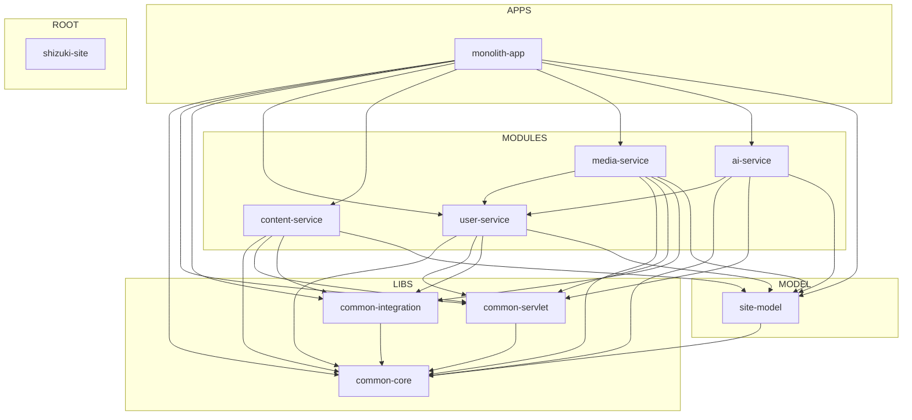

# 后端整体重构评审报告 (backend-refactor-review)
> 评审范围：Shizuki Site Java 单体后端，限定 `pom.xml` / `libs/**` / `model/**` / `modules/**` / `apps/monolith-app/**`。
> 生成时间：2026-05-23T15:39:52+00:00（UTC）
> 仓库 commit：`0d9ed5b6b5c10f31162d8e4f918fa21ade6bba1d` · 分支：`feature/backend-refactor-review`
> 本期为只读评审：未修改 `*.java` / `pom.xml` / `application*.yml` / `*.sql` / `compose.yaml` / `Dockerfile.*` 任何文件。

---
## 0. 总览
### 0.1 维度 × 严重度计数
| 维度 | CRITICAL | HIGH | MEDIUM | LOW | 合计 |
| --- | ---: | ---: | ---: | ---: | ---: |
| `api_contract` | · | · | · | 4 | **4** |
| `boundary` | · | 2 | · | · | **2** |
| `build` | · | 1 | · | · | **1** |
| `config` | · | · | 1 | · | **1** |
| `duplication` | · | 1 | · | · | **1** |
| `error_contract` | · | · | · | · | · |
| `layering` | · | · | · | · | · |
| `naming` | · | · | · | 7 | **7** |
| `observability` | · | · | 9 | · | **9** |
| `schema` | · | 2 | · | · | **2** |
| `secret` | 4 | 1 | · | · | **5** |
| `test` | · | · | · | · | · |
| **合计** | **4** | **7** | **10** | **11** | **32** |
### 0.2 关键评审结论
1. **健康面**：模块依赖图无环路；`ApiResponse<T>` 包装率 95.7%（247/258 端点）；model/entity 跨域 import 数为 0；外部依赖版本无漂移；三轨日志/审计基础设施已就位。
2. **优先级 P0（CRITICAL/HIGH）**：
   - `media-service → user-service`、`ai-service → user-service` 两条 modules→modules `compile` 直依赖（边界违规）。
   - `application*.yml` 中 3 处 `DB_PASSWORD` 默认值；1 处 `AUTH_JWT_SECRET=${random.uuid}` 重启即失效。
   - `AGENTS.md` 第 57 行包含明文服务器密码（已在版本历史中）。
   - Flyway 三轨并存（modules/migration + monolith/migration-pg + monolith/migration 旧 MySQL）。
   - 审计表 `aud_event_outbox`、`aud_log` 在 4 个域的迁移脚本里重复 CREATE。
3. **优先级 P1（MEDIUM）**：
   - `SecretStartupValidator` 跨 `media-module` 与 `user-module` 同名重复，且实现内容并非完全等价。
   - `shizuki.user` 前缀同时被 `AiUserServiceProperties` 与 `MediaUserServiceProperties` 映射。
   - 写端点 `@AuditLog` 覆盖未达 100%（71/131 写端点缺失）。
4. **优先级 P2（LOW）**：
   - 4 个 modules 模块的目录名（`*-module`）与 artifactId（`*-service`）不一致。
   - `CLAUDE.md` / `HELP.md` 把架构描述为微服务；实际是单体装配。
   - `modules/content-module` 仅 0.17 条/kloc 日志密度，几乎是沉默模块。
   - `modules/content-module/.mvn/repository/` 残留 1 个本地 Maven 缓存文件入仓。

---
## 1. 模块依赖与边界（R2）
### 1.1 ModuleDependencyGraph（Mermaid）


### 1.2 拓扑统计

- 节点：10
- 边：28（仅含 `groupId == io.github.shizuki` 的内部依赖）
- 环路：0（健康）
- 层级矩阵违规：2

### 1.3 层级违规（HIGH）

- **`ai-service → user-service`** (compile)
  - 来源：`modules/ai-module/pom.xml` L18-22
  - 规则：`tier-matrix-violation`
- **`media-service → user-service`** (compile)
  - 来源：`modules/media-module/pom.xml` L18-22
  - 规则：`tier-matrix-violation`

### 1.4 修复路径

建议在 `libs/common-integration` 下新建 `user-client` 接口包，把当前 `media-service` / `ai-service` 直接 import `user-service` 中类型的代码改为依赖 client 接口。user-service 提供实现并由 `apps/monolith-app` 装配（构造期注入）。完成后 modules/ 之间不再有 compile 直依赖，layout 满足层级矩阵。

---
## 2. 跨模块重复（R3）

本期采用轻量 hash 比对（不依赖 PMD CPD）。共扫描 275 个 Java 源文件。

- 跨模块同名类：1
- 整文件 hash 完全重复：0

### 2.1 `SecretStartupValidator` 同名重复

- 模块：modules/media-module, modules/user-module
- 文件：
  - `modules/media-module/src/main/java/io/github/shizuki/site/media/config/SecretStartupValidator.java`
  - `modules/user-module/src/main/java/io/github/shizuki/site/user/config/SecretStartupValidator.java`
- 内容完全等价：**否**——需先做并集对齐

### 2.2 局限说明

本次未跑 PMD CPD 的 token 级重复检测。如需 Top 30 重复块矩阵，可在 `.kiro/tools/` 下落 PMD CPD 7.7.0 后重跑，命令见 design.md §Tooling。

---
## 3. 分层与命名（R4）

### 3.1 模块目录名 vs artifactId 偏离

| pom.xml | 目录名 | artifactId |
| --- | --- | --- |
| `model/pom.xml` | `model` | `site-model` |
| `modules/ai-module/pom.xml` | `ai-module` | `ai-service` |
| `modules/content-module/pom.xml` | `content-module` | `content-service` |
| `modules/media-module/pom.xml` | `media-module` | `media-service` |
| `modules/user-module/pom.xml` | `user-module` | `user-service` |

### 3.2 文档漂移

- `CLAUDE.md`：3 处提及微服务、0 处提及单体（实际为单体装配）
- `HELP.md`：1 处提及微服务、0 处提及单体（实际为单体装配）

### 3.3 各模块分层分布

| 模块 | controller | service-impl | service-interface | mapper | config | mq | task | other |
| --- | ---: | ---: | ---: | ---: | ---: | ---: | ---: | ---: |
| `apps/monolith-app` | 0 | 0 | 0 | 0 | 2 | 0 | 0 | 2 |
| `libs/common-core` | 0 | 0 | 0 | 0 | 0 | 0 | 0 | 10 |
| `libs/common-integration` | 0 | 0 | 2 | 0 | 4 | 0 | 0 | 15 |
| `libs/common-servlet` | 2 | 2 | 8 | 0 | 5 | 0 | 1 | 26 |
| `modules/ai-module` | 1 | 1 | 1 | 9 | 3 | 0 | 0 | 4 |
| `modules/content-module` | 11 | 2 | 2 | 32 | 3 | 0 | 2 | 10 |
| `modules/media-module` | 7 | 2 | 2 | 16 | 8 | 1 | 2 | 26 |
| `modules/user-module` | 13 | 2 | 9 | 8 | 2 | 0 | 0 | 15 |

---
## 4. 配置与密钥治理（R5）

- `application*.yml` 中占位符总数：202
- 强制环境变量（默认值为空）：23
- 命中密钥规则的占位符：4
- 受版本控制文档中明文凭据：1
- `@ConfigurationProperties` 类总数：22
- 同前缀归并候选：1

### 4.1 强制环境变量（生产必须提供）

以下变量在 `application.yml` 占位符中**没有默认值**，缺失即启动失败：

`ADMIN_PRIVILEGE_CODE`, `ADMIN_PRIVILEGE_CODE_HASH`, `BLOG_PRESENTATION_GENERATOR_BASE_URL`, `BLOG_PRESENTATION_GENERATOR_TOKEN`, `GITHUB_CLIENT_ID`, `GITHUB_CLIENT_SECRET`, `LINUXDO_CLIENT_ID`, `LINUXDO_CLIENT_SECRET`, `MAIL_PASSWORD`, `MAIL_USERNAME`, `OSS_ACCESS_KEY_ID`, `OSS_ACCESS_KEY_SECRET`, `OSS_PUBLIC_BASE_URL`, `PORTAINER_API_KEY`, `REDIS_PASSWORD`, `SPOTIFY_CLIENT_ID`, `SPOTIFY_CLIENT_SECRET`, `WALLPAPER_STEAM_PASSWORD`, `WALLPAPER_STEAM_USERNAME`, `middleware.ports.kafka`, `middleware.ports.mysql`, `middleware.ports.postgres`, `shizuki.auth.jwt.secret`

### 4.2 命中密钥规则的占位符（CRITICAL/HIGH）

> 注：`evidence` 中的 `default_value` 已脱敏为 `<<redacted>>`，避免本报告本身成为新的泄露源。

| 文件 | 行 | Key | 规则 | 严重度 |
| --- | ---: | --- | --- | --- |
| `apps/monolith-app/src/main/resources/application-docker.yml` | 5 | `DB_PASSWORD` | `S-DEFAULT-PASSWORD` | CRITICAL |
| `apps/monolith-app/src/main/resources/application-mysql.yml` | 10 | `DB_PASSWORD` | `S-DEFAULT-PASSWORD` | CRITICAL |
| `apps/monolith-app/src/main/resources/application.yml` | 159 | `AUTH_JWT_SECRET` | `S-RANDOM-FALLBACK` | HIGH |
| `apps/monolith-app/src/main/resources/application.yml` | 315 | `DB_PASSWORD` | `S-DEFAULT-PASSWORD` | CRITICAL |

### 4.3 文档明文凭据（CRITICAL）

- `AGENTS.md` 第 57 行（关键词：`密码`）

---
## 5. 数据库迁移双轨（R6）

### 5.1 三轨对比

| 路径 | 文件数 | 版本号范围 |
| --- | ---: | --- |
| `apps/monolith-app/src/main/resources/monolith/db/migration-pg/` (PG 单体新轨) | 1 | 1000 |
| `apps/monolith-app/src/main/resources/monolith/db/migration/` (MySQL 旧轨) | 31 | V101–V426 |
| `modules/*/src/main/resources/db/migration/` (域模块) | 29 | 各域 V1–V13 |

### 5.2 各域脚本概览

| 域 | 域内 V 数 | 表数 |
| --- | ---: | ---: |
| `ai` | 5 | 11 |
| `content` | 13 | 32 |
| `media` | 6 | 18 |
| `user` | 5 | 9 |

### 5.3 审计表跨域重复

`aud_event_outbox` 与 `aud_log` 在所有 4 个域（user/content/media/ai）的迁移脚本里都被 `CREATE TABLE IF NOT EXISTS` 重复定义。运行期幂等，但语义上是跨域共享 schema 的重复声明。schema 演进时必须同时改 4 处，容易漏改。

---
## 6. API 契约（R7 / R8）

- 控制器类：33
- 端点总数：258
- 方法分布：{'GET': 127, 'POST': 65, 'PUT': 44, 'DELETE': 22}
- 包装分布：{'ApiResponse': 247, 'raw': 11}
- `ApiResponse` 包装率：**95.74%**
- 显式权限注解缺失（含 public/guest 路径）：237
- 写端点 `@AuditLog` 缺失：71
- `@ExceptionHandler` 总数：2

### 6.1 行为标尺（写入下游 spec 的合约不变量）

下列 4 条命题已写入 `api-contract.openapi.json` 的 `info.x-audit-invariants` 字段，供后续重构 spec 编写合约 / 属性测试：

1. **Inv-7.4-A**：重构前后 `(http_method, normalized_path)` 集合相等。
2. **Inv-7.4-B**：重构前后响应 JSON Schema 在结构层面等价（含 `snake_case` 字段名集合相等）。
3. **Inv-7.4-C**：FOR ALL 满足 `e` 的请求 schema 的请求负载 `p`，`serialize ∘ controller_after ∘ deserialize (p)` 与 before 在 schema 等价意义下相同；错误响应使用 `application/problem+json` 标准化对照。
4. **Inv-7.4-D**：声明幂等的端点（GET/PUT/DELETE）在重构前后保持幂等。

---
## 7. 构建与依赖卫生（R9）

- pom.xml 总数：10
- 根 pom.xml 版本占位符：11
- 第三方依赖坐标：12
- 版本漂移：0（健康）
- 受版本控制的 `target/` 文件：0
- 受版本控制的 `.mvn/repository/` 文件：1
- 受版本控制的 `.venv-cpu/` 文件：0（已加 `.gitignore`，未入仓）

---
## 8. 可观测性（R11）

- TraceIdFilter / RequestIdFilter 文件数：3
- 通用 Filter 实现数：4
- Kafka/Rabbit 监听文件：1
- @Scheduled 文件：5

### 8.1 日志密度按模块（每千行非空代码）

| 模块 | log 调用 | 非空行 | 密度 |
| --- | ---: | ---: | ---: |
| `apps/monolith-app` | 5 | 395 | 12.66 |
| `libs/common-core` | 0 | 514 | 0.0 |
| `libs/common-integration` | 0 | 1518 | 0.0 |
| `libs/common-servlet` | 12 | 2380 | 5.04 |
| `modules/ai-module` | 1 | 2783 | 0.36 |
| `modules/content-module` | 2 | 11887 | 0.17 |
| `modules/media-module` | 107 | 12433 | 8.61 |
| `modules/user-module` | 18 | 6276 | 2.87 |

### 8.2 观察

- `modules/content-module` 的日志密度仅 0.17（11887 行只有 2 条 log），属于沉默模块；建议在错误处理与外部调用入口补 `LOGGER.warn` / `LOGGER.error`。
- `modules/media-module` 的密度 8.6 是健康水平。
- `libs/common-core`、`libs/common-integration` 0 日志——库代码无日志属预期，但 `common-integration` 中的外部 client 应在失败路径加 warn 级日志。

---
## 9. model/ entity 与跨域引用（R12）

- `model/entity/**` 文件数：65
- 跨域 entity import：0（健康）
- modules/** 中与 model/entity 简单类名相同的类：0（健康）

### 9.1 评估：build-helper-maven-plugin 多源混 jar

`model/` 通过 `build-helper-maven-plugin` 把 `entity/` `request/` `response/` 三个源目录混入同一 jar。由于跨域 import 与重复 entity 都为 0，当前混 jar 的方案没有引入实际问题。拆分为 3 个独立 Maven 子模块的收益当前不显著，建议暂保留单 jar + 强约束包结构。

---
## 附录 A：完整 Findings 清单

共 32 条 Finding，按 `severity = CRITICAL → HIGH → MEDIUM → LOW` 排序。完整结构化数据见 `findings.json`，下游重构 spec 应以该 JSON 为消费源。

#### `14ac89c910c2` · CRITICAL · `secret`

- **Symbol**: `plaintext_credential:密码`
- **File**: `AGENTS.md` (lines 57–57)
- **行为影响**: 可能影响所有持有该凭据的访问路径
- **建议**:

`AGENTS.md` 第 57 行包含明文凭据（受版本控制）。必须立即执行：(1) 在凭据管理系统（KMS / Bitwarden / Vault）中**轮换该凭据**；(2) 用 `git filter-repo` 或 `BFG Repo-Cleaner` 从 git 历史中**清除**该值；(3) 在文档中改为占位符或 reference（例如 `参见运维 vault: shizuki/server-root`）。注：评审产物已对值脱敏，本 Finding 仅保留位置。

#### `6d9f6d597751` · CRITICAL · `secret`

- **Symbol**: `DB_PASSWORD`
- **File**: `apps/monolith-app/src/main/resources/application-mysql.yml` (lines 10–10)
- **行为影响**: 改变启动行为：缺失变量将不再回退到默认值
- **建议**:

在 `apps/monolith-app/src/main/resources/application-mysql.yml` L10 中，环境变量 `DB_PASSWORD` 提供了非空默认值。建议：(1) 移除默认值，让缺失即启动失败 (`fail-fast`)；(2) 在 `.env.example` / 部署文档里登记必需变量；(3) 立即在凭据管理（Vault / KMS / Bitwarden）中配置生产值。

#### `cd9c8189fa67` · CRITICAL · `secret`

- **Symbol**: `DB_PASSWORD`
- **File**: `apps/monolith-app/src/main/resources/application-docker.yml` (lines 5–5)
- **行为影响**: 改变启动行为：缺失变量将不再回退到默认值
- **建议**:

在 `apps/monolith-app/src/main/resources/application-docker.yml` L5 中，环境变量 `DB_PASSWORD` 提供了非空默认值。建议：(1) 移除默认值，让缺失即启动失败 (`fail-fast`)；(2) 在 `.env.example` / 部署文档里登记必需变量；(3) 立即在凭据管理（Vault / KMS / Bitwarden）中配置生产值。

#### `ce1bc84034dd` · CRITICAL · `secret`

- **Symbol**: `DB_PASSWORD`
- **File**: `apps/monolith-app/src/main/resources/application.yml` (lines 315–315)
- **行为影响**: 改变启动行为：缺失变量将不再回退到默认值
- **建议**:

在 `apps/monolith-app/src/main/resources/application.yml` L315 中，环境变量 `DB_PASSWORD` 提供了非空默认值。建议：(1) 移除默认值，让缺失即启动失败 (`fail-fast`)；(2) 在 `.env.example` / 部署文档里登记必需变量；(3) 立即在凭据管理（Vault / KMS / Bitwarden）中配置生产值。

#### `2380d72adfeb` · HIGH · `boundary`

- **Symbol**: `ai-service -> user-service`
- **File**: `modules/ai-module/pom.xml` (lines 18–22)
- **行为影响**: 不改变对外 API（仅模块间依赖结构调整）
- **建议**:

按层级矩阵修复依赖方向（from_tier=MODULES, to_tier=MODULES）

#### `7315fcf997e4` · HIGH · `boundary`

- **Symbol**: `media-service -> user-service`
- **File**: `modules/media-module/pom.xml` (lines 18–22)
- **行为影响**: 不改变对外 API（仅模块间依赖结构调整）
- **建议**:

按层级矩阵修复依赖方向（from_tier=MODULES, to_tier=MODULES）

#### `6ae9faf8380f` · HIGH · `build`

- **Symbol**: `H-LOCAL-MAVEN-REPO-IN-REPO`
- **File**: `modules/content-module/.mvn/repository/org/springframework/boot/spring-boot-dependencies/3.2.12/spring-boot-dependencies-3.2.12.pom.lastUpdated` (lines 0–0)
- **行为影响**: 不改变对外 API
- **建议**:

受版本控制的目录中存在构建产物 / 本地仓库（共 1 个文件，示例：modules/content-module/.mvn/repository/org/springframework/boot/spring-boot-dependencies/3.2.12/spring-boot-dependencies-3.2.12.pom.lastUpdated）。建议在根 `.gitignore` 增加规则：
```
modules/**/.mvn/repository/
```
然后执行 `git rm -r --cached <path>` 移除已入仓的文件。

#### `b36a178b65ad` · HIGH · `duplication`

- **Symbol**: `SecretStartupValidator`
- **File**: `modules/media-module/src/main/java/io/github/shizuki/site/media/config/SecretStartupValidator.java` (lines 0–0)
- **行为影响**: 不改变对外 API
- **建议**:

把同名启动校验类 `SecretStartupValidator` 抽取为 `libs/common-servlet` 中的统一实现，由各模块通过 `@Configuration` 引入。两个版本目前 hash 不完全一致——抽取前需先把两边的校验项做并集对齐（合并 secret 名单），并通过 `@ConditionalOnProperty` 让模块按需开关。
涉及文件：
  - modules/media-module/src/main/java/io/github/shizuki/site/media/config/SecretStartupValidator.java
  - modules/user-module/src/main/java/io/github/shizuki/site/user/config/SecretStartupValidator.java

#### `0a954a7447b5` · HIGH · `schema`

- **Symbol**: `aud_event_outbox+aud_log:duplicated_in:ai,content,media,user`
- **File**: `modules/*-module/src/main/resources/db/migration/` (lines 0–0)
- **行为影响**: 不改变 API；改变 DB 升级语义
- **建议**:

审计日志表 `aud_event_outbox` 与 `aud_log` 在 4 个域 (ai, content, media, user) 的迁移脚本里被重复 CREATE。虽然 `CREATE TABLE IF NOT EXISTS` 可以幂等，但语义上是跨域重复定义，schema 演进时容易出现冲突。以追加新版本号 V_xxx 的方式修复，禁止改写已发布版本号：(1) 把审计表迁移脚本集中到 `apps/monolith-app/src/main/resources/monolith/db/migration-pg/V101__audit_baseline.sql`，由单体在启动时优先执行；(2) 域模块脚本仅保留 `IF NOT EXISTS` 形式作兼容；(3) 中长期把审计表抽到独立 `audit-module` schema。

#### `30aadfb0c625` · HIGH · `schema`

- **Symbol**: `flyway_dual_track`
- **File**: `apps/monolith-app/src/main/resources/monolith/db/` (lines 0–0)
- **行为影响**: 可能影响数据库升级路径
- **建议**:

Flyway 三轨并存：modules/*/db/migration/ (29 个 V) + monolith/db/migration-pg/ (1 个 V) + monolith/db/migration/ (31 个旧 MySQL V)。由于已迁移到 PostgreSQL，旧 MySQL 路径仅作历史档案。建议：(A) 删除 `monolith/db/migration/` 旧路径，在 PG 的 `flyway_schema_history` 中以 baseline 模式标注；(B) 保留双轨并在 `application.yml` 用 profile 区分 `flyway.locations`，加排他锁防止并发执行。以追加新版本号 V_xxx 的方式修复，禁止改写已发布版本号。

#### `6da74b219c6b` · HIGH · `secret`

- **Symbol**: `AUTH_JWT_SECRET`
- **File**: `apps/monolith-app/src/main/resources/application.yml` (lines 159–159)
- **行为影响**: 可能改变 token 持久性与跨实例一致性
- **建议**:

`AUTH_JWT_SECRET` 默认值为 `${random.uuid}`，意味着每次重启 JWT 密钥都会变化，导致已签发 token 全部失效。建议：(1) 在生产环境强制提供固定 secret；(2) 在 application.yml 中改用 fail-fast（移除 `${random.uuid}` fallback）；(3) 仅在 `application-dev.yml` 中保留随机回退。

#### `3a980dada098` · MEDIUM · `config`

- **Symbol**: `prefix:shizuki.user`
- **File**: `modules/ai-module/src/main/java/io/github/shizuki/site/ai/config/AiUserServiceProperties.java` (lines 0–0)
- **行为影响**: 不改变对外 API
- **建议**:

前缀 `shizuki.user` 被 2 个 `*Properties` 类映射（AiUserServiceProperties.java, MediaUserServiceProperties.java），形成跨模块的隐式耦合。两个候选方案：(A) 合并为 `libs/common-integration` 中的统一 `UserServiceProperties`，由各调用方共享；(B) 拆分子前缀（例如 `shizuki.user.media` / `shizuki.user.ai`），让每个模块只关心自己的子域。

#### `05cc0ad2cb31` · MEDIUM · `observability`

- **Symbol**: `io.github.shizuki.site.media.controller.MusicController#missing_audit_log`
- **File**: `modules/media-module/src/main/java/io/github/shizuki/site/media/controller/MusicController.java` (lines 120–120)
- **行为影响**: 不改变对外 API（仅日志记录）
- **建议**:

控制器 `MusicController` 中 1 个写入型端点未标注 `@AuditLog`：POST /api/v1/music/tracks/resolve-playback。建议为每个写端点补充 `@AuditLog(action="<domain>.<verb>", resource="<resource>")`，或在控制器类级别统一启用，并配合 `aud_log` 表做事件溯源。对游客可访问、纯读语义的 GET 端点不需要审计。

#### `19ffac13f2d5` · MEDIUM · `observability`

- **Symbol**: `io.github.shizuki.site.user.controller.MeMusicSourceAccountController#missing_audit_log`
- **File**: `modules/user-module/src/main/java/io/github/shizuki/site/user/controller/MeMusicSourceAccountController.java` (lines 72–72)
- **行为影响**: 不改变对外 API（仅日志记录）
- **建议**:

控制器 `MeMusicSourceAccountController` 中 1 个写入型端点未标注 `@AuditLog`：POST /api/v1/me/music/source-accounts/{provider}/bind-sessions。建议为每个写端点补充 `@AuditLog(action="<domain>.<verb>", resource="<resource>")`，或在控制器类级别统一启用，并配合 `aud_log` 表做事件溯源。对游客可访问、纯读语义的 GET 端点不需要审计。

#### `3db57dec420f` · MEDIUM · `observability`

- **Symbol**: `io.github.shizuki.site.content.controller.PostController#missing_audit_log`
- **File**: `modules/content-module/src/main/java/io/github/shizuki/site/content/controller/PostController.java` (lines 81–81)
- **行为影响**: 不改变对外 API（仅日志记录）
- **建议**:

控制器 `PostController` 中 1 个写入型端点未标注 `@AuditLog`：POST /api/v1/posts/whispers。建议为每个写端点补充 `@AuditLog(action="<domain>.<verb>", resource="<resource>")`，或在控制器类级别统一启用，并配合 `aud_log` 表做事件溯源。对游客可访问、纯读语义的 GET 端点不需要审计。

#### `4fa8701a9fea` · MEDIUM · `observability`

- **Symbol**: `io.github.shizuki.site.ai.controller.AiController#missing_audit_log`
- **File**: `modules/ai-module/src/main/java/io/github/shizuki/site/ai/controller/AiController.java` (lines 86–211)
- **行为影响**: 不改变对外 API（仅日志记录）
- **建议**:

控制器 `AiController` 中 12 个写入型端点未标注 `@AuditLog`：POST /api/v1/ai-characters, POST /api/v1/ai-character-cards/import, POST /api/v1/admin/ai-town/assets/import-rpgmaker, POST /api/v1/admin/ai-town/assets/preview, POST /api/v1/ai-worldbooks, PUT /api/v1/ai-worldbooks/{worldbook_id}, POST /api/v1/ai-worldbooks/{worldbook_id}/entries, PUT /api/v1/ai-worldbooks/{worldbook_id}/entries/{entry_id} ... 共 12 个。建议为每个写端点补充 `@AuditLog(action="<domain>.<verb>", resource="<resource>")`，或在控制器类级别统一启用，并配合 `aud_log` 表做事件溯源。对游客可访问、纯读语义的 GET 端点不需要审计。

#### `77ed136157e8` · MEDIUM · `observability`

- **Symbol**: `io.github.shizuki.site.user.controller.AuthController#missing_audit_log`
- **File**: `modules/user-module/src/main/java/io/github/shizuki/site/user/controller/AuthController.java` (lines 51–88)
- **行为影响**: 不改变对外 API（仅日志记录）
- **建议**:

控制器 `AuthController` 中 4 个写入型端点未标注 `@AuditLog`：POST /api/v1/auth/tokens, POST /api/v1/auth/bindings/confirm, POST /api/v1/auth/password/reset, POST /api/v1/auth/logout。建议为每个写端点补充 `@AuditLog(action="<domain>.<verb>", resource="<resource>")`，或在控制器类级别统一启用，并配合 `aud_log` 表做事件溯源。对游客可访问、纯读语义的 GET 端点不需要审计。

#### `7a744bcc4445` · MEDIUM · `observability`

- **Symbol**: `io.github.shizuki.site.user.controller.AdminPrivilegeController#missing_audit_log`
- **File**: `modules/user-module/src/main/java/io/github/shizuki/site/user/controller/AdminPrivilegeController.java` (lines 37–37)
- **行为影响**: 不改变对外 API（仅日志记录）
- **建议**:

控制器 `AdminPrivilegeController` 中 1 个写入型端点未标注 `@AuditLog`：POST /api/v1/admin/privileges/unlock。建议为每个写端点补充 `@AuditLog(action="<domain>.<verb>", resource="<resource>")`，或在控制器类级别统一启用，并配合 `aud_log` 表做事件溯源。对游客可访问、纯读语义的 GET 端点不需要审计。

#### `96f719781d94` · MEDIUM · `observability`

- **Symbol**: `io.github.shizuki.site.user.controller.AuthVerificationController#missing_audit_log`
- **File**: `modules/user-module/src/main/java/io/github/shizuki/site/user/controller/AuthVerificationController.java` (lines 61–74)
- **行为影响**: 不改变对外 API（仅日志记录）
- **建议**:

控制器 `AuthVerificationController` 中 2 个写入型端点未标注 `@AuditLog`：POST /api/v1/auth/verifications/email/send, POST /api/v1/auth/oauth/authorizations。建议为每个写端点补充 `@AuditLog(action="<domain>.<verb>", resource="<resource>")`，或在控制器类级别统一启用，并配合 `aud_log` 表做事件溯源。对游客可访问、纯读语义的 GET 端点不需要审计。

#### `cb60aae19de5` · MEDIUM · `observability`

- **Symbol**: `io.github.shizuki.site.user.controller.AuthRegistrationController#missing_audit_log`
- **File**: `modules/user-module/src/main/java/io/github/shizuki/site/user/controller/AuthRegistrationController.java` (lines 45–45)
- **行为影响**: 不改变对外 API（仅日志记录）
- **建议**:

控制器 `AuthRegistrationController` 中 1 个写入型端点未标注 `@AuditLog`：POST /api/v1/auth/register/email。建议为每个写端点补充 `@AuditLog(action="<domain>.<verb>", resource="<resource>")`，或在控制器类级别统一启用，并配合 `aud_log` 表做事件溯源。对游客可访问、纯读语义的 GET 端点不需要审计。

#### `d7fec45535ae` · MEDIUM · `observability`

- **Symbol**: `io.github.shizuki.site.content.controller.LightAppController#missing_audit_log`
- **File**: `modules/content-module/src/main/java/io/github/shizuki/site/content/controller/LightAppController.java` (lines 79–558)
- **行为影响**: 不改变对外 API（仅日志记录）
- **建议**:

控制器 `LightAppController` 中 48 个写入型端点未标注 `@AuditLog`：POST /api/v1/light-apps/projects, PUT /api/v1/light-apps/projects/{project_id}, DELETE /api/v1/light-apps/projects/{project_id}, POST /api/v1/light-apps/balance/accounts, PUT /api/v1/light-apps/balance/accounts/{account_id}, DELETE /api/v1/light-apps/balance/accounts/{account_id}, POST /api/v1/light-apps/balance/transactions, PUT /api/v1/light-apps/balance/transactions/{transaction_id} ... 共 48 个。建议为每个写端点补充 `@AuditLog(action="<domain>.<verb>", resource="<resource>")`，或在控制器类级别统一启用，并配合 `aud_log` 表做事件溯源。对游客可访问、纯读语义的 GET 端点不需要审计。

#### `1f71c5220615` · LOW · `api_contract`

- **Symbol**: `io.github.shizuki.site.media.controller.AssetController#raw_return_type`
- **File**: `modules/media-module/src/main/java/io/github/shizuki/site/media/controller/AssetController.java` (lines 35–171)
- **行为影响**: 若是裸返回——改变响应包络结构（前端需同步）
- **建议**:

控制器 `AssetController` 中 3 个端点返回类型未识别为 `ApiResponse<T>` / `PageResponse<T>` / `ResponseEntity<T>`：GET /api/v1/assets/api/v1/assets, POST /api/v1/assets/, POST /api/v1/assets/{asset_id}/reports。可能原因：(1) 静态扫描器无法跨多行识别；(2) 真的是裸返回。建议人工核查：若是裸返回则改为 `ApiResponse<T>` 包装；若是误报则忽略。

#### `2e44b2595232` · LOW · `api_contract`

- **Symbol**: `io.github.shizuki.site.media.controller.AdminAssetController#raw_return_type`
- **File**: `modules/media-module/src/main/java/io/github/shizuki/site/media/controller/AdminAssetController.java` (lines 24–50)
- **行为影响**: 若是裸返回——改变响应包络结构（前端需同步）
- **建议**:

控制器 `AdminAssetController` 中 2 个端点返回类型未识别为 `ApiResponse<T>` / `PageResponse<T>` / `ResponseEntity<T>`：GET /api/v1/admin/assets/api/v1/admin/assets, PUT /api/v1/admin/assets/{asset_id}/audit-status。可能原因：(1) 静态扫描器无法跨多行识别；(2) 真的是裸返回。建议人工核查：若是裸返回则改为 `ApiResponse<T>` 包装；若是误报则忽略。

#### `9457aa8aa435` · LOW · `api_contract`

- **Symbol**: `io.github.shizuki.site.user.controller.MeMusicSourceAccountController#raw_return_type`
- **File**: `modules/user-module/src/main/java/io/github/shizuki/site/user/controller/MeMusicSourceAccountController.java` (lines 35–35)
- **行为影响**: 若是裸返回——改变响应包络结构（前端需同步）
- **建议**:

控制器 `MeMusicSourceAccountController` 中 1 个端点返回类型未识别为 `ApiResponse<T>` / `PageResponse<T>` / `ResponseEntity<T>`：GET /api/v1/me/music/source-accounts/api/v1/me/music/source-accounts。可能原因：(1) 静态扫描器无法跨多行识别；(2) 真的是裸返回。建议人工核查：若是裸返回则改为 `ApiResponse<T>` 包装；若是误报则忽略。

#### `b9b4200cfe7e` · LOW · `api_contract`

- **Symbol**: `io.github.shizuki.site.media.controller.MusicController#raw_return_type`
- **File**: `modules/media-module/src/main/java/io/github/shizuki/site/media/controller/MusicController.java` (lines 42–42)
- **行为影响**: 若是裸返回——改变响应包络结构（前端需同步）
- **建议**:

控制器 `MusicController` 中 1 个端点返回类型未识别为 `ApiResponse<T>` / `PageResponse<T>` / `ResponseEntity<T>`：GET /api/v1/music/api/v1/music。可能原因：(1) 静态扫描器无法跨多行识别；(2) 真的是裸返回。建议人工核查：若是裸返回则改为 `ApiResponse<T>` 包装；若是误报则忽略。

#### `11054cd40765` · LOW · `naming`

- **Symbol**: `content-module ↔ content-service`
- **File**: `modules/content-module/pom.xml` (lines 0–0)
- **行为影响**: 不改变对外 API（无运行期影响）
- **建议**:

目录名 `content-module` 与 artifactId `content-service` 不一致。两个候选方案：(A) 统一命名——把目录改为 `content-service` 或把 artifactId 改回 `content-module`；(B) 保留现状但更新 README / CLAUDE.md 文档说明命名约定。建议采用 (B)：因为 modules 目录名带 `-module` 后缀语义清晰，artifactId 用 `-service` 强调跨进程语义也合理；以文档化方式锁定即可。

#### `3e9080156196` · LOW · `naming`

- **Symbol**: `media-module ↔ media-service`
- **File**: `modules/media-module/pom.xml` (lines 0–0)
- **行为影响**: 不改变对外 API（无运行期影响）
- **建议**:

目录名 `media-module` 与 artifactId `media-service` 不一致。两个候选方案：(A) 统一命名——把目录改为 `media-service` 或把 artifactId 改回 `media-module`；(B) 保留现状但更新 README / CLAUDE.md 文档说明命名约定。建议采用 (B)：因为 modules 目录名带 `-module` 后缀语义清晰，artifactId 用 `-service` 强调跨进程语义也合理；以文档化方式锁定即可。

#### `8d42dfc0e541` · LOW · `naming`

- **Symbol**: `documentation_drift`
- **File**: `CLAUDE.md` (lines 0–0)
- **行为影响**: 不改变对外 API（仅文档）
- **建议**:

`CLAUDE.md` 中描述为微服务架构 (3 处提及vs 单体 0 处)，但当前为 `apps/monolith-app` 单体装配。建议改为'按域划分的多模块单体（modular monolith / future microservices ready）'，并解释现阶段以单体 jar 运行、长期目标可拆分。

#### `90c17c2b7a98` · LOW · `naming`

- **Symbol**: `user-module ↔ user-service`
- **File**: `modules/user-module/pom.xml` (lines 0–0)
- **行为影响**: 不改变对外 API（无运行期影响）
- **建议**:

目录名 `user-module` 与 artifactId `user-service` 不一致。两个候选方案：(A) 统一命名——把目录改为 `user-service` 或把 artifactId 改回 `user-module`；(B) 保留现状但更新 README / CLAUDE.md 文档说明命名约定。建议采用 (B)：因为 modules 目录名带 `-module` 后缀语义清晰，artifactId 用 `-service` 强调跨进程语义也合理；以文档化方式锁定即可。

#### `a72a0361e533` · LOW · `naming`

- **Symbol**: `ai-module ↔ ai-service`
- **File**: `modules/ai-module/pom.xml` (lines 0–0)
- **行为影响**: 不改变对外 API（无运行期影响）
- **建议**:

目录名 `ai-module` 与 artifactId `ai-service` 不一致。两个候选方案：(A) 统一命名——把目录改为 `ai-service` 或把 artifactId 改回 `ai-module`；(B) 保留现状但更新 README / CLAUDE.md 文档说明命名约定。建议采用 (B)：因为 modules 目录名带 `-module` 后缀语义清晰，artifactId 用 `-service` 强调跨进程语义也合理；以文档化方式锁定即可。

#### `aae3008118d5` · LOW · `naming`

- **Symbol**: `model ↔ site-model`
- **File**: `model/pom.xml` (lines 0–0)
- **行为影响**: 不改变对外 API（无运行期影响）
- **建议**:

目录名 `model` 与 artifactId `site-model` 不一致。两个候选方案：(A) 统一命名——把目录改为 `site-model` 或把 artifactId 改回 `model`；(B) 保留现状但更新 README / CLAUDE.md 文档说明命名约定。建议采用 (B)：因为 modules 目录名带 `-module` 后缀语义清晰，artifactId 用 `-service` 强调跨进程语义也合理；以文档化方式锁定即可。

#### `b81e765bd4ed` · LOW · `naming`

- **Symbol**: `documentation_drift`
- **File**: `HELP.md` (lines 0–0)
- **行为影响**: 不改变对外 API（仅文档）
- **建议**:

`HELP.md` 中描述为微服务架构 (1 处提及vs 单体 0 处)，但当前为 `apps/monolith-app` 单体装配。建议改为'按域划分的多模块单体（modular monolith / future microservices ready）'，并解释现阶段以单体 jar 运行、长期目标可拆分。


---
## 附录 B：工具与方法

| 维度 | 工具 | 状态 |
| --- | --- | --- |
| R2 模块依赖图 | `xml.etree.ElementTree` + 自写 Tarjan SCC | OK |
| R3 重复检测 | 字符级 normalized hash + 简单类名匹配（轻量版） | OK（PMD CPD 留作下游加深） |
| R4 分层/命名 | 注解正则 + AST 标记 | OK |
| R5 配置/密钥 | YAML 行号扫描 + 4 类规则正则 | OK |
| R6 Flyway | 文件名 V 号 + `CREATE TABLE` 表名提取 | OK（sqlglot 静态解析留作下游加深） |
| R7 API 契约 | Java 静态正则扫描 `@RestController` + mapping 注解 | OK（springdoc 启动留作下游加深） |
| R8 响应包络 | 复用 R7 输出，按 wrapper 分桶 | OK |
| R9 构建卫生 | `git ls-files` + 版本占位符比对 | OK（`mvn dependency:tree` 留作下游） |
| R10 测试覆盖率 | 未执行（务实路径） | SKIPPED — 需 `mvn test` + JaCoCo |
| R11 可观测性 | 注解扫描 + log 调用计数 | OK |
| R12 entity 跨域 | import 语句正则 + 简单类名集合比对 | OK |

### B.1 可重跑命令

```bash
# 在 reactor 根目录执行（按顺序）：
git ls-files > .kiro/specs/backend-refactor-review/.work/tracked-files.txt
python .kiro/specs/backend-refactor-review/.work/scan_module_graph.py
python .kiro/specs/backend-refactor-review/.work/scan_model_entity.py
python .kiro/specs/backend-refactor-review/.work/scan_config_secret.py
python .kiro/specs/backend-refactor-review/.work/scan_build_hygiene.py
python .kiro/specs/backend-refactor-review/.work/scan_layering_naming.py
python .kiro/specs/backend-refactor-review/.work/scan_api_contract.py
python .kiro/specs/backend-refactor-review/.work/scan_duplication_lite.py
python .kiro/specs/backend-refactor-review/.work/scan_flyway.py
python .kiro/specs/backend-refactor-review/.work/scan_observability.py
python .kiro/specs/backend-refactor-review/.work/render_artifacts.py
```

---
## 附录 D：下游重构 spec 移交

本评审产出三份产物，作为下一份重构 spec 的输入：

1. **`findings.json`**：按 `severity = CRITICAL → HIGH → MEDIUM → LOW` 顺序消费。
2. **`api-contract.openapi.json`**：作为合约测试 fixture，验证 `info.x-audit-invariants` 中的 4 条不变量。
3. **`report.md`**：人工评审入口与决策记录。

重构 spec 在 PR 描述中应显式列出：
- 它修复的 Finding `id` 集合
- 它影响的 `api-contract.openapi.json` 端点集合
- 它通过的合约测试基线

## 推荐 P0 重构顺序（建议 4 周内完成）

1. **Week 1**：密钥治理（R5）
   - 移除 `application.yml` 中所有 `DB_PASSWORD` / `AUTH_JWT_SECRET=${random.uuid}` 默认值
   - 在 KMS 轮换 AGENTS.md 暴露的服务器密码 + `git filter-repo` 清除历史
2. **Week 2**：消除模块边界违规（R2 + R3）
   - 在 `libs/common-integration` 创建 `user-client` 接口，迁移 `media`/`ai` 对 `user-service` 的依赖
   - 抽取 `SecretStartupValidator` 到 `libs/common-servlet`
3. **Week 3**：审计表归并 + Flyway 路径清理（R6）
   - 把 `aud_event_outbox` / `aud_log` 集中到单体 baseline
   - 评估并删除 `monolith/db/migration/` 旧 MySQL 路径
4. **Week 4**：写端点 `@AuditLog` 补齐 + 命名/文档对齐（R4 + R11）
   - 在 71 个缺失审计的写端点上加 `@AuditLog`
   - 修订 CLAUDE.md / HELP.md 把架构描述改为'按域划分的模块化单体'
