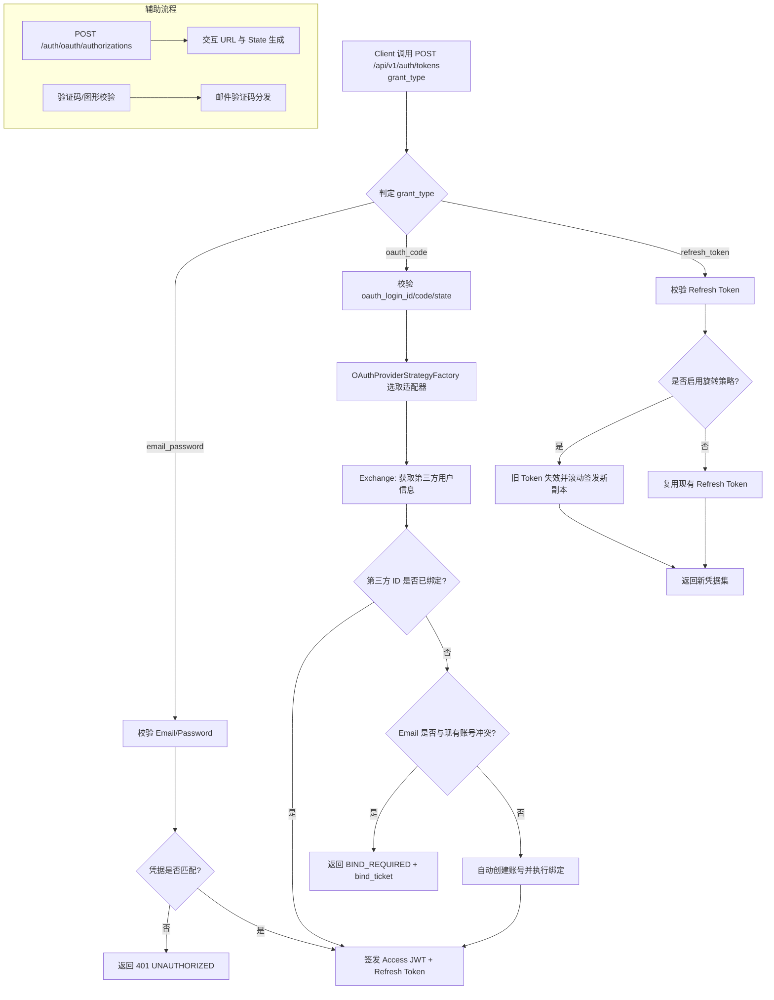

# 认证与授权体系重构实施报告 (v0.1)

## 1. 实施目标与背景 (Scope)

本次重构旨在统一全站的认证入口与授权模型，引入工业级的策略模式以支持多平台扩展，并增强系统在复杂网络环境下的韧性（Resilience）。

### 1.1 核心交付能力
1.  **统一认证模型：** 基于 `grant_type` 的多模式认证支持（邮件密码、OAuth2、Refresh Token）。
2.  **多平台扩展：** 实现 `GitHub` 与 `LinuxDo` 的 OAuth2 授权码流程适配。
3.  **安全性闭环：** 涵盖 JWT 签发、Refresh Token 滚动更新、图形验证码及邮件校验机制。
4.  **韧性设计：** 网关级错误分层处理及分布式配额调用的自动重试机制。

---

## 2. 架构设计决策 (Architectural Decisions)

### 2.1 认证分发架构
采用 **策略模式 (Strategy)** 与 **工厂模式 (Factory)**：
- `AuthGrantStrategy`: 定义不同登录模式（Email/OAuth/Refresh）的执行契约。
- `AuthServiceImpl`: 负责高层业务编排，通过策略工厂动态分发认证逻辑。

### 2.2 多提供方适配
- `OAuthProviderStrategy`: 封装第三方社交登录的差异性（授权 URL 构建、Token 校验、用户属性映射）。
- 抽象所有社交平台的公共行为至 `AbstractOAuthProviderStrategy` 基类，减少代码冗余。

### 2.3 Token 生命周期管理
- **Access Token:** 使用 Sa-Token 配合 JWT 扩展进行显式签发。
- **Refresh Token:** 存于 Redis，支持单次旋转（Rotation）策略，确保凭据被盗用后的快速失效。

---

## 3. 认证交互流 (Authentication Flow)

---

## 4. 关键接口定义 (Interface Definition)

| 接口路径 | 核心职能 | 实现位置 |
| :--- | :--- | :--- |
| **POST /api/v1/auth/tokens** | 统一认证入口（支持多 Grant） | `AuthController` |
| **GET /api/v1/auth/introspect** | Token 自省（用于网关/微服务验证） | `AuthController` |
| **POST /api/v1/auth/bindings/confirm** | 冲突场景下的显式账号绑定确认 | `AuthBindingController` |
| **POST /api/v1/auth/register/email** | 基于邮件验证码的自主注册 | `AuthRegistrationController` |
| **GET /api/v1/me/account** | 获取当前登录用户的账户元数据 | `MeController` |

---

## 5. 韌性与容错方案 (Resilience)

### 5.1 网关错误处理
网关层对 `introspect` 回调进行分层防护：
- **4xx 错误：** 映射为 401 Unauthorized，防止非法的 Token 穿透。
- **5xx/超时/网络异动：** 映射为 503 Service Unavailable，提示上游服务暂时不可用。
- **日志记录：** 强制记录 `reason` 与 `upstream_status` 字段以供审计与排障。

### 5.2 重试策略
复用 `common-core` 中的 `SpringRetryExecutor`：
- **AI 配额调用：** 针对 5xx 与网络抖动实施指数退避重试，4xx 类错误直接 Fallback。
- **OAuth 提供方：** 外部 HTTP 请求封装重试逻辑，隔离上游不稳定因素。

---

## 6. 验证结果 (Verification)

### 6.1 测试统计
- **单元测试/集成测试覆盖数：** 29 项。
- **关键测试覆盖：** 
  - Token 旋转完整性校验。
  - OAuth 绑定冲突逻辑。
  - 验证码暴力破解防护。
  - 网关降级策略（Guest Downgrade）。

### 6.2 结论
[x] 核心认证链路全线打通。
[x] 安全基线（加密、脱敏、限流）已在认证逻辑中集成。
[x] 韧性组件成功覆盖关键网络调用。

> [!NOTE]
> 为确保生产环境安全性，建议在部署后通过自动化脚本定期对 OAuth 回调及 Token 旋转逻辑进行回归校验。
、邮箱注册、refresh 轮换、绑定流程。
6. 增加 Flyway 与 SQL 文档同步。
7. 追加最小必要测试并跑全链路定向测试。

---

## 9. 闭环状态与后续建议

### 9.1 闭环状态

- 已新增 `POST /api/v1/auth/bindings/confirm`，支持 `bind_ticket` 显式确认。
- 绑定确认成功后，服务端会完成 OAuth 绑定、更新 `OAU_LOGIN` 状态并消费 ticket，然后签发 token。

### 9.2 建议下一步

1. 增加端到端集成测试（MySQL/Redis/OAuth mock/SMTP mock）。
2. 上线前补充监控指标：token 发放量、refresh 轮换失败率、验证码发送失败率、OAuth 上游错误率。
3. 视产品策略决定是否将 `bind_ticket` 改为“失败次数超限后失效”的更强风控模式。

---

## 10. 关键文件索引

### 10.1 认证重构核心
- `modules/user-module/src/main/java/io/github/shizuki/site/user/controller/AuthController.java`
- `modules/user-module/src/main/java/io/github/shizuki/site/user/controller/AuthVerificationController.java`
- `modules/user-module/src/main/java/io/github/shizuki/site/user/controller/AuthRegistrationController.java`
- `modules/user-module/src/main/java/io/github/shizuki/site/user/controller/AuthBindingController.java`
- `modules/user-module/src/main/java/io/github/shizuki/site/user/service/impl/AuthServiceImpl.java`
- `modules/user-module/src/main/java/io/github/shizuki/site/user/service/auth/AuthFlowService.java`
- `modules/user-module/src/main/java/io/github/shizuki/site/user/service/auth/AuthTokenIssuer.java`
- `modules/user-module/src/main/java/io/github/shizuki/site/user/service/auth/RefreshTokenService.java`

### 10.2 OAuth Provider 抽象
- `libs/common-integration/src/main/java/io/github/shizuki/common/oauth/strategy/OAuthProviderStrategy.java`
- `libs/common-integration/src/main/java/io/github/shizuki/common/oauth/strategy/OAuthProviderStrategyFactory.java`
- `libs/common-integration/src/main/java/io/github/shizuki/common/oauth/strategy/AbstractOAuthProviderStrategy.java`
- `libs/common-integration/src/main/java/io/github/shizuki/common/oauth/strategy/GitHubOAuthProviderStrategy.java`
- `libs/common-integration/src/main/java/io/github/shizuki/common/oauth/strategy/LinuxDoOAuthProviderStrategy.java`

### 10.3 韧性收口核心
- `libs/common-core/src/main/java/io/github/shizuki/common/core/resilience/RetrySpec.java`
- `libs/common-core/src/main/java/io/github/shizuki/common/core/resilience/SpringRetryExecutor.java`
- `apps/monolith-app/src/main/java/io/github/shizuki/site/monolith/filter/AuthEntryFilter.java`
- `modules/ai-module/src/main/java/io/github/shizuki/site/ai/client/UserQuotaClient.java`

---

> 备注：本文档用于“现阶段基础骨架完成态”归档，便于后续接入真实业务逻辑时快速定位边界与扩展点。
