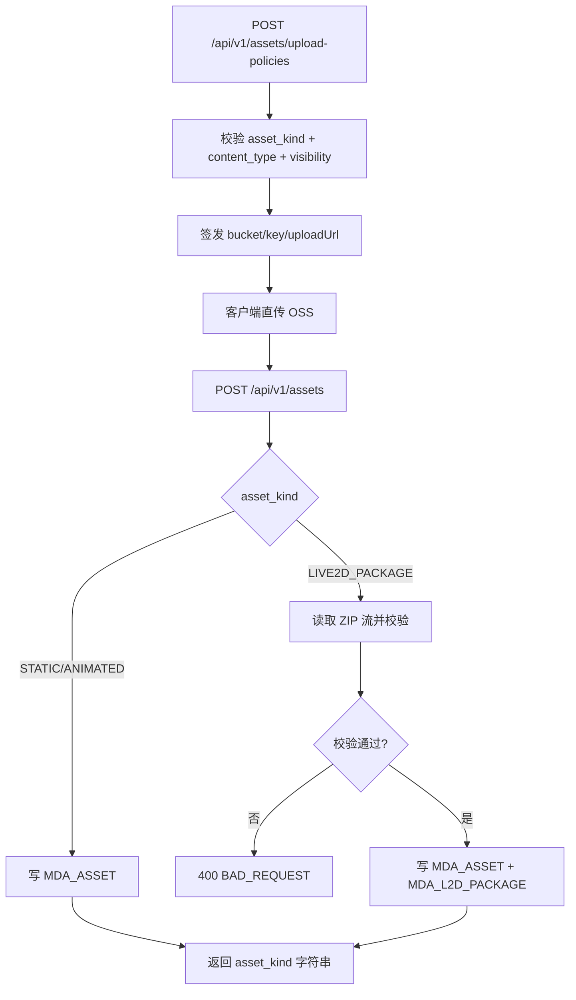
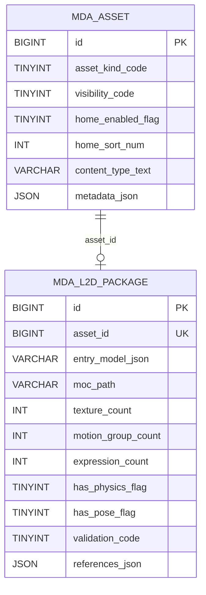

# L2D/图片媒体后端一期实施说明（v0.1）

- 文档日期：2026-02-12
- 适用仓库：`shizuki-site`
- 范围：后端一期（media/gateway/user）

---

## 1. 本期目标

在不实现前端页面的前提下，先打通「首页角色资源链路」后端能力：

1. 统一支持 3 类媒体资产：
   - `STATIC_IMAGE`
   - `ANIMATED_IMAGE`
   - `LIVE2D_PACKAGE`
2. 数据库存储使用 `tinyint` 代码；接口返回 `enum` 字符串。
3. 支持公开角色池查询（游客可访问）。
4. 支持 L2D ZIP 包结构校验并落库存档。
5. 补齐 `GET /api/v1/me/preferences` 供后续前端读取偏好。

---

## 2. 本期落地概览

### 2.1 服务改动

- `media-service`
  - 新增资产类型枚举与可见性枚举。
  - 扩展上传策略与资产落库接口字段。
  - 新增公开首页角色池接口。
  - 新增 L2D ZIP 校验器（防 Zip Slip + model3 引用校验）。
  - 新增 `MDA_L2D_PACKAGE` 一对一扩展表写入。
- `gateway-service`
  - guest 路径新增 `/api/v1/assets/public/**`、`/api/v1/assets/*/download-url`。
- `user-service`
  - 新增 `GET /api/v1/me/preferences`。

### 2.2 关键流程图



---

## 3. 数据模型

### 3.1 MDA_ASSET 新增字段

- `asset_kind_code TINYINT`：1 静态图 / 2 动态图 / 3 L2D包
- `visibility_code TINYINT`：1 私有 / 2 公开
- `home_enabled_flag TINYINT(1)`：是否进入首页公开角色池
- `home_sort_num INT`：首页排序
- `content_type_text VARCHAR(128)`：原始 MIME
- `object_hash VARCHAR(128)`：对象内容指纹（ETag 归一化），用于去重查询
- `metadata_json JSON`：扩展元数据

### 3.2 MDA_L2D_PACKAGE 新表

- `asset_id`（唯一，关联 `MDA_ASSET.id`）
- `entry_model_json`
- `moc_path`
- `texture_count`
- `motion_group_count`
- `expression_count`
- `has_physics_flag`
- `has_pose_flag`
- `references_json`
- `validation_code`（1=PASSED,2=FAILED）

### 3.3 ER 图



### 3.4 迁移基线策略（未正式部署前）

1. 将原 `V3__asset_kind_and_l2d.sql` 的结构性变更并入 `V1__init_schema.sql`。
2. 删除 `V3` 文件，避免新环境初始化时多段迁移叠加。
3. 本地若已执行过旧迁移，默认重建数据库后重新执行 Flyway 基线。
4. `resouces/sql/shizuki_media.sql` 同步为最新基线结构。

### 3.5 索引与去重策略（v0.1 增补）

1. 新增索引：`IX_MDA_ASSET_4 (user_id, object_hash, deleted_flag)`。
2. 去重查询改为命中独立列 `object_hash`，不再通过 `JSON_EXTRACT(metadata_json, '$.object_hash')`。
3. 目标：降低 JSON 函数扫描成本，避免规模增长后出现明显慢查询。

---

## 4. 接口变更

## 4.1 `POST /api/v1/assets/upload-policies`

请求新增：
- `asset_kind`（必填）
- `visibility`（默认 `PRIVATE`）

响应新增：
- `asset_kind`
- `asset_kind_code`
- `upload_strategy`（固定 `DIRECT_OSS`）

## 4.2 `POST /api/v1/assets`

请求新增：
- `asset_kind`
- `content_type`
- `visibility`
- `metadata`（可选）

响应新增：
- `asset_kind`
- `visibility`
- `audit_status`
- `l2d_validation`（L2D 时返回）

## 4.3 `GET /api/v1/assets/public/home-roles`（新增）

返回字段：
- `asset_id`
- `asset_kind`
- `cover_url`
- `download_url`
- `l2d_entry_model_json`（L2D 时）
- `sort_num`

过滤条件：
- `visibility=PUBLIC`
- `audit_status=APPROVED`
- `home_enabled_flag=1`

## 4.4 `GET /api/v1/assets/{asset_id}/download-url`

扩展返回：
- `asset_kind`
- `is_public`
- 公开资源返回 `public_url`
- 私有资源返回 `download_url + expire_seconds`
- 访问规则：`PUBLIC + APPROVED` 可匿名访问，其余仅 owner 或 ADMIN 可访问

## 4.5 `PUT /api/v1/admin/assets/{asset_id}/audit-status`

由 query 参数改为 JSON body，支持：
- `audit_status`
- `home_enabled`
- `home_sort_num`
- `visibility`

## 4.6 `GET /api/v1/me/preferences`（新增）

读取当前用户偏好 JSON，供后续前端恢复角色/布局选择。

补充约束（当前决策）：
- 轻应用（widgets）`位置(position)` 与 `尺寸(size)` 仅保存在前端运行时内存，不落后端。
- 后端偏好接口仅保留：
  - 用户启用的轻应用清单（例如 `widget_key`、开关状态、排序号等）
  - 轻应用业务参数（例如每个轻应用自己的 `config`/`params`）
- 因为位置与尺寸不入库，刷新页面后由前端按默认布局重建。

## 4.7 契约收敛补充（v0.1 增补）

为避免弱类型响应带来的前后端契约漂移，本期将以下接口响应收敛为强类型 DTO：

- `POST /api/v1/assets/{asset_id}/reports`
  - 响应字段：`asset_id`、`report_id`、`report_status`
- `PUT /api/v1/admin/assets/{asset_id}/audit-status`
  - 响应字段：`asset_id`、`audit_status`、`home_enabled`、`home_sort_num`、`visibility`、`asset_kind`

说明：字段名保持既有 snake_case，不做路径和语义破坏性变更。

---

## 5. L2D ZIP 校验规则

1. 后缀与 MIME：仅允许 ZIP。
2. 安全：
   - 禁止 `..`、绝对路径、反斜杠穿越路径。
   - 限制 entry 数量、entry 名长度、单 entry 大小。
3. 结构：
   - 必须且仅能有一个 `*.model3.json`。
   - 必须包含 `Moc` 与 `Textures[]` 引用文件。
   - `Motions/Expressions/Physics/Pose` 若声明则必须存在对应文件。
4. 校验通过后，写入 `MDA_L2D_PACKAGE`。

## 5.1 去重与安全扫描钩子（v0.1 增补）

1. 资产落库前读取对象元数据，提取 `ETag` 归一化为 `object_hash`。
2. 默认启用“同用户 + object_hash”轻量去重，命中则拒绝重复上传。
3. 一期安全扫描采用“钩子占位”策略：
   - `enable-security-scan-hook=false`：写入 `security_scan_status=BYPASSED`
   - `enable-security-scan-hook=true`：写入 `security_scan_status=PENDING`
4. 系统元数据写入 `metadata_json`，包含：
   - `object_hash`
   - `security_scan_status`
   - `security_scan_message`
   - `object_size_bytes`
   - `storage_content_type`

## 5.2 MIME 一致性校验（v0.1 增补）

1. 资产落库前，服务端读取存储端对象元数据 `content_type`。
2. 若“请求声明 MIME”与“存储实际 MIME”均存在且不一致，直接拒绝请求（`400 BAD_REQUEST`）。
3. 按 `asset_kind` 做二次白名单校验：
   - `STATIC_IMAGE`：`image/png,image/jpeg,image/webp`
   - `ANIMATED_IMAGE`：`image/gif,image/webp,image/apng`
   - `LIVE2D_PACKAGE`：`application/zip`（兼容 `application/x-zip-compressed` 归一化）
4. 目标：防止客户端伪造类型导致错误资产落库。

## 5.3 OSS 元数据错误语义（v0.1 增补）

`AliyunOssClient#getObjectMetadata` 错误映射规则：

1. `OSSException` 且状态码 `404` -> `NOT_FOUND`
2. `OSSException` 且状态码 `>=500` -> `INTERNAL_ERROR`
3. 其他 `OSSException` -> `BAD_REQUEST`
4. `ClientException` 或未知异常 -> `INTERNAL_ERROR`

说明：该语义用于区分“对象不存在”“OSS 服务故障”“调用参数问题”，便于上层接口返回更可读的错误。

---

## 6. 配置项新增

`shizuki.media.storage` 下新增：
- `public-base-url`
- `max-l2d-zip-entry-count`
- `max-l2d-zip-entry-name-length`
- `max-l2d-zip-single-entry-size`
- `max-l2d-zip-total-size`
- `enable-object-hash-dedup`
- `enable-security-scan-hook`

并补充 MIME 白名单：
- `image/gif`
- `image/apng`
- `application/zip`
- `application/x-zip-compressed`

---

## 7. 测试结果

执行命令：

```bash
mvn -pl services/media-service,services/gateway-service,services/user-service -am test -DskipITs
```

结果：`BUILD SUCCESS`

新增/扩展测试覆盖：
- `AssetKindEnumTest`
- `L2dZipValidatorTest`
- `AssetControllerIntegrationTest`（扩展）
- `AuthGatewayFilterTest`（guest public 路径）
- `MeControllerIntegrationTest`（新增）
- `UserServiceImplTest`（新增偏好读取测试）
- `DefaultAssetSecurityInspectorTest`（新增 MIME 一致性/类型匹配失败场景）

---

## 8. 代码注释落地约定（本期新增）

为与 `user-service` 风格保持一致，本期后端实现采用以下注释约定：

1. `controller/service/service-impl` 均补齐类注释与方法注释，明确职责与输入输出。
2. 对以下高风险逻辑补行内注释：
   - L2D ZIP 安全校验（路径归一化、Zip Slip 防护、entry 限额）
   - 新旧字段兼容（`asset_kind_code` 与历史 `asset_type`）
   - 可见性与 bucket 绑定校验（避免公开/私有策略绕过）
3. 新增 `enum/dto/entity` 的关键字段补语义注释，强调 code 与字符串映射关系。
4. 后续功能扩展时，保持“改逻辑必改注释”的同步原则。

## 9. 下一步（前端对接准备）

1. 前端上传时必须显式传 `asset_kind`、`content_type`、`visibility`。
2. 首页拉取角色池使用：`GET /api/v1/assets/public/home-roles`。
3. 已登录用户进入首页后，再调用 `GET /api/v1/me/preferences` 合并本地状态（仅合并轻应用清单与参数，不覆盖位置/尺寸运行态）。
4. 前端二期再接 Live2D 官方 SDK（model3.json 入口模式）。
