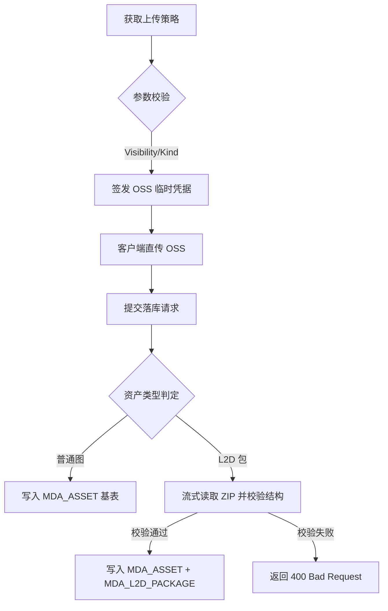
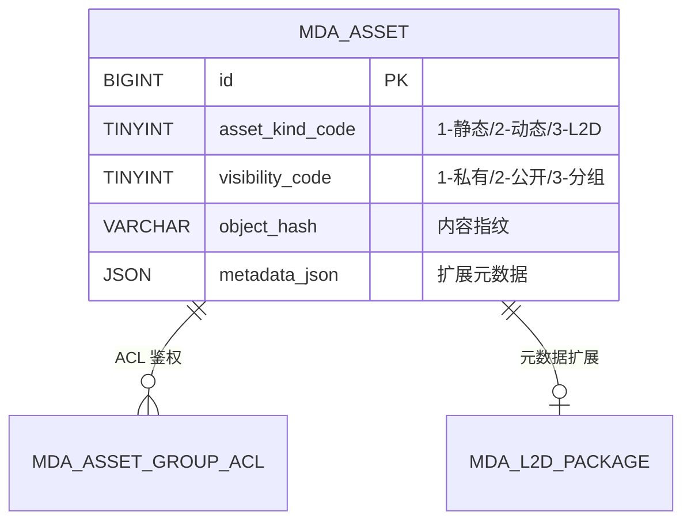

# L2D 角色与媒体资产后端实施方案 (v0.1)

## 1. 方案目标 (Objectives)

本阶段旨在打通沉浸式陪伴系统的核心资源链路，在后端建立可支持多种媒体形态、多层级可见性控制及安全校验的资源托管能力。

### 1.1 核心支持项
1.  **资产类型映射：** 统一管理 `STATIC_IMAGE`（静态图）、`ANIMATED_IMAGE`（动态图）及 `LIVE2D_PACKAGE`（L2D 资源包）。
2.  **访问控制：** 实现公开角色池、分组可见资源及私有资源的权限隔离。
3.  **合规性校验：** 建立针对 L2D ZIP 包的结构化校验机制，防御安全漏洞（如 Zip Slip）。
4.  **偏好集成：** 建立偏好同步接口，为前端恢复交互状态提供支撑。

---

## 2. 实施变更总览 (Implementation Overview)

### 2.1 模块职责扩展
- **`media-module`:** 引入资产种类与可见性枚举，新增 `MDA_ASSET_GROUP_ACL`（访问控制列表）与 `MDA_L2D_PACKAGE`（L2D 元数据扩展表）。
- **`monolith-app`:** 在入口层放行公开资源查询接口，并为管理端接口配置对应的权限门禁。
- **`user-module`:** 交付 `GET /api/v1/me/preferences` 接口，支持用户个性化配置的云端拉取。

### 2.2 资产上传与处理流程

```mermaid
flowchart TD
    A[获取上传策略] --> B{参数校验}
    B -->|Visibility/Kind| C[签发 OSS 临时凭据]
    C --> D[客户端直传 OSS]
    D --> E[提交落库请求]
    E --> F{资产类型判定}
    F -->|普通图| G[写入 MDA_ASSET 基表]
    F -->|L2D 包| H[流式读取 ZIP 并校验结构]
    H -->|校验通过| I[写入 MDA_ASSET + MDA_L2D_PACKAGE]
    H -->|校验失败| J[返回 400 Bad Request]
```

---

## 3. 存储与数据模型 (Storage & Data Model)

### 3.1 核心表结构变更
- **MDA_ASSET (基表):** 新增 `asset_kind_code`、`visibility_code`、控制首页公开池的 `home_enabled_flag` 以及用于去重校验的 `object_hash`。
- **MDA_ASSET_GROUP_ACL (权限表):** 用于存储资源与授权分组（Groups）的关联关系。
- **MDA_L2D_PACKAGE (扩展表):** 存储 L2D 模型的元数据，包括 Entry JSON 路径、MOC 文件位置、纹理数量等及其校验状态。

### 3.2 ER 关系映射

```mermaid
erDiagram
    MDA_ASSET ||--o{ MDA_ASSET_GROUP_ACL : "ACL 鉴权"
    MDA_ASSET ||--o| MDA_L2D_PACKAGE : "元数据扩展"

    MDA_ASSET {
        BIGINT id PK
        TINYINT asset_kind_code "1-静态/2-动态/3-L2D"
        TINYINT visibility_code "1-私有/2-公开/3-分组"
        VARCHAR object_hash "内容指纹"
        JSON metadata_json "扩展元数据"
    }
```

---

## 4. 关键接口说明 (API Specifications)

### 4.1 资源访问与检索
- **`GET /api/v1/assets/public/home-roles`:** 拉取首页公开角色池。仅返回已审计通过且开启展示标记的 PUBLIC 资源。
- **`GET /api/v1/assets/{id}/download-url`:** 动态下发资源链接。对于非公开资源，将根据当前用户的权限组及身份进行严格截断，并签发带时效性的私有 URL。

### 4.2 个人偏好管理
- **`GET /api/v1/me/preferences`:** 获取用户启用的 Widgets 清单及对应的个性化配置。
- **设计决策：** Widgets 的实时坐标与尺寸信息仅由前端运行时维护，后端仅负责持久化业务配置（如 Widget 状态、排序及特定参数）。

---

## 5. 安全与准入规范 (Validation Requirements)

### 5.1 L2D 资源包校验准则
1.  **路径安全：** 严禁出现绝对路径、反斜杠及 `..` 符号，防止目录穿越。
2.  **结构完整性：** ZIP 包内必须包含唯一有效的 `*.model3.json`，且所有引用的资源文件（Moc, Textures, Physics 等）必须在包内实际存在。
3.  **资源约束：** 限制单个 Entry 的大小及文件总数，防止压缩爆炸攻击。

### 5.2 媒体类型一致性校验
- **MIME 匹配：** 在落库前将对请求声明的 MIME 类型与 OSS 存储端的实际类型进行二次对齐，严禁伪造类型上传。

---

## 6. 测试与交付标准 (Testing)

- [x] **校验覆盖：** 通过 `L2dZipValidatorTest` 确保异常包无法落库。
- [x] **鉴权覆盖：** 确认 `GROUP` 级可见资源对非成员的拦截生效。
- [x] **性能对齐：** 引入 `object_hash` 索引以规避 JSON 字段带来的慢查询风险。

> [!TIP]
> **后续对接准备：** 前端在调用上传接口时，必须显式传递 `asset_kind` 与 `visibility`。若设置为 `GROUP` 可见，则需同步提供合法的授权分组编码。
