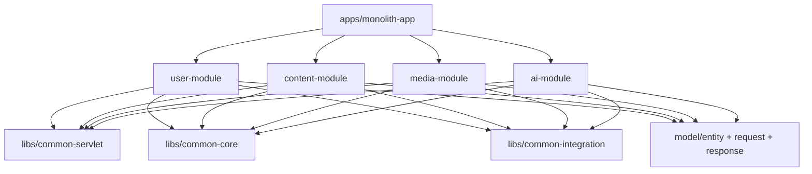
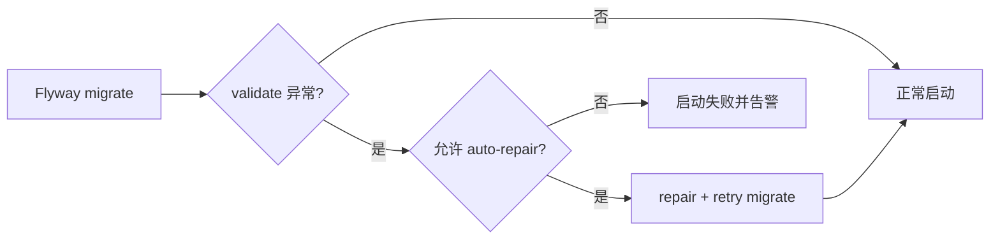

# 我是怎么把个人项目写成“可演进后端系统”的：阅读地图与复盘入口

> 这篇是整个系列的导航稿。我不想把它写成目录清单，而是写成“我当时怎么想、怎么拆、怎么验证”的开场复盘。

## 1. 我遇到的实际问题（背景与失败信号）

刚开始做个人站点的时候，想法很简单：能跑起来就行，功能能用就够了。

结果写到第三个模块，问题就来了：

- 用户登录那套逻辑，在好几个接口里都写了一遍，改一次得到处找
- 加个新功能，东改一点西改一点，根本不知道会影响到哪
- 明明只是个人项目，但已经有了”上线后出问题不知道咋查”的苗头

这时候我才反应过来：问题不是功能没写完，而是系统边界压根没划清楚。

## 2. 第一版方案为什么不够（踩坑和边界）

第一版嘛，走的就是典型的”先跑起来再说”路线：

- Controller 里直接堆业务逻辑
- 模块之间想调就调，临时打个通道
- 数据库？先加字段，迁移啥的以后再说

短期确实快，但长期就是个坑。特别是后来加了音乐、媒体、AI 这三块之后，整个系统开始乱套了：

- 认证、限流、审计，到处都在打补丁
- 文章可见性、媒体权限、用户分组，规则重复得一塌糊涂
- 最尴尬的是，过两天自己都看不懂：当时为啥要这么写？

## 3. 我怎么做技术选型（为什么选它而不是别的）

最后我选了 **Monolith Modular（单体部署 + 模块化边界）**，没直接上微服务。

为啥？原因挺实在的：

- 得先把各个域的边界理清楚，别一上来就搞服务治理那套复杂玩意儿
- 个人项目嘛，部署方便、调试快才是王道
- 等模块边界清晰了，再拆服务也不迟，到时候心里有底

我把整个结构分成了三层：

- `apps/monolith-app`：唯一的启动入口，负责把各模块组装起来
- `modules/*`：`user/content/media/ai` 四个业务域，各管各的
- `libs/*`：鉴权、限流、审计、异常处理这些通用能力



**图解说明**

- 输入：HTTP 请求由 `monolith-app` 接收。
- 处理：业务在 `modules/*` 内完成，横切治理统一走 `libs/*`。
- 输出：统一 `ApiResponse/ProblemDetail` 协议返回前端。

## 4. 我在代码里怎么落地（类/方法/API/表证据）

为了避免”架构图画得漂亮，代码里啥也没有”，我给每个域都留了可以追踪的证据。

### 4.1 请求入口和鉴权证据

- 入口过滤器：`AuthEntryFilter#doFilterInternal`
- 上下文注入：`LoginUserContextFilter#doFilterInternal`
- 示例接口：`POST /api/v1/auth/tokens`、`GET /api/v1/posts`

```java
// 入口只做一件事：把 token 解析成可信头，再交给业务层
AuthIntrospectResponse introspectResponse = authService.introspectByAccessToken(accessToken);
AuthContext context = parseAuthContext(introspectResponse);
filterChain.doFilter(withUserHeaders(request, context.userId(), context.groups(), context.permissions()), response);
```

### 4.2 治理链路证据

- 限流切面：`RateLimitAspect#around`
- 统一异常：`GlobalExceptionHandler#handleBusinessException`
- 审计落库：`JdbcAuditLogService#save`

相关表我固定看这几张：

- `AUD_LOG`
- `AUD_EVENT_OUTBOX`
- `USR_ACCOUNT`
- `CTN_POST`

### 4.3 迁移与演进证据

- 迁移目录：`apps/monolith-app/src/main/resources/monolith/db/migration`
- 版本段：`V101~V4xx`
- 自动恢复：`FlywayMigrationRecoveryConfig#flywayMigrationStrategy`



**图解说明**

- 输入：应用启动时触发 Flyway。
- 失败分支：仅在配置允许时自动 `repair`。
- 风险控制：生产环境默认不放开自动修复。

## 5. 这组系列文章怎么读（按我的实战顺序）

建议按”先搭骨架、再做业务、最后搞治理”的顺序来看：

1. `01_单体模块化架构与请求链路.md`
2. `02_认证授权与用户域设计.md`
3. `03_博客内容域与可见性策略.md`
4. `04_媒体资产域与L2D校验链路.md`
5. `05_音乐系统：检索_解析_缓存_歌单.md`
6. `06_AI会话与配额联动.md`
7. `07_审计_限流_异常与安全基线.md`
8. `08_Flyway迁移与核心数据表地图.md`
9. `09_配置清单与运行建议.md`
10. `10_可直接发布的专题选题建议.md`
11. `a.md`（总复盘样章）

## 6. 成本、风险和取舍

做这个架构的时候，我明确接受了三件事：

- 单体不是最终方案，但现阶段它就是效率最高的选择
- 鉴权、限流、审计这些得提前做好，不然后面补救成本翻倍
- 每个功能都得留下”证据”（类名、方法名、表名、接口），不然过段时间文章和代码都没法维护

## 7. 可复用 checklist

- [ ] 先把模块边界划清楚，再往里加功能
- [ ] 所有请求走统一鉴权入口，别在业务层到处解析 token
- [ ] 统一用 `ProblemDetail` 返回错误，别每个 Controller 自己造格式
- [ ] 审计日志用”主日志 + outbox”两段式，别拖累主流程
- [ ] 数据库改动全走迁移脚本，别手工执行”临时 SQL”
- [ ] 写技术文章时，类名、接口、表名、流程图，一个都不能少
