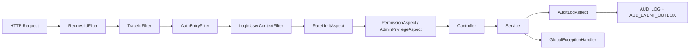
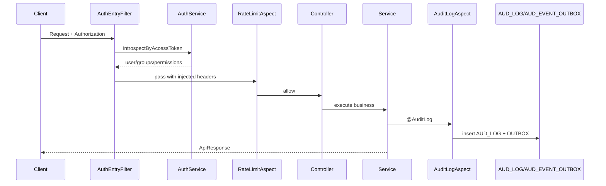

# 我是怎么把“能跑就行”的后端改造成可维护架构的：单体模块化与请求链路

> 这篇我只讲一件事：一个请求进来后，如何在我的系统里被“可控地”处理，而不是在代码里乱窜。

## 1. 我遇到的实际问题（背景与失败信号）

最开始做的后端接口能用是能用，但有两个明显的问题：

- 同样的权限校验逻辑，在好几个 Controller 里都写了一遍
- 线上出了问题想排查，根本不知道这个请求经过了哪些关键节点

特别是像 `POST /api/v1/music/picks` 和 `POST /api/v1/me/posts` 这种写接口，逻辑一多，就容易漏掉校验、漏掉日志、漏掉限流。

## 2. 第一版方案为什么不够（踩坑和边界）

第一版的做法挺常见的：

- Controller 里做鉴权判断
- Service 里顺便加个限流
- 出错了就 `try/catch` 拼个响应

这套方案模块一多就暴露问题了：

- 同样的逻辑到处重复，行为还不一致
- 错误码格式五花八门，前端得做一堆兼容
- 审计、TraceId、RequestId 没法统一下沉

## 3. 我怎么做技术选型（为什么选它而不是别的）

最后我用了”入口过滤器 + 上下文过滤器 + 切面治理 + 全局异常”这套链路模型：

- 入口层：`AuthEntryFilter`
- 上下文层：`LoginUserContextFilter`
- 治理层：`RateLimitAspect`、`PermissionAspect`、`AuditLogAspect`
- 兜底层：`GlobalExceptionHandler`

这套组合比”全写在业务里”好在哪？

- 鉴权和业务分开了
- 限流、权限、审计直接用注解就能接入
- 排查问题有统一的链路字段（`X-Request-Id`、`X-Trace-Id`）

## 4. 我在代码里怎么落地（类/方法/API/表证据）

### 4.1 入口：网关化鉴权

关键类与方法：

- `AuthEntryFilter#doFilterInternal`
- `AuthService#introspectByAccessToken`

关键接口样例：

- `GET /api/v1/posts`
- `POST /api/v1/me/posts`

```java
if (!StringUtils.hasText(authorization)) {
    if (guestPath) {
        filterChain.doFilter(withGuestHeaders(request), response);
        return;
    }
    unauthorized(response, "Login required");
    return;
}
```

这里我用了“游客路径可降级”的策略：`guest-invalid-token-policy=downgrade`，避免公共读接口被脏 token 完全阻断。

### 4.2 上下文：统一注入登录主体

- `LoginUserContextFilter#doFilterInternal`
- 从 `X-User-Id / X-User-Groups / X-User-Permissions` 组装出 `LoginUserContext`

这样 Service 层就不用管 token 格式了，只关心业务身份就行。

### 4.3 切面：限流、权限、审计

- 限流：`RateLimitAspect#around`
- 权限：`PermissionAspect#checkPermission`
- 审计：`AuditLogAspect#around` + `JdbcAuditLogService#save`

涉及数据表：

- `AUD_LOG`
- `AUD_EVENT_OUTBOX`

```java
if (!tryAcquire(key, rateLimit.limit(), rateLimit.windowSeconds())) {
    throw new BusinessException(ErrorCode.TOO_MANY_REQUESTS, "Rate limit exceeded");
}
```

### 4.4 异常：统一 ProblemDetail 协议

- `GlobalExceptionHandler#handleBusinessException`
- 统一输出 `code/request_id/type/status`

这一步把”后端内部的异常”转成”前端能稳定消费的协议”。

## 5. 请求链路图（mermaid）



**图解说明**

- 输入：任意 `/api/v1/*` 请求。
- 输出：成功响应或统一 ProblemDetail 错误。
- 失败分支：限流、鉴权、权限任一失败都会短路。



**图解说明**

- 审计记录放在 finally 语义里，成功失败都会落日志
- 审计事件异步出站，不会阻塞主业务响应

## 6. 成本、风险和取舍（性能/一致性/可维护性）

- 性能：多了一层过滤器和切面，但换来的是链路可观测性
- 一致性：统一协议和统一上下文，大大降低了”接口行为漂移”的问题
- 可维护性：新加模块时直接复用治理链路，不用从零开始粘贴模板

我接受的代价是：

- 链路变长了，新手理解成本会高一些
- 有些异常在入口就被拦住了，需要更清晰的日志注释

## 7. 可复用 checklist

- [ ] 鉴权只在入口做一次，别在业务里重复解析
- [ ] 登录上下文必须从可信头生成，先把不可信的同名头剥离掉
- [ ] 限流要支持 Redis 和本地降级两条路
- [ ] 错误统一输出 ProblemDetail，别返回散装 JSON
- [ ] 审计要有 outbox，避免下游挂了拖垮主流程
- [ ] 所有关键写接口都得挂上限流、权限、审计注解
