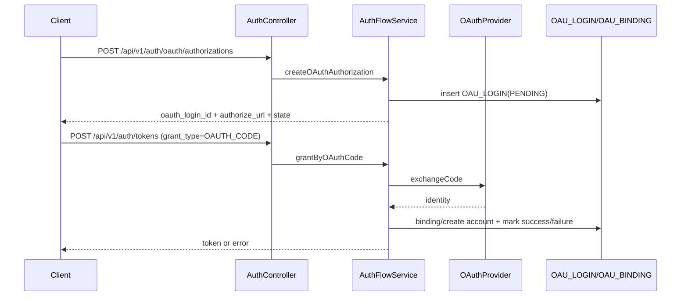

# 我是怎么把登录系统从”能登上”做到”可回收、可审计、可扩展”的

> 这篇是我在用户域踩坑最多的一段经历。真正难的不是发个 token，而是怎么保证生命周期、授权模式和高危操作都在掌控之中。

## 1. 我遇到的实际问题（背景与失败信号）

最开始只做了邮箱密码登录，接口是 `POST /api/v1/auth/tokens`。结果很快就暴露出几个问题：

- OAuth 登录一加进来，`if/else` 分支直接爆炸
- Refresh token 没法有效回收，注销的语义也不清不楚
- 管理员高危接口只看 `ADMIN` 分组，没有二次确认

这时候我意识到：必须把”授权模式”和”会话生命周期”拆成独立的能力。

## 2. 第一版方案为什么不够（踩坑和边界）

第一版的核心问题有三个：

- 授权模式耦合：邮箱登录、OAuth、refresh token 都挤在一个流程里
- 会话不可控：access token 过期策略和刷新策略没有清晰边界
- 风险操作没防线：管理员只凭登录态就能执行敏感操作

能用是能用，但一扩展就不稳了。

## 3. 我怎么做技术选型（为什么选它而不是别的）

我用了这套组合：

- 授权模式分发：`AuthGrantStrategyFactory` + `AuthGrantType`
- 认证核心流程：`AuthFlowService`
- 双 token：`Sa-Token access` + `RefreshTokenService`
- 管理员二次验证：`AdminPrivilegeService` + `@RequireAdminPrivilege`

关键接口：

- `POST /api/v1/auth/tokens`
- `POST /api/v1/auth/logout`
- `POST /api/v1/admin/privileges/unlock`

关键表：

- `USR_ACCOUNT`
- `OAU_LOGIN`
- `OAU_BINDING`
- `USR_GROUP_PERMISSION`

## 4. 我在代码里怎么落地（类/方法/API/表证据）

### 4.1 grant_type 策略化分发

- `AuthServiceImpl#issueToken`
- `AuthGrantStrategyFactory#get`

```java
AuthGrantType grantType = AuthGrantType.from(request.getGrantType());
AuthGrantResult result = authGrantStrategyFactory.get(grantType).grant(command);
return toTokenResponse(result);
```

这样新增授权模式的时候，就不用改主流程了。

### 4.2 OAuth 事务化与失败留痕

- `AuthFlowService#grantByOAuthCode`
- `AuthFlowService#markOauthLoginSuccess / markOauthLoginFailure`

这里我要求 OAuth 登录必须做到：

- `state` 只能消费一次
- 失败原因要写回登录事务
- 能区分是 provider 配置错了还是临时故障

### 4.3 refresh rotate 与撤销策略

- `RefreshTokenService#issue`
- `RefreshTokenService#rotate`
- `RefreshTokenService#revokeAll`

```java
if (authProperties.getJwt().isRefreshRotate()) {
    RefreshTokenService.IssueResult rotated = refreshTokenService.rotate(command.getRefreshToken());
    return authTokenIssuer.issueWithExistingRefresh(rotated.userId(), rotated.token(), rotated.expiresInSec());
}
```

### 4.4 管理员二次权限码

- `AdminPrivilegeService#verifyAndUnlock`
- `AdminPrivilegeAspect#checkAdminPrivilege`

解锁状态写入 Redis，key 跟用户 + token 指纹绑定，TTL 默认 1800 秒。

## 5. 授权与会话链路图（mermaid）

```mermaid
flowchart LR
  A[/api/v1/auth/tokens] --> B[AuthServiceImpl.issueToken]
  B --> C[AuthGrantType.from]
  C --> D[AuthGrantStrategyFactory.get]
  D --> E1[EmailPasswordGrantStrategy]
  D --> E2[OAuthCodeGrantStrategy]
  D --> E3[RefreshTokenGrantStrategy]
  E1 --> F[AuthFlowService]
  E2 --> F
  E3 --> F
  F --> G[AuthTokenIssuer]
  G --> H[AccessToken]
  G --> I[RefreshTokenService]
  I --> J[(Redis auth:refresh:*)]
```

**图解说明**

- 输入：同一个发 token 接口。
- 分流：按 grant_type 进入不同策略。
- 输出：统一 `AuthTokenResponse`，屏蔽内部差异。



**图解说明**

- 失败分支也会回写 `OAU_LOGIN`，方便后续审计和排障
- `state` 只消费一次，降低重放风险

```mermaid
flowchart TD
  A[管理员调用敏感接口] --> B{@RequireAdminPrivilege}
  B --> C[AdminPrivilegeAspect]
  C --> D{isUnlocked?}
  D -- 否 --> E[403 ADMIN_PRIVILEGE_REQUIRED]
  D -- 是 --> F[放行业务]
  E --> G[POST /api/v1/admin/privileges/unlock]
  G --> H[AdminPrivilegeService.verifyAndUnlock]
  H --> I[(Redis unlock key + TTL)]
  I --> F
```

**图解说明**

- 我把管理员”登录态”和”高危操作权限”明确拆成了两层
- 这样能有效降低误操作和会话被盗用的风险

## 6. 成本、风险和取舍

- 成本：实现复杂度比单 token 高不少
- 风险：refresh key 设计不当会导致撤销不彻底
- 收益：授权模式扩展、会话撤销、审计追踪都更稳了

最重要的取舍是：宁可在认证域多写点结构，也不要在业务域到处打补丁。

## 7. 可复用 checklist

- [ ] 用枚举 + 策略工厂来分离授权模式
- [ ] OAuth 登录必须事务化，失败状态也要保留
- [ ] refresh token 建议做 rotate 和 revokeAll
- [ ] access 和 refresh 的生命周期别混用
- [ ] 管理员敏感操作必须二次验证，不能只看分组
- [ ] 所有认证错误统一成业务错误码，别暴露内部细节
