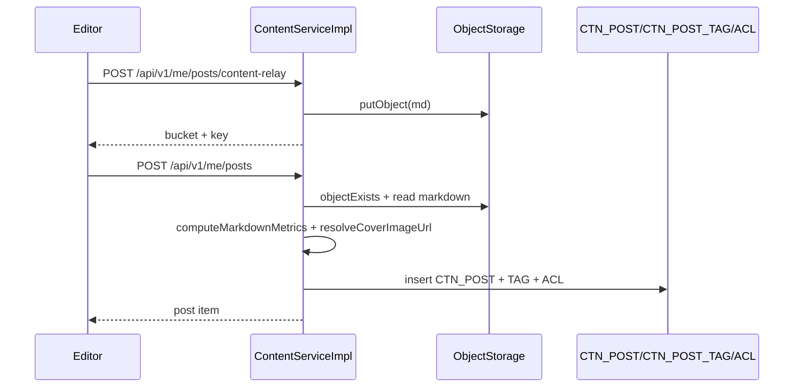
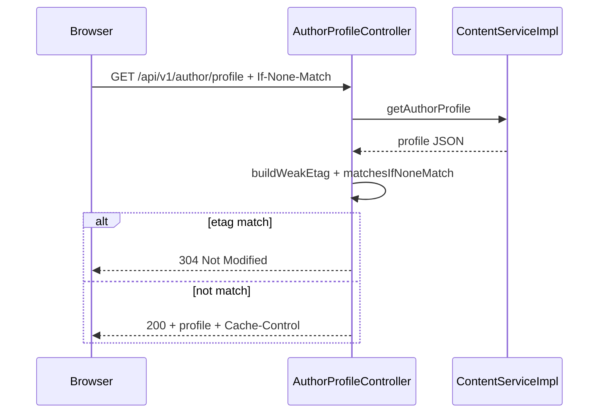

# 我是怎么把博客从”文章 CRUD”做成”可运营内容系统”的

> 我真正想解决的不是”发一篇文章”，而是”长期稳定地发布、控制可见范围、让展示端能缓存”。

## 1. 我遇到的实际问题（背景与失败信号）

一开始我把博客理解成三张表：标题、摘要、正文。结果很快就碰到问题了：

- 正文放数据库后，列表查询和详情读取耦在一起
- 分组可见和分类策略叠加时，权限判断开始乱套
- 作者主页频繁请求，前端每次刷新都重复拉相同数据

关键接口当时已经不少：

- `POST /api/v1/me/posts/content-relay`
- `POST /api/v1/me/posts`
- `GET /api/v1/posts/{post_id}`
- `GET /api/v1/author/profile`

## 2. 第一版方案为什么不够（踩坑和边界）

第一版我有两个误判：

- 误判 1：正文和索引字段放一张表就够了
- 误判 2：只做文章 ACL，就能覆盖所有可见性需求

后果挺明显的：

- 读路径性能差，统计指标算得不稳定
- 分类维度的访问策略没法表达（比如”某分类只给 FRIEND/ADMIN 看”）

## 3. 我怎么做技术选型（为什么选它而不是别的）

最后的方案是”对象存储正文 + 数据库索引 + 双层可见性 + 公开资料 HTTP 缓存”。

- 正文：`md_bucket + md_key` 指向对象存储
- 索引：`CTN_POST` 存状态、分类、统计字段
- 第一层可见性：`CTN_POST_GROUP_ACL`
- 第二层策略：`CTN_POST_CATEGORY_POLICY + _GROUP`
- 作者主页：`CTN_AUTHOR_PROFILE` + ETag 条件请求

## 4. 我在代码里怎么落地（类/方法/API/表证据）

### 4.1 内容中转与发布

关键方法：

- `ContentServiceImpl#relayPostMarkdown`
- `ContentServiceImpl#createMyPost`
- `ContentServiceImpl#publishMyPost`

```java
if (!objectStorageClient.objectExists(markdownBucket, markdownKey)) {
    throw new BusinessException(ErrorCode.BAD_REQUEST, “Markdown object does not exist in storage”);
}
String markdown = readMarkdownObject(markdownBucket, markdownKey);
MarkdownMetrics metrics = computeMarkdownMetrics(markdown);
```

这段逻辑确保”索引入库之前，正文已经存在、指标能算出来”。

### 4.2 双层可见性决策

关键方法：

- `ContentServiceImpl#canAccessPublishedPost`
- `ContentServiceImpl#canAccessByCategoryPolicy`

第一层看文章可见性（PUBLIC/GROUP），第二层看分类策略有没有启用。

### 4.3 Markdown 统计与封面兜底

关键方法：

- `ContentServiceImpl#computeMarkdownMetrics`
- `ContentServiceImpl#resolveCoverImageUrl`

它会混合统计：CJK 字符 + ASCII 单词，并根据正文首图自动兜底封面。

### 4.4 作者主页 ETag 缓存

关键类：

- `AuthorProfileController#getProfile`
- `AuthorProfileHttpCacheSupport#buildWeakEtag`

如果 `If-None-Match` 命中，就直接 304，减少重复 payload 传输。

## 5. 请求与数据链路图（mermaid）



**图解说明**

- 输入：编辑器上传 markdown。
- 校验：先验对象，再入索引。
- 输出：发布后可以稳定用于列表与详情。

```mermaid
flowchart TD
  A[请求文章详情 /api/v1/posts/{id}] --> B{状态=published?}
  B -- 否 --> N1[404]
  B -- 是 --> C[canAccessPublishedPost]
  C --> D{visibility=PUBLIC?}
  D -- 是 --> E[canAccessByCategoryPolicy]
  D -- 否 --> F{owner/admin?}
  F -- 否 --> G{visibility=GROUP?}
  G -- 否 --> N2[403]
  G -- 是 --> H[check CTN_POST_GROUP_ACL]
  H --> I{group hit?}
  I -- 否 --> N2
  I -- 是 --> OK[返回详情]
  E --> J{category policy pass?}
  J -- 否 --> N2
  J -- 是 --> OK
  F -- 是 --> OK
```

**图解说明**

- 权限决策拆成了可读的分支，排查时很快能定位是哪一层拒绝的



**图解说明**

- 公开资料走协商缓存后，页面刷新成本明显降下来了

## 6. 成本、风险和取舍

- 成本：可见性规则从”一个判断”升级成了”多层判定”
- 风险：策略叠加时容易误封，需要清晰的测试用例
- 收益：内容治理能力真正可运营了，不再是简单的”能看/不能看”

我的取舍是：复杂度放在后端规则层，前端只消费最终结果。

## 7. 可复用 checklist

- [ ] 正文和索引分离，正文优先用对象存储
- [ ] 发文前必须验证对象存在，防止脏引用
- [ ] 可见性至少拆成”内容 ACL + 分类策略”两层
- [ ] 统计指标统一在服务层算，别依赖前端上报
- [ ] 作者主页这类低频变更数据优先加 ETag
- [ ] 每条权限拒绝要有明确错误码和可追踪分支
