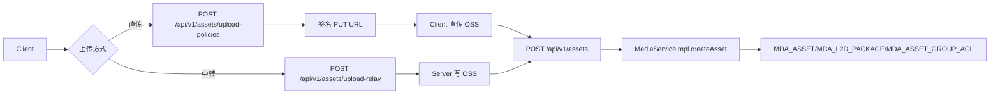
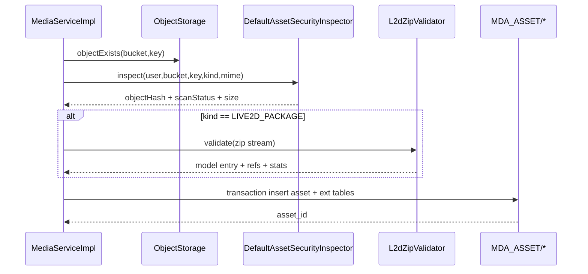

# 我是怎么把”文件上传”升级成”可治理资产系统”的：媒体域与 L2D 校验复盘

> 这篇最核心的一句话是：上传成功不等于资产能用，更不等于资产能治理。

## 1. 我遇到的实际问题（背景与失败信号）

媒体功能初版里，我只做了”上传后存个 URL”。然后很快遇到三类问题：

- 没法判断一个资源是否安全、是否重复、是否符合类型约束
- Live2D ZIP 包经常”上传成功但运行失败”
- 公共资源和私有资源的访问边界不稳定

相关接口当时已经覆盖：

- `POST /api/v1/assets/upload-policies`
- `POST /api/v1/assets/upload-relay`
- `POST /api/v1/assets`
- `GET /api/v1/assets/{asset_id}/download-url`

## 2. 第一版方案为什么不够（踩坑和边界）

第一版的问题挺典型的：

- 只看文件后缀，不看存储端真实 MIME
- 不校验 bucket 和可见性的语义一致性
- L2D ZIP 没做结构校验，导致运行时才暴雷

这导致”上传成功率高，但可用率低”，问题延迟到前端才暴露出来。

## 3. 我怎么做技术选型（为什么选它而不是别的）

我把媒体系统重构成了”资产中心”模型：

- 资产主表：`MDA_ASSET`
- L2D 扩展表：`MDA_L2D_PACKAGE`
- 资源 ACL：`MDA_ASSET_GROUP_ACL`
- 举报记录：`MDA_REPORT`

关键类与方法：

- `MediaServiceImpl#createAsset`
- `MediaServiceImpl#createDownloadUrl`
- `L2dZipValidator#validate`
- `DefaultAssetSecurityInspector#inspect`

## 4. 我在代码里怎么落地（类/方法/API/表证据）

### 4.1 上传双模式：直传 + 中转

我保留了两条路：

- 直传：`createUploadPolicy` 签发 OSS PUT URL
- 中转：`uploadRelay` 由服务端接收并写 OSS

这样既能兼顾性能（直传），又能兼顾兼容性（中转）。

### 4.2 资产创建不是”插一行表”

`createAsset` 我做了完整的校验链：

- 校验 `assetKind` 和 content-type
- 校验 `visibility` 和 bucket 一致
- 校验对象在 OSS 已经存在
- 调用 `assetSecurityInspector.inspect` 生成 hash 和扫描状态
- L2D 包先校验再事务落库

```java
if (!bucketByVisibility(visibility).equals(request.getBucket())) {
    throw new BusinessException(ErrorCode.BAD_REQUEST, "Bucket does not match visibility");
}
if (!objectStorageClient.objectExists(request.getBucket(), request.getKey())) {
    throw new BusinessException(ErrorCode.BAD_REQUEST, "Object does not exist in storage");
}
```

### 4.3 L2D ZIP 结构校验

`L2dZipValidator` 会做三组强约束：

- 安全：Zip Slip、entry 数量、单文件大小、总大小
- 结构：必须且只能有一个 `.model3.json`
- 引用完整性：`Moc/Textures/Motions/Expressions` 引用的文件必须存在

```java
if (modelPaths.size() != 1) {
    throw new BusinessException(ErrorCode.BAD_REQUEST, "Zip must contain exactly one .model3.json");
}
```

### 4.4 下载授权边界

`createDownloadUrl` 我把规则分成了两层：

- `PUBLIC + APPROVED`：可以匿名返回公开 URL
- 其他：必须是 owner 或 ADMIN（GROUP 还要命中 ACL）

避免”只要知道 asset_id 就能拿到下载地址”的风险。

## 5. 请求与校验链路图（mermaid）



**图解说明**

- 输入：对象上传成功后的 bucket/key。
- 处理：资产创建时做强校验，不把风险留到消费阶段。
- 输出：可下载、可审核、可追踪的资产记录。



**图解说明**

- L2D 远程 IO 校验放在事务外，避免长事务占用数据库连接

```mermaid
flowchart TD
  A[GET /api/v1/assets/{id}/download-url] --> B[load asset]
  B --> C{visibility=PUBLIC and audit=APPROVED?}
  C -- 是 --> D[返回 public url]
  C -- 否 --> E{login and ACL pass?}
  E -- 否 --> F[403]
  E -- 是 --> G[签名 get url]
  G --> H[返回临时下载地址]
```

**图解说明**

- 公开资源和受限资源走不同 URL 策略，降低越权风险。

## 6. 成本、风险和取舍

- 成本：上传流程变长了，实现复杂度提高
- 风险：校验规则太严会影响可用性，需要逐步调参
- 收益：资源治理、审核、复用能力明显提升

我接受的取舍是：宁可上传阶段慢一点，也要换运行阶段的稳定。

## 7. 可复用 checklist

- [ ] 上传策略必须绑定资产类型和 MIME
- [ ] bucket 和 visibility 必须强绑定
- [ ] 资产创建前必须验证对象真实存在
- [ ] L2D ZIP 必须做安全 + 结构 + 引用完整性三重校验
- [ ] 下载授权必须区分公开 URL 和签名 URL
- [ ] 资产主表和扩展表写入建议放在同一事务内
