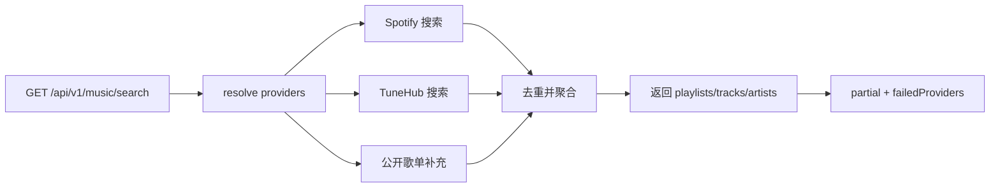
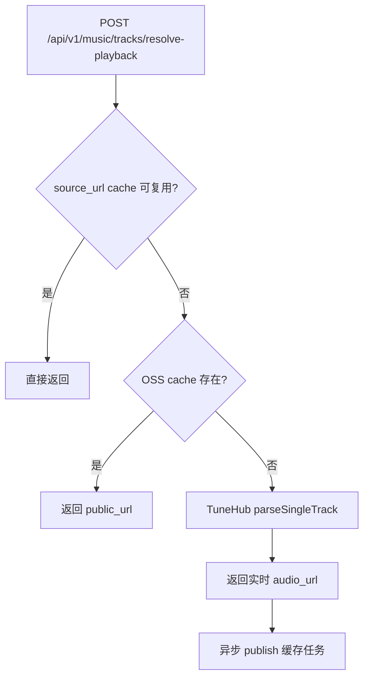
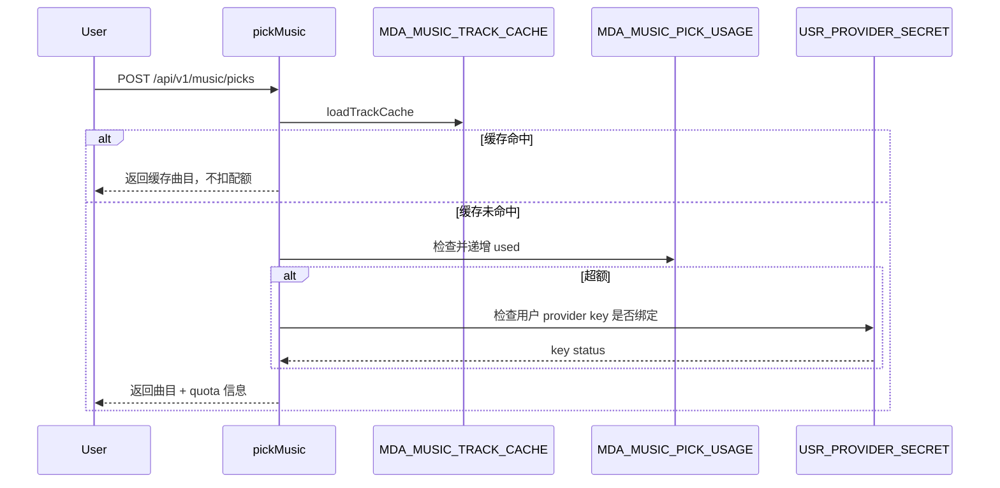

# 我是怎么把音乐功能从”能播”做到”可降级、可缓存、可运营”的

> 这篇里我最在意的是：第三方音乐源不稳定是常态，系统必须在不稳定的环境下还能用。

## 1. 我遇到的实际问题（背景与失败信号）

音乐模块上线初期，遇到的不是”没数据”，而是”数据时好时坏”：

- 某个 provider 突然超时，搜索全链路跟着挂
- 播放链接短期失效，用户点开后随机报错
- 歌单内容和配额逻辑耦在一起，改起来成本高

涉及接口：

- `GET /api/v1/music/search`
- `POST /api/v1/music/tracks/resolve-playback`
- `POST /api/v1/music/picks`
- `POST /api/v1/me/music/playlists`

## 2. 第一版方案为什么不够（踩坑和边界）

第一版”单源直连”的问题很快就显现了：

- provider 异常会把搜索全盘拖死
- 不做缓存意味着每次播放都要重新解析
- 歌单只做静态列表，没法支持用户收藏和自建

这时候我做了个决定：必须把”检索、解析、缓存、歌单、配额”拆成独立环节。

## 3. 我怎么做技术选型（为什么选它而不是别的）

我在 `MediaServiceImpl` 里把音乐能力拆为四段：

- 检索聚合：`searchMusic`
- 播放解析：`resolvePlaybackTrack`
- 配额联动：`myMusicQuota` + `pickMusic`
- 歌单运营：默认歌单 + 用户歌单 + 收藏关系

关键表：

- `MDA_MUSIC_TRACK_CACHE`
- `MDA_MUSIC_PICK_USAGE`
- `MDA_MUSIC_UPLOAD_USAGE`
- `MDA_USER_MUSIC_PLAYLIST`
- `MDA_USER_MUSIC_PLAYLIST_TRACK`
- `MDA_USER_MUSIC_PLAYLIST_COLLECT`

## 4. 我在代码里怎么落地（类/方法/API/表证据）

### 4.1 搜索聚合：允许 partial

关键方法：`MediaServiceImpl#searchMusic`

这里我明确支持 `failedProviders` 和 `partial=true`，而不是”只要一个源失败就整体失败”。

```java
boolean partial = !failedProviders.isEmpty();
return new MusicSearchResponse(query, type, page, limit, partial, new ArrayList<>(failedProviders), ...);
```

### 4.2 播放解析：三段回源

关键方法：`MediaServiceImpl#resolvePlaybackTrack`

回源顺序：

1. 命中 `source_url` 缓存（可复用）
2. 命中 OSS 对象缓存
3. 调 TuneHub 实时解析

解析成功后再异步入缓存队列，避免阻塞主请求。

### 4.3 pick 配额：优先缓存，不滥扣额度

关键方法：`MediaServiceImpl#pickMusic`

- 如果命中缓存，不扣本次 pick 配额
- 未命中时先看分组额度（`music_pick_daily` 类似策略），额度不够再判断有没有绑定用户 API key

### 4.4 歌单分层

我把歌单拆成了三层：

- 平台默认歌单（运营入口）
- 用户自建歌单（`CUSTOM`）
- 收藏关系（跨歌单聚合）

对应接口：

- `GET /api/v1/music/playlist/default/bundle`
- `GET /api/v1/me/music/library/sidebar`
- `POST /api/v1/me/music/playlists/{playlistCode}/collect`

## 5. 检索与播放链路图（mermaid）



**图解说明**

- 不追求”全成功”，而是追求”可用优先”
- 前端可以根据 `partial` 做降级提示



**图解说明**

- 回源路径越靠前，延迟越低、成本越低
- 只有真正 miss 时才调第三方解析



**图解说明**

- 把”可缓存命中”和”额度消耗”显式解耦，避免过度扣减

## 6. 成本、风险和取舍

- 成本：代码复杂度明显提升，日志也更多了
- 风险：多 provider 聚合要处理更多异常分支
- 收益：即使单源波动，用户还是能搜、能播、能收藏

最终的取舍是：稳定性优先于”单次调用最短路径”。

## 7. 可复用 checklist

- [ ] 搜索聚合必须支持部分失败返回
- [ ] 播放解析至少设计两级缓存回源
- [ ] 配额策略要区分”缓存命中”和”真实消耗”
- [ ] provider 可用性配置必须能后台动态调整
- [ ] 歌单分层（默认/自建/收藏）要有独立表结构
- [ ] 把失败 provider 信息显式回传给前端
