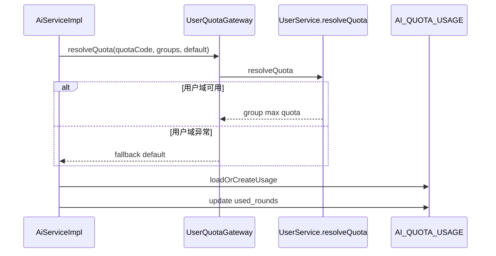

# 我是怎么把 AI 模块从“Mock 对话”做成“可上线底座”的：会话与配额联动

> 这篇讲的是我在 AI 模块做的一个关键取舍：先把配额、鉴权、数据结构打牢，再替换真实模型。

## 1. 我遇到的实际问题（背景与失败信号）

最开始我也想直接接模型 API，但很快意识到：

- 没有额度控制，系统成本不可控
- 没有稳定的会话 ID，前后端上下文难对齐
- 没有用户分组配额联动，后续权限策略会很难补

所以我先落了这些接口：

- `POST /api/v1/ai-sessions`
- `POST /api/v1/ai-sessions/{session_id}/messages`
- `GET /api/v1/ai-quotas/me`

## 2. 第一版方案为什么不够（踩坑和边界）

第一版我把配额算在前端，问题是：

- 前端可以绕过，额度不可信
- 多端登录场景下额度会乱
- 后端没法统一审计”谁消耗了多少轮次”

最终结论是：额度必须服务端做”唯一真相”。

## 3. 我怎么做技术选型（为什么选它而不是别的）

我选了”服务端配额 + 跨域网关获取策略 + mock 可替换回复”的组合：

- 核心实现：`AiServiceImpl#sendMessage`
- 配额网关：`UserQuotaGateway#resolveQuota`
- 存储表：`AI_QUOTA_USAGE`
- 角色配置：`AI_CHARACTER`

关键思想：

- 不等模型接入完成再补治理
- 先把额度、上下文、协议做稳定

## 4. 我在代码里怎么落地（类/方法/API/表证据）

### 4.1 发送消息时先扣额度

关键方法：`AiServiceImpl#sendMessage`

```java
AiQuotaUsageEntity usage = loadOrCreateUsage(userId, total);
long next = usage.getUsedRounds() + 1;
if (next > usage.getTotalRounds()) {
    throw new BusinessException(ErrorCode.FORBIDDEN, "AI quota exhausted");
}
usage.setUsedRounds(next);
aiQuotaUsageMapper.updateById(usage);
```

这意味着“配额是后端强约束”，而不是前端提示。

### 4.2 配额策略跨域解耦

- `AiServiceImpl#resolveTotalQuota`
- `UserQuotaGateway#resolveQuota`

AI 模块不直接依赖用户域实现细节，只走网关接口。网关异常时使用 fallback。

### 4.3 会话策略

- `createSession` 返回稳定的 `session-*` 编号
- `listSessions` 目前由前端本地维护

这是当前阶段对”快速迭代 vs 服务端复杂度”的平衡。

## 5. 链路图（mermaid）

```mermaid
flowchart LR
  A[POST /api/v1/ai-sessions/{id}/messages] --> B[AiServiceImpl.sendMessage]
  B --> C[UserQuotaGateway.resolveQuota]
  C --> D[loadOrCreate AI_QUOTA_USAGE]
  D --> E{used + 1 <= total?}
  E -- 否 --> F[403 AI quota exhausted]
  E -- 是 --> G[used_rounds++]
  G --> H[返回 assistant_message + quota]
```

**图解说明**

- 输入：用户消息。
- 处理：先判断额度，再生成回复。
- 输出：回复同时带 quota 信息，前端可直接展示。



**图解说明**

- 把”策略来源”和”额度消耗”拆开，实现上更耐变更

## 6. 成本、风险和取舍

- 成本：即使是 mock 阶段，也要先做数据库和配额逻辑
- 风险：如果配额策略和用户分组配置不一致，会出现”看似随机”的额度问题
- 收益：后续替换真实 LLM 时，不用重构外围治理

我接受的取舍是：现在多做点基础设施，换后续低风险扩展。

## 7. 可复用 checklist

- [ ] 配额必须服务端结算，别放前端
- [ ] `loadOrCreate` 适合配额这类懒初始化场景
- [ ] AI 模块对用户域能力建议走网关，避免硬耦合
- [ ] 回复协议提前固定，便于 mock 和真实模型平滑切换
- [ ] 接口响应里带剩余额度，前端能感知成本
- [ ] 超额必须返回明确错误码和剩余额度字段
