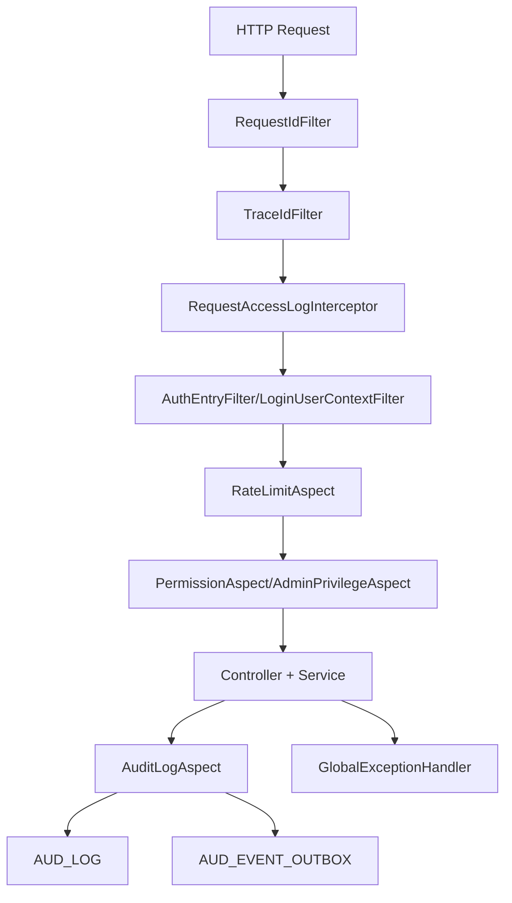
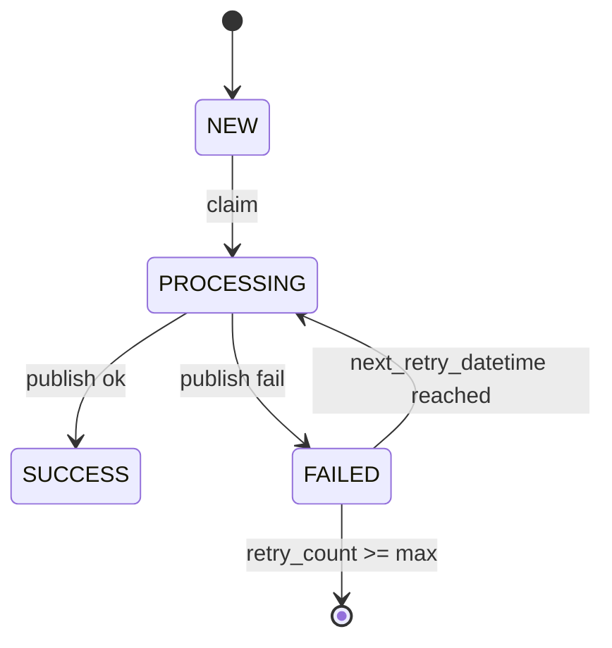
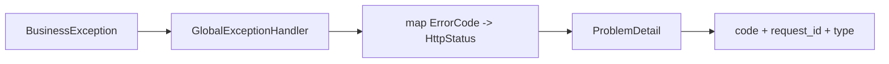

# 我是怎么给后端补上”护城河”的：审计、限流、异常与安全基线

> 写到这个阶段我有个很强烈的感受：功能只是地基，治理能力才是系统能否长期运行的关键。

## 1. 我遇到的实际问题（背景与失败信号）

系统功能变多之后，面临三类风险：

- 接口被高频调用时，系统没有稳定的削峰机制
- 关键操作出了问题，缺乏完整的审计链
- 不同接口错误格式不一致，前端和排查都很痛苦

此外还有安全侧压力：

- 富文本输入的 XSS 风险
- 管理员高危接口缺少二次门禁

## 2. 第一版方案为什么不够（踩坑和边界）

第一版做法是”哪里出问题就在哪里补”：

- 某个接口超载就在该接口加 if 判断
- 某个操作重要就手工写日志
- 某个异常难看就临时改返回

这种”点状修补”会带来不可维护性：

- 行为不一致
- 排查链条断裂
- 治理能力没法复用

## 3. 我怎么做技术选型（为什么选它而不是别的）

最终固定了”四层治理结构”：

- 入口可追踪：`RequestIdFilter` + `TraceIdFilter`
- 访问日志：`RequestAccessLogInterceptor` + `BusinessOperationLogAspect`
- 行为约束：`RateLimitAspect` + `PermissionAspect` + `AdminPrivilegeAspect`
- 审计与可靠投递：`AuditLogAspect` + `JdbcAuditLogService` + `JdbcAuditOutboxServiceImpl`

统一异常由 `GlobalExceptionHandler` 输出 `ProblemDetail`。

## 4. 我在代码里怎么落地（类/方法/API/表证据）

### 4.1 限流：注解化 + Redis 优先 + 本地降级

关键方法：`RateLimitAspect#around`

- Redis `INCR + EXPIRE` 为主
- Redis 异常降级 `LocalRateLimiter`

```java
Long count = redisTemplate.opsForValue().increment(key);
if (count != null && count == 1L) {
    redisTemplate.expire(key, Duration.ofSeconds(windowSeconds));
}
```

### 4.2 审计：主日志 + Outbox

关键类：

- `AuditLogAspect`
- `JdbcAuditLogService`
- `JdbcAuditOutboxServiceImpl`

关键表：

- `AUD_LOG`
- `AUD_EVENT_OUTBOX`

`JdbcAuditLogService#save` 会先写主日志，再写 outbox；分发失败靠重试任务兜底。

### 4.3 异常统一协议

关键方法：`GlobalExceptionHandler#handleBusinessException`

统一返回字段包含：`code`、`request_id`、`type`、`status`。

### 4.4 安全基线

- XSS 清洗：`HtmlSanitizerService#sanitize`
- 管理员二次门禁：`AdminPrivilegeAspect` + `AdminPrivilegeService`

关键接口示例：

- `POST /api/v1/admin/privileges/unlock`
- `PUT /api/v1/admin/users/{user_id}/groups`

## 5. 治理链路图（mermaid）



**图解说明**

- 入口先拿到关联 ID，再进入治理与业务。
- 审计写入和异常输出都统一化。



**图解说明**

- outbox 事件状态机可以显式观察”失败重试是否卡住”
- `JdbcAuditOutboxServiceImpl` 还会回收超时的 `PROCESSING` 事件



**图解说明**

- 把所有错误收敛成可前端消费、可日志检索的统一格式

## 6. 成本、风险和取舍

- 成本：治理链路变长了，调试入口需要更多上下文知识
- 风险：切面过多可能影响可读性，需要明确注解约定
- 收益：线上稳定性、排查效率、安全基线同时提升

我的取舍是：把复杂度集中在通用治理层，不扩散到业务实现。

## 7. 可复用 checklist

- [ ] 每个请求都要有 request_id 和 trace_id
- [ ] 限流必须有 Redis 主路径 + 本地降级路径
- [ ] 审计必须用”主日志 + outbox”模式，避免丢事件
- [ ] 全局异常统一成 ProblemDetail，禁止接口各自定义错误结构
- [ ] 高危管理接口必须二次验证，不能只靠 ADMIN 分组
- [ ] 富文本入口必须做 XSS 清洗
