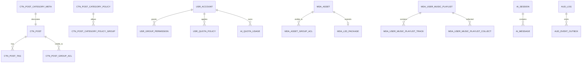
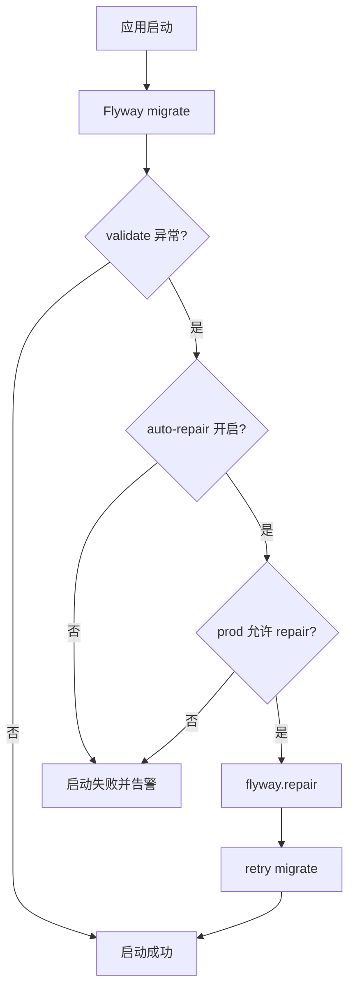

# 我是怎么把数据库改动从”手工 SQL”变成”可演进迁移系统”的：Flyway 复盘

> 这篇不是罗列表，而是我在持续改 schema 过程中，怎么把风险控制住、把历史留得能追踪。

## 1. 我遇到的实际问题（背景与失败信号）

项目早期我也做过”临时改库”：

- 本地手改字段，线上忘了同步
- 多人环境下索引状态不一致
- 版本升级时出现 checksum mismatch，启动直接挂

这类问题最可怕的是：平时看不见，一发版就炸。

## 2. 第一版方案为什么不够（踩坑和边界）

第一版我把 SQL 放在零散脚本里，问题是：

- 变更顺序追不回来
- 回滚和补偿没有统一入口
- “某个环境已经执行过哪个脚本”不透明

所以我把所有迁移收敛到单目录，按版本段管理。

## 3. 我怎么做技术选型（为什么选它而不是别的）

我采用 Flyway + 版本分段命名：

- 用户域：`V101~V1xx`
- 内容域：`V201~V2xx`
- 媒体域：`V301~V3xx`
- AI/治理域：`V401~V4xx`

迁移目录：

- `apps/monolith-app/src/main/resources/monolith/db/migration`

并加了启动恢复策略：

- `FlywayMigrationRecoveryConfig#flywayMigrationStrategy`
- 仅在配置允许时自动 `repair()`。

关键影响接口示例：

- `GET /api/v1/posts`
- `GET /api/v1/music/library/home`
- `GET /api/v1/ai-quotas/me`

## 4. 我在代码里怎么落地（类/方法/API/表证据）

### 4.1 迁移分段和幂等写法

我在 `V408` 等迁移里大量使用了“先查信息架构再 ALTER”的方式，避免重复执行报错。

```sql
SET @col_exists = (
  SELECT COUNT(1) FROM information_schema.columns
  WHERE table_schema = DATABASE() AND table_name = 'CTN_POST' AND column_name = 'status_code'
);
SET @ddl = IF(@col_exists = 0,
  'ALTER TABLE CTN_POST ADD COLUMN status_code VARCHAR(32) NOT NULL DEFAULT ''PUBLISHED''',
  'SELECT 1');
```

### 4.2 checksum 失败恢复策略

关键方法：`FlywayMigrationRecoveryConfig#flywayMigrationStrategy`

```java
try {
    flyway.migrate();
} catch (FlywayValidateException ex) {
    flyway.repair();
    flyway.migrate();
}
```

实际实现里我加了两个保护开关：

- `shizuki.flyway.auto-repair-on-validate-error`
- `shizuki.flyway.allow-auto-repair-in-prod`

### 4.3 核心表演进证据

在 `V401~V412` 这一段，我把“AI + 审计 + 内容扩展”一起补齐：

- `AI_SESSION` / `AI_MESSAGE` / `AI_QUOTA_USAGE`
- `AUD_LOG` / `AUD_EVENT_OUTBOX`
- `CTN_POST` 扩展字段 + `CTN_POST_TAG` + `CTN_POST_CATEGORY_META`
- `CTN_AUTHOR_PROFILE`

## 5. 迁移与数据演进图（mermaid）

```mermaid
gantt
  title 我的迁移演进时间线（能力视角）
  dateFormat  X
  axisFormat %s

  section User
  V101 用户基础模型        :a1, 0, 1
  V404 分组目录补全        :a2, 1, 1

  section Content
  V201 内容基础表          :b1, 2, 1
  V408 博客一期扩展        :b2, 3, 1
  V409 封面字段            :b3, 4, 1
  V411 分类元数据          :b4, 5, 1
  V412 作者主页            :b5, 6, 1

  section Media
  V301 媒体主模型          :c1, 7, 1
  V406 用户歌单三表        :c2, 8, 1
  V407 试听缓存索引        :c3, 9, 1

  section AI & Audit
  V401 AI + 审计 outbox    :d1, 10, 1
```



**图解说明**

- 按”业务域能力”而不是”随机编号”组织迁移，后续回看成本更低



**图解说明**

- 这张图能快速回答“某个能力改动会影响哪些表”。



**图解说明**

- 自动恢复不是默认全开，只在受控场景使用

## 6. 成本、风险和取舍

- 成本：写迁移脚本比手工改库慢
- 风险：迁移脚本质量差会把问题固化到所有环境
- 收益：发布可预测、版本能追踪、回滚能讨论

我接受的取舍是：开发期多花时间写好迁移，换生产期低风险。

## 7. 可复用 checklist

- [ ] 所有 schema 变更都必须进 Flyway 目录
- [ ] 尽量写幂等迁移，避免重复执行炸环境
- [ ] 用版本段表达业务域，便于历史回溯
- [ ] checksum 自动修复必须有环境开关
- [ ] 每次迁移都写明影响表和影响接口
- [ ] 发布前至少跑一次空库初始化 + 增量升级验证
