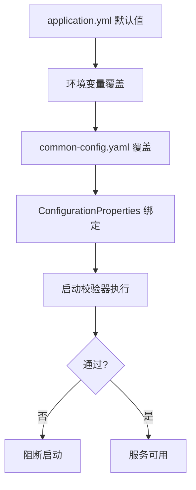
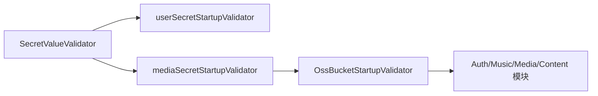

# 我是怎么把”本地能跑”变成”环境可控”的：配置分层与运行策略复盘

> 这篇我想讲清楚一个经常被忽略的问题：后端的稳定性，很大一部分取决于配置治理，而不是代码本身。

## 1. 我遇到的实际问题（背景与失败信号）

早期配置最大的痛点是：

- 本地能跑，换个环境就报错
- 中间件地址、密钥、开关分散在不同地方
- 启动失败信息不聚焦，排查路径很慢

关键受影响接口：

- `GET /api/v1/music/search`
- `GET /api/v1/author/profile`
- `POST /api/v1/auth/tokens`

## 2. 第一版方案为什么不够（踩坑和边界）

第一版我靠”记忆配置”推进：

- 哪些参数必须设置，靠文档和口口相传
- 密钥占位值可能混进运行环境
- 多环境覆盖关系不透明

这导致配置错误往往在运行期才暴露出来。

## 3. 我怎么做技术选型（为什么选它而不是别的）

最后固定了三层策略：

- 基础默认：`apps/monolith-app/src/main/resources/application.yml`
- 环境覆盖：`resouces/yaml/common-config.yaml`（本地私有）
- 启动前置校验：Secret/Bucket 启动校验器

关键类：

- `SecretStartupValidator`（user/media）
- `OssBucketStartupValidator`
- `SecretValueValidator`

## 4. 我在代码里怎么落地（类/方法/API/表证据）

### 4.1 配置分层与覆盖顺序

`application.yml` 通过 `spring.config.import` 引入额外 yaml，实现“默认 + 覆盖”的组合。

```yaml
spring:
  config:
    import:
      - optional:file:./resouces/yaml/common-config.yaml
      - optional:file:../../resouces/yaml/common-config.yaml
```

### 4.2 启动时密钥有效性校验

- `SecretValueValidator#isInvalid`
- `userSecretStartupValidator` / `mediaSecretStartupValidator`

不允许明显占位值（如 `replace_me`）在生产链路里”静默通过”。

### 4.3 存储桶可用性启动校验

`OssBucketStartupValidator#run` 会在启动阶段主动检测：

- `private-bucket`
- `public-bucket`

避免把 `NoSuchBucket` 留到运行期才爆出来。

### 4.4 配置如何映射到业务行为

把关键配置都绑定到了具体行为：

- `shizuki.gateway.auth.*`：游客路径、public 路径、无效 token 降级策略
- `shizuki.music.listen-cache.*`：播放缓存模式
- `shizuki.content.author-profile.cache.*`：作者资料缓存 TTL
- `shizuki.audit.outbox.*`：审计事件重试节奏

并且能在数据层看到对应效果：

- `AUD_EVENT_OUTBOX`（重试节奏）
- `AI_QUOTA_USAGE`（配额策略）
- `MDA_MUSIC_TRACK_CACHE`（缓存策略）

## 5. 运行与校验链路图（mermaid）



**图解说明**

- 把”配置错误”前移到启动阶段，而不是延后到线上请求阶段



**图解说明**

- 密钥有效性与桶可用性作为硬前置条件，减少线上随机故障。

## 6. 成本、风险和取舍

- 成本：多了启动校验和配置治理文档维护
- 风险：校验过严可能影响本地快速启动体验
- 收益：环境切换更稳定，配置错误更早暴露

最终取舍是：开发环境可以放松，生产环境必须严格校验。

## 7. 可复用 checklist

- [ ] 所有关键配置必须有默认值和环境变量映射
- [ ] 密钥配置必须经过占位值校验
- [ ] 对象存储桶建议启动即校验，别等运行时爆错
- [ ] 公共路径和游客路径必须清单化管理
- [ ] 缓存、审计、配额配置要映射到可观测数据表
- [ ] 私有配置文件必须和仓库分离，避免泄露凭据
