# 我是怎么从后端代码里抽出“可传播技术博客选题”的：实战策划稿

> 这篇不是“标题生成器”，而是我自己在写系列文章时，用来保证内容质量与持续输出的工作流。

## 1. 我遇到的实际问题（背景与失败信号）

项目做完一批功能后，遇到的不是”没内容”，而是”不会讲”：

- 文章容易写成接口说明书
- 读者看完不知道你解决了什么真实问题
- 没有证据链，内容难建立可信度

后来总结：技术博客不是”我做了什么”，而是”我为什么这么做、踩过什么坑、最后怎么收敛”。

## 2. 第一版方案为什么不够（踩坑和边界）

第一版常见的写法是：

- 背景一句话，随后堆代码截图
- 缺失架构图和链路图
- 没有失败分支和取舍说明

这会导致文章”信息很多，但记忆点很弱”。

## 3. 我怎么做技术选型（为什么选它而不是别的）

给自己定了一个固定写作协议（每篇都遵守）：

1. 问题背景（真实失败信号）
2. 第一版方案不足
3. 选型理由
4. 代码证据（类/方法/API/表）
5. mermaid 链路图
6. 成本与取舍
7. checklist

证据锚点来源固定到真实实现：

- 类方法：`AuthEntryFilter#doFilterInternal`、`MediaServiceImpl#resolvePlaybackTrack`
- 接口路径：`/api/v1/auth/tokens`、`/api/v1/music/search`
- 数据表：`AUD_EVENT_OUTBOX`、`CTN_POST`、`MDA_MUSIC_TRACK_CACHE`

## 4. 我在代码里怎么落地（选题抽取证据）

### 4.1 我实际怎么抽题

会先按模块问三个问题：

- 这个模块解决了什么”非功能性问题”？
- 有没有明显的失败分支或降级分支？
- 能不能拿出类/接口/表三类证据？

如果三问都回答不了，这个题就不发。

### 4.2 我用的证据最小集

每篇至少包含：

- 1 条真实 API 路径
- 2 个真实类/方法
- 1 组真实数据表
- 2 张 mermaid（架构 + 流程）

```bash
# 我常用的取证方式：按“类/接口/迁移”三路并行抽证
rg -n "@RequestMapping|@GetMapping|@PostMapping" modules
rg -n "class .*ServiceImpl|Filter|Aspect" modules apps libs
rg --files apps/monolith-app/src/main/resources/monolith/db/migration
```

## 5. 内容生产链路图（mermaid）


**图解说明**

- 先找”问题”和”证据”，最后才写字
- 这样文章天然更像工程复盘，而不是功能说明

```mermaid
gantt
  title 我的系列发布节奏（周）
  dateFormat  X
  axisFormat %s

  section 架构骨架
  01 请求链路与模块化 :a1, 0, 1
  02 认证授权设计     :a2, 1, 1

  section 业务主线
  03 内容域策略        :b1, 2, 1
  04 媒体与L2D治理     :b2, 3, 1
  05 音乐聚合与缓存     :b3, 4, 1
  06 AI配额底座        :b4, 5, 1

  section 工程治理
  07 审计限流异常安全   :c1, 6, 1
  08 Flyway迁移演进     :c2, 7, 1
  09 配置与运行建议     :c3, 8, 1

  section 总结与扩散
  10 选题方法论         :d1, 9, 1
  a  跨模块总复盘       :d2, 10, 1
```



**图解说明**

- 把发布顺序和系统复杂度绑定，读者理解曲线更平滑

## 6. 成本、风险和取舍

- 成本：每篇前置取证和画图需要额外时间
- 风险：如果证据不够，会写成”空洞方法论”
- 收益：文章可复用、可验证、可持续连载

我的取舍是：宁可少发，也不发没有工程证据的文章。

## 7. 可复用 checklist

- [ ] 每篇先写问题，再写方案，再写代码证据
- [ ] 证据必须来自真实类、真实接口、真实表
- [ ] 每篇至少 2 张 mermaid（架构 + 流程）
- [ ] 必须写”第一版为什么不够”，避免成功学叙事
- [ ] 必须写”成本和取舍”，体现工程判断
- [ ] 发布后记录反馈，反向修正文档结构
