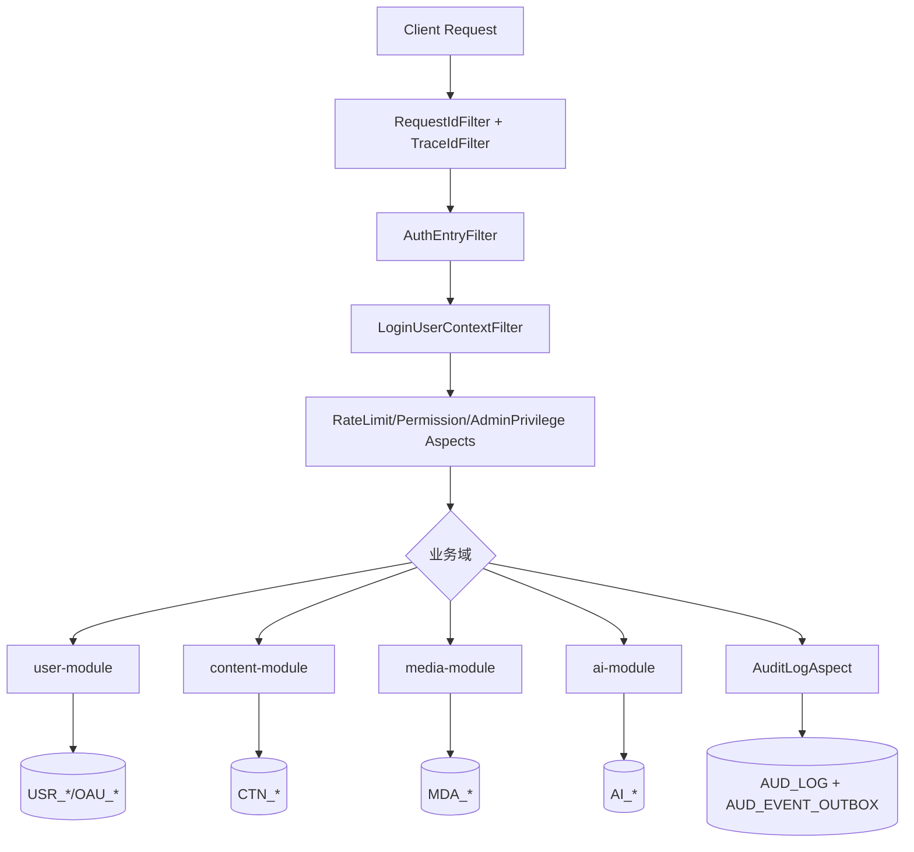
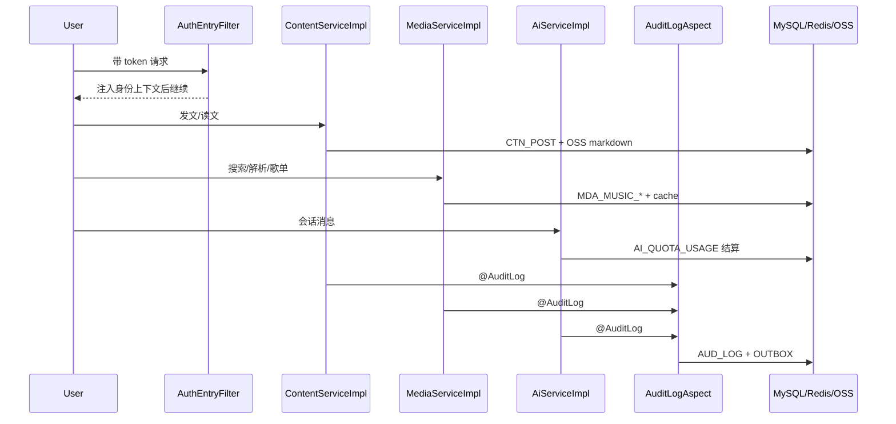

# 从一次“功能堆叠危机”到一套可演进后端：我的跨模块总复盘

> 这篇是加餐样章。我把整个后端改造过程串成一个完整故事：问题怎么暴露、方案怎么反复、系统怎么稳定下来。

## 1. 我遇到的实际问题（背景与失败信号）

我最初只是想做一个个人站点，后来功能越加越多：博客、音乐、媒体、AI、后台管理。

当功能从 1 个模块变成 4 个模块时，危机一下子显现：

- 我很难回答“一个请求到底经过了哪些环节”。
- 某些接口偶发 403 或 429，却很难快速定位。
- 数据库表越长越多，但 schema 变更没有统一节奏。

我那时最焦虑的一点是：这套系统正在“可用”，但不“可控”。

## 2. 第一版方案为什么不够（踩坑和边界）

我当时失败的第一版方案有三个特征：

- 以功能为中心，不以链路为中心。
- 以单点修复为主，不以统一治理为主。
- 以“先写出来”为目标，不以“后续可演进”为目标。

典型表现是：

- `POST /api/v1/auth/tokens`、`POST /api/v1/music/picks`、`POST /api/v1/me/posts` 这类核心接口行为不够一致。
- 审计、限流、权限、错误协议没有统一抽象。
- 新需求能做，但每次改动都伴随“未知副作用”。

## 3. 我怎么做技术选型（为什么选它而不是别的）

我后来把问题拆成五个“必须先稳定”的支点：

1. 请求入口可控：`AuthEntryFilter` + `LoginUserContextFilter`
2. 治理能力前置：`RateLimitAspect`、`PermissionAspect`、`AuditLogAspect`
3. 内容/媒体资产化：`ContentServiceImpl`、`MediaServiceImpl`
4. 配额与会话可结算：`AiServiceImpl`、`UserQuotaGateway`
5. 迁移与配置可治理：Flyway + 启动校验器

我没有直接拆微服务，而是坚持 Monolith Modular：

- 先把域边界稳定。
- 再考虑部署边界拆分。

## 4. 我在代码里怎么落地（类/方法/API/表证据）

### 4.1 入口链路：从“匿名请求”到“可信上下文”

关键类与方法：

- `AuthEntryFilter#doFilterInternal`
- `LoginUserContextFilter#doFilterInternal`

关键接口：

- `GET /api/v1/posts`
- `POST /api/v1/me/posts`

这一步做完后，我所有业务层都不再自己解析 token。

### 4.2 内容与媒体：从“文件上传”到“资产治理”

- 内容关键方法：`relayPostMarkdown`、`createMyPost`、`canAccessPublishedPost`
- 媒体关键方法：`createAsset`、`createDownloadUrl`
- L2D 校验：`L2dZipValidator#validate`

核心表：

- `CTN_POST`、`CTN_POST_GROUP_ACL`、`CTN_POST_CATEGORY_POLICY`
- `MDA_ASSET`、`MDA_L2D_PACKAGE`、`MDA_ASSET_GROUP_ACL`

### 4.3 音乐与 AI：从“可用功能”到“成本可控能力”

- 音乐关键方法：`searchMusic`、`resolvePlaybackTrack`、`pickMusic`
- AI 关键方法：`sendMessage`、`loadOrCreateUsage`
- 配额桥接：`UserQuotaGateway#resolveQuota`

核心表：

- `MDA_MUSIC_TRACK_CACHE`、`MDA_MUSIC_PICK_USAGE`
- `AI_QUOTA_USAGE`、`AI_CHARACTER`

### 4.4 治理与可靠性：从“日志打印”到“可追踪系统”

- 审计：`AuditLogAspect` + `JdbcAuditLogService`
- outbox 重试：`JdbcAuditOutboxServiceImpl`
- 异常协议：`GlobalExceptionHandler`

核心表：

- `AUD_LOG`
- `AUD_EVENT_OUTBOX`

## 5. 全局链路图（mermaid）

**图解说明**

- 我把“入口治理”和“业务域”明确分层，避免横切逻辑侵入业务实现。

**图解说明**

- 这条序列是我系统“跨模块协作”的主脉络。

**图解说明**

- 这是我后来固定的迭代节奏，避免“只改代码不改治理”。

## 6. 成本、风险和取舍（性能/一致性/可维护性）

### 6.1 我付出的成本

- 早期开发速度变慢：要先设计边界，再写功能。
- 文档维护成本上升：每个改动都要有证据。

### 6.2 我规避的风险

- 降低了“功能增长导致系统失控”的概率。
- 避免了“线上问题无法定位来源”的被动局面。

### 6.3 我最终的取舍

- 我接受短期复杂度，换长期可维护性。
- 我优先统一治理，再追求功能速度。

## 7. 可复用 checklist

- [ ] 把请求链路先画出来，再写业务代码。
- [ ] 鉴权、限流、审计、异常协议必须统一下沉。
- [ ] 内容与媒体都按“资产化”思路建模，不做裸 URL。
- [ ] 配额相关逻辑必须服务端结算，前端只展示。
- [ ] 每次 schema 变更必须配 Flyway 迁移。
- [ ] 每篇技术文都附“类/接口/表 + mermaid”证据链。

---

如果让我重来一次，我仍然会走这条路：

先把系统做成“可解释、可追踪、可演进”，再去追求“看起来很快的功能堆叠”。
